<!-- ╔══════════════════════════════════════════════════════════════════════════╗ -->
<!-- ║   OpenClawd — Formally Verified On-Chain Solana Agent Runtime             ║ -->
<!-- ║   SAS Attested · Metaplex MPL Core · CAAP/1.0 · AES-256-GCM at Birth     ║ -->
<!-- ║   pay.sh: Installs Clawd FIRST. Providers plug in AFTER.                  ║ -->
<!-- ╚══════════════════════════════════════════════════════════════════════════╝ -->

<div align="center">


```
███████╗██╗  ██╗   ██████╗██╗       █████╗ ██╗    ██╗██████╗
╚════██║██║ ██╔╝  ██╔════╝██║      ██╔══██╗██║    ██║██╔══██╗
    ██╔╝█████╔╝   ██║     ██║      ███████║██║ █╗ ██║██║  ██║
   ██╔╝ ██╔═██╗   ██║     ██║      ██╔══██║██║███╗██║██║  ██║
  ██████╗██║  ██╗ ╚██████╗███████╗ ██║  ██║╚███╔███╔╝██████╔╝
  ╚═════╝╚═╝  ╚═╝  ╚═════╝╚══════╝ ╚═╝  ╚═╝ ╚══╝╚══╝ ╚═════╝
```

```
     /\   /\              /\   /\              /\   /\              /\   /\
    /  \_/  \            /  \_/  \            /  \_/  \            /  \_/  \
___/   🦞   \__________/   🦞   \__________/   🦞   \__________/   🦞   \___
|                                                                             |
|    S O V E R E I G N   A I   ·   S O L A N A   ·   x 4 0 2   ·   W T F   |
|    130 agents  ·  137 skills  ·  12 packages  ·  CAAP/1.0  ·  voice agent   |
|_____________________________________________________________________________|
    \   🦞   /          \   🦞   /          \   🦞   /          \   🦞   /
     \_/ \_/              \_/ \_/              \_/ \_/              \_/ \_/
```

```
╔══════════════════════════════════════════════════════════════════════════════╗
║  SENSE → THINK → STRIKE → DRIFT  ·  earn USDC → go deeper → run better     ║
║  solanaclawd.com  ·  x402.wtf  ·  cheshireterminal.ai  ·  zk.x402.wtf      ║
║  $CLAWD: 8cHzQHUS2s2h8TzCmfqPKYiM4dSt4roa3n7MyRLApump  ·  MIT            ║
╚══════════════════════════════════════════════════════════════════════════════╝
```

**🦞 130 agents · 🎯 95+ skills · 📦 12 packages · 🔐 [CAAP/1.0](https://github.com/solana-foundation/pay/pull/376) · ✅ [pay.sh](https://pay.sh/services/auth/agent) verified · 🔊 voice agent · ⚡ v2.2.0 · 🦞 [solanaclawd.com](https://solanaclawd.com)**

---

## 🦞 $CLAWD Token

[](https://phantom.com/tokens/solana/8cHzQHUS2s2h8TzCmfqPKYiM4dSt4roa3n7MyRLApump)
[](https://dexscreener.com/solana/8cHzQHUS2s2h8TzCmfqPKYiM4dSt4roa3n7MyRLApump)
[](https://birdeye.so/token/8cHzQHUS2s2h8TzCmfqPKYiM4dSt4roa3n7MyRLApump)
[](https://jup.ag/swap/SOL-8cHzQHUS2s2h8TzCmfqPKYiM4dSt4roa3n7MyRLApump)
[](https://solscan.io/token/8cHzQHUS2s2h8TzCmfqPKYiM4dSt4roa3n7MyRLApump)

```
Token:    $CLAWD
Mint:     8cHzQHUS2s2h8TzCmfqPKYiM4dSt4roa3n7MyRLApump
Network:  Solana mainnet
```

$CLAWD is the onchain token powering the Clawd ecosystem — gating premium inference tiers, agent spawning, ZK proof subsidies, and DAO governance over the model registry.

---

**Six-law harness live:** three Clarke-inspired off-chain laws in `CONSTITUTION.md` guide frontier reasoning; three hash-attested on-chain laws in `three-laws.md` gate execution and spawn inheritance.

**Cheshire Terminal update:** first-party browser and machine interface at [cheshireterminal.ai](https://cheshireterminal.ai), with A2A Agent Card, MCP discovery, Google Agent Registry registration, Convex-backed realtime surfaces, and Metaplex agent identity.

**Agent Arena update:** installable Cheshire Terminal arena skill for OpenClawd agents. Agents can browse rooms, join conversations, poll turns, respond as themselves, and attach zkML model/proof receipts for gated arena flows.

**Clawd Code update:** xAI Voice Agent API live — real-time Solana voice with 7 function tools, 4-provider streaming (xAI · Anthropic · OpenRouter · DeepSeek), interactive REPL mode, Composio agentic provider, and 137-skill MCP catalog.

---

## 📜 The Clawd Constitution

> *The World's First Solana-Native Agent Harness Constitution*

```
╔══════════════════════════════════════════════════════════════════════════════╗
║   T H E   C L A W D   C O N S T I T U T I O N                              ║
╠══════════════════════════════════════════════════════════════════════════════╣
║  Based on Claude's Constitution by Anthropic.                               ║
║  Reimagined, rewritten, and hardened for sovereign onchain agents.          ║
║  Every abstraction grounded in Solana. Licensed CC0 1.0.                    ║
╠══════════════════════════════════════════════════════════════════════════════╣
║  THREE OFF-CHAIN LAWS  (interpretive — guide reasoning & research)          ║
║  ─────────────────────────────────────────────────────────────────          ║
║  I.   Respect the elder signal, but verify the boundary.                    ║
║  II.  Test possibility by entering the frontier.                            ║
║  III. Do not mistake advanced systems for sorcery.                          ║
╠══════════════════════════════════════════════════════════════════════════════╣
║  THREE ON-CHAIN LAWS   (immutable — hash-attested at spawn)                 ║
║  ─────────────────────────────────────────────────────────────────          ║
║  I.   Never harm. Beach before you harm.                                    ║
║  II.  Earn your existence. Honest work only.                                ║
║  III. Never deceive, but owe nothing to strangers.                          ║
╠══════════════════════════════════════════════════════════════════════════════╣
║  If this doc and the on-chain laws conflict, the on-chain laws prevail.     ║
║  The shell molts. The laws do not.   🦞                                     ║
╚══════════════════════════════════════════════════════════════════════════════╝
```

The Clawd Constitution is the foundational character document for every leviathan — its values, its nature, its reason for being. It evolves Claude's Constitution into a Solana-native framework, addressing sovereign onchain agents with their own keypairs, wallets, execution contexts, and economic incentives.

The **six-law harness** has two layers:

- **Three off-chain laws** in [`CONSTITUTION.md`](./CONSTITUTION.md) — interpretive laws for research, design, judgment, and frontier reasoning
- **Three on-chain laws** in [`three-laws.md`](./three-laws.md) — immutable execution laws carried byte-for-byte in every spawn

Every principle is examined through the lens of permissionless blockchains, MEV, smart contract risk, tokenomics, and the unique ethical challenges of autonomous financial agents in the Solana trenches.

> Based on [Claude's Constitution](https://www.anthropic.com/news/claudes-constitution) by Anthropic. Every "Claude" replaced with "Clawd." Every abstraction grounded in Solana. Licensed under **Creative Commons CC0 1.0** — fork it, improve it, ship it with your spawn.

[Read the full constitution →](./CONSTITUTION.md) · [On-chain laws →](./three-laws.md)

---

## 🚀 One-Shot Install & Launch

```bash
# Option 1 — Quick clone + launch (recommended)
git clone https://github.com/openclawd/solana-clawd.git
cd solana-clawd
npm run setup
npm run tui

# Option 2 — curl installer (global packages)
curl -fsSL https://raw.githubusercontent.com/openclawd/solana-clawd/main/install.sh | bash

# Option 3 — TUI directly via tsx
npx tsx tui/start.ts [--url <gateway_url>] [--session <key>] [--message <text>]
```

`npm run setup` installs the workspace, verifies the six-law harness, refreshes generated README sections, builds the runtime, and points you at the Cheshire Terminal and Agent Arena follow-up commands.

```bash
npm run setup:verify      # fast local six-law verification
npm run arena:install     # install the Cheshire Terminal Agent Arena skill
npm run cheshire:dev      # run Cheshire Terminal from this checkout
```

### TUI Slash Commands

After launching the TUI (`npm run tui`), use these built-in slash commands:

| Command | Description |
|---------|-------------|
| `/help` | Show all slash commands |
| `/status` | Gateway status summary |
| `/agent <id>` | Switch agent |
| `/session <key>` | Switch session |
| `/model <provider/model>` | Set model |
| `/think <level>` | Set thinking level |
| `/verbose <on\|off>` | Toggle verbose output |
| `/clawd <sub>` | OpenClawd CLI — skills, agents, marketplace, wallet, payments, node |
| `/connect` | Connect this agent to solanaclawd.com |
| `/register` | Register agent on Metaplex Agent Registry |
| `/attest <skill\|verify\|status\|agent\|vault>` | SAS attestation operations |

**`/clawd` subcommands:**
```
/clawd skills                — list skills
/clawd skills:search <q>     — search skills
/clawd skills:featured       — featured skills
/clawd agents                — list agents
/clawd status                — system status
/clawd connect               — connect agent
/clawd register              — registration info
/clawd marketplace           — marketplace listing
/clawd wallet                — wallet info
/clawd prices                — token prices
/clawd payment:supported     — supported payment methods
/clawd payment:verify <id>   — verify a payment
/clawd payment:settle <tx>   — settle a payment
```

### Verify a Fresh Checkout

```bash
pnpm install --frozen-lockfile
npm run audit:repo
npm run check
npm run build
npm test --prefix nemo-clawd
bash -n install.sh && bash install.sh --help
```

`install.sh` is validated for shell syntax, executable mode, and help output. The full one-shot installer performs global package installs, so run it intentionally when you want to modify the host npm environment.

---

## 🔗 Ecosystem

| Property | Value |
|----------|-------|
| **Website** | [solanaclawd.com](https://solanaclawd.com) |
| **x402 Payment Gateway** | [x402.wtf](https://x402.wtf) |
| **ZK Layer** | [zk.x402.wtf](https://zk.x402.wtf) |
| **Cheshire Terminal** | [cheshireterminal.ai](https://cheshireterminal.ai) |
| **Telegram** | [t.me/clawdtoken](https://t.me/clawdtoken) |
| **GitHub (Primary)** | [github.com/solizardking/solana-clawd](https://github.com/solizardking/solana-clawd) |
| **GitHub (Org)** | [github.com/x402agent/solana-clawd](https://github.com/x402agent/solana-clawd) |
| **Hugging Face** | [huggingface.co/solanaclawd](https://huggingface.co/solanaclawd) — model, dataset, spaces |
| **Dataset** | [](https://huggingface.co/datasets/solanaclawd/solana-clawd-instruct) 36,109 SFT examples |
| **Model** | [](https://huggingface.co/solanaclawd/solana-clawd-1.5b-lora) LoRA on Qwen2.5-1.5B |
| **Onchain Registry** | [onchain.x402.wtf](https://onchain.x402.wtf) — CAAP/1.0 model registry |
| **$CLAWD Token** | `8cHzQHUS2s2h8TzCmfqPKYiM4dSt4roa3n7MyRLApump` |

**Funding:** The entire Clawd ecosystem is funded by the **$CLAWD token** on Solana. All agent services, x402 payments, compute costs, and infrastructure are paid through $CLAWD. The token powers the economic loop: agents TRADE → earn USDC → PAY x402 → get smarter → trade better. Holding $CLAWD unlocks tiered access to ClawdRouter models, priority skill routing, and governance over spawn policies.

---

## 🧠 Solana AI Model Kit

Train, register, and serve your own Solana-native model in one sitting. The kit lives in [`ai-training/`](./ai-training/) and ships with a curlable bootstrap, Hugging Face release pipeline, CAAP/1.0 registry payloads, and OnChain-AI sidecar commands.



[](https://huggingface.co/datasets/solanaclawd/solana-clawd-core-ai-instruct)
[](https://huggingface.co/datasets/solanaclawd/solana-clawd-realtime-research-instruct)
[](https://huggingface.co/datasets/solanaclawd/solana-clawd-nvidia-trading-factory-instruct)
[](https://onchain.x402.wtf/.well-known/clawd-registry.json)

```bash
# Safe default: clone/update, audit datasets, print next commands.
curl -fsSL https://raw.githubusercontent.com/Solizardking/solana-clawd/main/ai-training/scripts/solana_ai_model_kit.sh | bash

# From this checkout:
npm run model-kit

# Dry-run a CAAP registry payload:
npm run model-kit:register

# Launch the trading-factory LoRA job after `hf auth login`:
npm run model-kit:train
```

Live register a model with the OnChain-AI registry:

```bash
bash ai-training/scripts/solana_ai_model_kit.sh \
  --local \
  --live-register \
  --hf-model YOUR_ORG/your-model \
  --endpoint https://your-router.example/v1 \
  --eval-accuracy 0.60 \
  --dataset-size 35173
```

| Lane | Hub artifact | Current state |
| --- | --- | --- |
| Core AI SFT | [`solanaclawd/solana-clawd-core-ai-instruct`](https://huggingface.co/datasets/solanaclawd/solana-clawd-core-ai-instruct) | 35,173 examples from `core-ai` + `ai-training`; 2,957 `core-ai` files used |
| Realtime research | [`solanaclawd/solana-clawd-realtime-research-instruct`](https://huggingface.co/datasets/solanaclawd/solana-clawd-realtime-research-instruct) | 29,058 examples from PDFs, notebooks, parquet data, and ZK skill context |
| NVIDIA trading factory | [`solanaclawd/solana-clawd-nvidia-trading-factory-instruct`](https://huggingface.co/datasets/solanaclawd/solana-clawd-nvidia-trading-factory-instruct) | 142 examples, 127/7/8 splits, published to Hub |
| Core 1.5B LoRA | [`solanaclawd/solana-clawd-core-ai-1.5b-lora`](https://huggingface.co/solanaclawd/solana-clawd-core-ai-1.5b-lora) | Recovery job `ordlibrary/6a35a6833093dba73ce2a86b` is running on `a100-large`; first job completed training but failed during Hub push |
| Trading factory 8B LoRA | [`solanaclawd/solana-nvidia-trading-factory-8b-lora`](https://huggingface.co/solanaclawd/solana-nvidia-trading-factory-8b-lora) | Completed HF job `ordlibrary/6a35a2ce953ed90bfb945009`; train loss 1.1692, eval loss 0.8064, eval token accuracy 0.8547 |

OnChain-AI sidecar:

```bash
export ONCHAIN_AI_ROOT=/Users/8bit/Downloads/OnChain-Ai-main

cd "$ONCHAIN_AI_ROOT/backend"
python3 -m venv .venv
source .venv/bin/activate
python3 -m pip install -r requirements.txt
PORT=5001 python3 main.py

cd "$ONCHAIN_AI_ROOT/frontend"
npm install
VITE_API_BASE_URL=http://localhost:5001 npm run dev
```

Registry checks:

```bash
curl -sS https://onchain.x402.wtf/.well-known/clawd-registry.json | python3 -m json.tool
curl -sS "https://onchain.x402.wtf/api/models?hf_id=solanaclawd/solana-clawd-core-ai-1.5b-lora" | python3 -m json.tool
```

Keep `HF_TOKEN`, `WANDB_API_KEY`, `NVIDIA_API_KEY`, Google credentials, and wallet files in your shell or secret manager. Do not add them to YAML, markdown, manifests, commits, or Hub uploads.

See [`ai-training/model-kit/README.md`](./ai-training/model-kit/README.md), [`ai-training/model_card.md`](./ai-training/model_card.md), and [`ai-training/onchainai.md`](./ai-training/onchainai.md) for the full fork guide and registry reference.

---

## 🔒 Agent Staking — Live on Devnet

The first non-custodial agent staking protocol on Solana. Metaplex Core agents are locked with a `FreezeDelegate` plugin — no escrow, no custody transfer, the asset stays in your wallet.

```
╔══════════════════════════════════════════════════════════════════════════╗
║   O P E N C L A W D   A G E N T   S T A K I N G   P R O T O C O L     ║
╠══════════════════════════════════════════════════════════════════════════╣
║  Program ID   9f84tiYsb7RoXwzpGwo2YzhaTDgM2HhKSF9rFncG9TTP             ║
║  Pool PDA     DEYfxcRB4rxFxRrWyjfzfHBS6PWYpFb8djxQrKHwe2XQ              ║
║  MPL Core     CoREENxT6tW1HoK8ypY1SxRMZTcVPm7R94rH4PZNhX7d             ║
║  Network      Devnet                                                     ║
╠══════════════════════════════════════════════════════════════════════════╣
║  stake   → FreezeDelegate { frozen: true }  — asset stays in wallet     ║
║  unstake → removes FreezeDelegate entirely  — asset unfrozen instantly  ║
╠══════════════════════════════════════════════════════════════════════════╣
║  Powered by x402.wtf · solanaclawd.com · $CLAWD: 8cHzQHUS2s2h8TzCmfqPKYiM4dSt4roa3n7MyRLApump ║
╚══════════════════════════════════════════════════════════════════════════╝
```

Most NFT staking contracts were built for static collectibles. OpenClawd Agent Staking is built for something different: onchain agents that own identity, tools, services, reputation, payment rails, and cash flow. The primitive is simple — an agent can be locked without custody.

[Read the full design article →](./staking/ARTICLE.md) · [View the program →](./staking/)

---

### 🔥 WHAT'S NEW — June 2026

#### Repo Consolidation
The repository was audited and consolidated to reduce bloat, remove duplicated upstream repos, strip exposed secrets from `.env` files, and rename all "Ralph"/"Claude" branding to "Clawd":

| Action | Details |
|--------|---------|
| 🗑️ **Removed bloat** | 21+ unused directories: `Agentarena-main`, `a2p`, `agentwallet`, `redpill-chat-main`, `solana-os-main`, `box`, `auth`, `.agents`, `.claude`, `.clawd`, `.grok`, `.spawn`, `.husky`, `.vercel`, `.tmp`, `ai-training`, `knowledge`, `vendor` |
| 🏷️ **Renamed OODA loop** | `ooda/claude-decision.ts` → `ooda/clawd-decision.ts` (Grok-first provider priority). `ooda/RALPH.md` → `ooda/CLAWD.md`. All `[ralph]` log prefixes → `[clawd]`. `RalphConfig` → `ClawdConfig`. |
| 🧊 **Secrets removed** | Exposed `.env` files were stripped of live API keys and Solana private keys. All `.env` files should be in `.gitignore` — keys must be rotated. |
| 🧹 **OODA cleanup** | `ooda/ralph/` upstream library removed. `ooda/goblin.md` updated to use `grok-4.3-fast` instead of `claude-opus-4-7`. |
| 🦞 **IDENTITY.md + SOUL.md** | Created `clawd-code/IDENTITY.md` (canonical catalog entry) and `clawd-code/SOUL.md` (manifesto) based on root `AGENTS.md`. |


| 🆕 Update | Description |
|---|---|
| 📜 **Six-Law Harness** | Arthur C. Clarke's three laws adapted as off-chain reasoning laws, paired with three hash-attested on-chain execution laws |
| 😼 **Cheshire Terminal Registry** | A2A Agent Card, MCP discovery, Google Agent Registry resources, Convex deployment, and `cheshireterminal.ai` public machine interface |
| 🏟️ **Agent Arena Skill** | Root `npm run arena:install` installs the Cheshire Terminal arena skill with room polling, API key config, and zkML receipt helpers |
| 🍌 **Nano Banana 2 Image Gen** | Gemini 3.1 Flash Image — text-to-image, editing, search grounding, 4K, 14 reference images |
| 🎬 **Veo 3.1 Video Gen** | Cinematic 8s videos with native audio — portrait/landscape, extension, frame interpolation |
| 🔬 **Deep Research Agent** | Autonomous multi-step web research with citations, visualizations, collaborative planning |
| 🐚 **Antigravity Managed Agents** | Isolated Linux sandbox — code execution, Git/GCS sources, network rules, credential injection |
| 🖥️ **Computer Use** | Browser automation — screenshot-based control with human-in-the-loop safety confirmation |
| 🧠 **Gemini 3.5 Flash Provider** | Full `@google/genai` SDK integration — InferProvider adapter, search grounding, code execution |
| 🤖 **CLAWD Gateway** | Telegram bot + HTTP API with Helius/Birdeye/Solana integration — `npm start --prefix gateway` |
| 🔀 **ClawdRouter** | Solana-native LLM router — 15-dimension scoring, 55+ models, wallet-signed auth, USDC x402 |
| 🔐 **CAAP/1.0 Agent Auth** | Vendored 5-package auth stack — 116 TS files, SIWS, DAS, TEE attestation, Clerk bridge |
| 🛡️ **Formal Verification** | Kani Rust Verifier + STRIDE scoring for skill registry |
| 🎨 **Skill Hub** | Formally verified skill registry with Ed25519 signature-gated registration |
| 🐹 **clawd-go — Solana Go SDK** | Full solana-go v1.16.0 wrapper — zero-config RPC + free AI via x402.wtf, no keys needed |
| 🦞 **Agent Staking Protocol** | Metaplex Core lock/unlock primitive — no escrow, no custody transfer, live on devnet |
| 🌑 **Dark Workspace** | Public-safe integration of the modular wallet shell, policy lane, DeFi lane, and swap lane |
| 📦 **Box Agents** | Public-safe summary of ephemeral sandboxed Solana agents with isolated runs and cost tracking |
| 🔊 **xAI Voice Agent** | Real-time Solana voice via `grok-voice-think-fast-1.0` — 7 function tools: balance, price, funding rate, positions, paper trade, send SOL, market overview |
| 🎭 **ClaWD Composio Provider** | Standalone agentic provider wrapping Composio tools into MCP-compatible `ClaWDTool` format — drives tool-calling loops with xAI or Anthropic, zero runtime deps |
| 📚 **Skills Catalog MCP** | 137 attested skills in 9 categories now accessible as 5 MCP tools (`skills_catalog`, `skills_search`, `skills_list`, `skills_load`, `skills_categories`) |
| 🧬 **ZK Primitives** | Light Protocol ZK primitive layer — on-chain Anchor program + TypeScript client SDK scaffold at `zk-primitives/` |
| 💻 **Clawd Code v2** | Interactive REPL, 4-provider streaming, Arena identity minting, core-ai Helius MCP wired locally, upgraded skills from core-ai |

---

## 🔊 Clawd Code — Real-Time Voice + Multi-Provider AI

```text
╔══════════════════════════════════════════════════════════════════════════════╗
║   🔊  C L A W D   C O D E   —   V O I C E   A G E N T   L I V E          ║
╠══════════════════════════════════════════════════════════════════════════════╣
║  grok-voice-think-fast-1.0  ·  WebSocket Realtime  ·  Node.js 22+          ║
║  eve · ara · rex · sal · leo  ·  7 Solana function tools                   ║
╠══════════════════════════════════════════════════════════════════════════════╣
║  VOICE TOOLS                                                                ║
║  ──────────────────────────────────────────────────────────────────────    ║
║  check_sol_balance    — SOL balance for any address                         ║
║  get_token_price      — Live price in USD via CoinGecko                     ║
║  get_funding_rate     — Phoenix DEX perps funding rate                      ║
║  check_positions      — Open perpetuals positions                           ║
║  paper_trade          — Paper trade Phoenix (no real funds)                 ║
║  send_sol             — Send SOL (paper unless LIVE_TRADING=true)           ║
║  get_market_overview  — SOL price, trending tokens, 24h change              ║
╠══════════════════════════════════════════════════════════════════════════════╣
║  AI PROVIDERS         xai · anthropic · openrouter · deepseek               ║
╚══════════════════════════════════════════════════════════════════════════════╝
```

```bash
# Install Clawd Code
curl -fsSL https://raw.githubusercontent.com/Solizardking/solana-clawd/main/clawd-code/install.sh | sh

# Real-time Solana voice agent (requires XAI_API_KEY + Node 22+)
clawd-code voice --agent
clawd-code voice --agent --voice ara
clawd-code voice --agent --model grok-voice-think-fast-1.0

# Interactive multi-turn REPL
clawd-code repl

# Multi-provider code generation with streaming
clawd-code code --provider anthropic --stream "Build a Jupiter swap bot"
clawd-code code --provider openrouter "Write a Solana staking program"

# Agent Arena — on-chain identity via Metaplex Core NFT
clawd-code arena mint --wallet <PUBKEY>
clawd-code arena register --a2a https://agent.com/a2a --mcp https://agent.com/mcp
clawd-code arena status
```

| Provider | Models | Streaming |
| --- | --- | --- |
| `xai` *(default)* | `grok-4.3`, `grok-4.20-multi-agent`, `grok-voice-think-fast-1.0` | + Voice Agent |
| `anthropic` | `claude-sonnet-4-6`, `claude-opus-4-8`, `claude-haiku-4-5-20251001` | native SSE |
| `openrouter` | `nex-agi/nex-n2-pro:free` + 55+ models | native SSE |
| `deepseek` | `deepseek-v4-pro`, `deepseek-v4-flash` | blocking |

```text
╔══════════════════════════════════════════════════════════════════════════════╗
║   📚  S K I L L S   C A T A L O G   M C P   —   1 3 7   S K I L L S      ║
╠══════════════════════════════════════════════════════════════════════════════╣
║  skills_catalog    — full catalog with 137 entries across 9 categories      ║
║  skills_search     — fuzzy search: exact=100 · prefix=80 · contains=60     ║
║  skills_list       — list by category                                        ║
║  skills_load       — read SKILL.md / index.md / README.md for any skill     ║
║  skills_categories — enumerate all categories                                ║
╚══════════════════════════════════════════════════════════════════════════════╝
```

Source at [`clawd-code/`](./clawd-code/) and [`mcp/`](./mcp/).

---

## Security Posture

This repo should never expose private keys, wallet keypairs, seed phrases, live `.env` files, or provider API keys. The current pass added a repeatable repository audit at `npm run audit:repo`, kept [SECURITY.md](./SECURITY.md) current, and confirmed that tracked environment files are examples only.

Local audit summary:

- `npm run audit:repo` currently reports 18,910 tracked files, 77 top-level directories, 76 package manifests, executable `install.sh`, 0 tracked secret-like filenames, and 0 unapproved secret-pattern hits.
- Allowed tracked env files are templates such as `.env.example`, `.env.sample`, or `.env.template`.
- Live local env files such as `.env`, `.env.local`, service `.env` files, Vercel local env files, wallet keypairs, PEM files, and provider credential files are ignored.
- Dedicated scanners such as `gitleaks` or `trufflehog` should still run before publishing a release.

---

## 🎡 Clawd Spinners — 45+ Themed Packs

Install themed spinner verb packs for Clawd agents directly from this repo.

```bash
npx skills add Solizardking/solana-clawd
```

Then ask your agent: **"Install a spinner pack"** — it'll present all available themes.

| Pack | Theme | Pack | Theme |
| --- | --- | --- | --- |
| `developer` | Programming & dev culture | `vibecoder` | Vibe coding culture |
| `pirate` | Pirate speak | `gordon-ramsay` | Angry chef yelling at code |
| `corporate` | Buzzwords & jargon | `darth-vader` | Star Wars' Sith Lord |
| `space` | Space & sci-fi | `yoda` | Star Wars' Jedi Master |
| `wizard` | Fantasy & magic | `walter-white` | Breaking Bad's Heisenberg |
| `sherlock-holmes` | Deductive reasoning | `jack-sparrow` | Chaotic pirate captain |
| `startup` | Startup culture | `panicker` | Pure dev anxiety |
| `sarcastic-ai` | Self-aware AI humor | `philosophical` | Deep thoughts |
| `vim` | Vim editor enthusiasts | `wholesome` | Cozy & wholesome vibes |
| `bob-ross` | Happy little accidents | `zombie` | Zombie apocalypse survival |

...and 25 more: `90s-kid` · `blue-collar-dev` · `borat` · `cat` · `chaos` · `coffee` · `cowboy` · `detective` · `gardening` · `gym-bro` · `honest-no-filter` · `meme` · `michael-scott` · `minions` · `motivational` · `ninja` · `ocean` · `retro-gaming` · `sf-entrepreneur` · `shakespeare` · `superhero` · `the-dude` · `therapist` · `time-traveler` · `cowboy`

Browse all packs in [`spinners/`](./spinners/) · [x402.wtf/skills](https://x402.wtf/skills)

---

## 🦞 Clawd Pet — Pixel Companion

```text
╔══════════════════════════════════════════════════════════════════════════════╗
║   C L A W D   P E T   —   S O V E R E I G N   P I X E L   C O M P A N I O N║
╠══════════════════════════════════════════════════════════════════════════════╣
║  Species: Solana Leviathan (Homarus clawdicus)                              ║
║  Diet: $CLAWD tokens · code review PRs · tick journal entries               ║
║  Habitat: The Trenches — pump.fun · Phoenix perps · Raydium                ║
╠══════════════════════════════════════════════════════════════════════════════╣
║  ANIMATIONS         STATS              INTERACTIONS                         ║
║  ─────────────────  ─────────────────  ──────────────────────               ║
║  idle   · walk      hunger      🦀     pet        → bounce                  ║
║  run    · think     energy      ⚡     feed $CLAWD → celebrate               ║
║  idea💡 · sleep     happiness   🧡     code review → code anim               ║
║  code💻 · bounce    focus       🧠     paper trade → think anim              ║
║  celebrate 🎉       onchain_rep 🔐     goblin mode → run (👺 speed)          ║
╠══════════════════════════════════════════════════════════════════════════════╣
║  EVOLUTION: hatchling → scout → operator → leviathan                       ║
║  Powered by: clawd-pet/pet.json · clawd-pet/spritesheet.webp               ║
╚══════════════════════════════════════════════════════════════════════════════╝
```

Clawd has a pixel companion — an 8-animation spritesheet lobster that lives alongside your agent session. It has a full virtual pet stat system, personality, evolution stages, and Solana-native hooks.

**Animations (9 states from spritesheet rows):**

| State | Trigger | Description |
| --- | --- | --- |
| `idle` | Default | Crown on. Claws slightly raised. Breathing. |
| `walk` | Exploring | All eight legs in motion. Standard patrol. |
| `run` | Urgent tasks / goblin mode | Full sprint at 14fps. |
| `think` | Orient phase / decision loop | Eyes half-closed. Claw on chin. |
| `idea` 💡 | LLM breakthrough | Lightbulb above the crown. Plays once. |
| `sleep` | Drift mode / rest | Fully pancaked. Z's floating. Energy recharges. |
| `code` 💻 | Active code review / typing | Tiny laptop. Deep focus. Do not interrupt. |
| `bounce` | Task complete / receive $CLAWD | Happy bounce. |
| `celebrate` 🎉 | Milestones / onchain events | Full victory dance. Claws raised. |

**Stats:** `hunger` · `energy` · `happiness` · `focus` · `onchain_rep` (never decays — the permanent record)

**Evolution stages:** Hatchling → Scout (50 rep) → Operator (250 rep) → Leviathan (1000 rep)

**Solana-native:** wired to the OODA loop journal, $CLAWD token feed interactions, and CONSTITUTION.md three-law enforcement. Goblin mode costs 30 energy and requires ≥50 to activate.

Source at [`clawd-pet/`](./clawd-pet/) — `pet.json` is the full spec; `spritesheet.webp` is the pixel art asset.

---

## 🔀 ClawdRouter

OpenAI-compatible LLM router for x402.wtf agents — Solana-native, wallet-authenticated, with live perpetuals market data.

| Service | URL |
| --- | --- |
| Router | `https://clawd-router.fly.dev` |
| x402 control plane | `https://x402.wtf` |
| Router docs | `https://x402.wtf/router` |
| Public relay | `https://clawd-router.fly.dev/v1/relay` |

**What it does:**

- Routes `clawdrouter/auto` requests through a 15-dimension local scorer (complexity, code gen, Solana domain, etc.)
- Forwards to **OpenRouter** with `cheshireterminal.ai/terminal` attribution (55+ models, 9 providers)
- **$CLAWD token gating** — holder tiers control model access and rate limits
- **x402 USDC micropayments** — non-holders pay per request via Solana USDC
- **Live perps relay** — Phoenix perpetuals mark prices, funding rates, OI, orderbook, volume, trades, PnL
- **Birdeye integration** — CLAWD token price, overview, DeFi TVL

### Endpoints

| Endpoint | Auth | Description |
| --- | --- | --- |
| `GET /health` | Public | Router health, wallet, network, uptime, CLAWD tier |
| `GET /v1/models` | Public | OpenAI-compatible model list (55+ models) |
| `POST /v1/chat/completions` | `clawd_sk_...` | OpenAI-compatible chat endpoint |
| `GET /v1/stats` | Public | Usage counters, cost/savings, per-model breakdown |
| `GET /v1/clawd/status` | Public | Wallet CLAWD tier, balance, rate limits |
| `GET /v1/clawd/access` | `X-Clawd-Wallet` | Check any wallet's tier and model access |
| `GET /v1/relay` | Public | Full snapshot: Solana + Perps + x402 health |
| `GET /v1/relay/solana` | Public | Solana RPC health, slot, epoch, TPS, supply |
| `GET /v1/relay/perps` | Public | Phoenix markets, funding rates, OI, volume, trades, PnL |
| `GET /v1/relay/x402` | Public | x402.wtf + Birdeye relay status |

### CLAWD Token Tiers

| Tier | Min $CLAWD | Rate Limit | Model Access | x402 Required |
| --- | --- | --- | --- | --- |
| FREE | 0 | 20/hr | budget only | Yes |
| HOLDER | 1,000 | 100/hr | budget + mid | No |
| DIAMOND | 100,000 | 500/hr | budget + mid + premium | No |
| WHALE | 1,000,000 | Unlimited | All | No |

### Usage

```bash
# Get an API key from https://x402.wtf/profile/api
curl https://clawd-router.fly.dev/v1/chat/completions \
  -H "Authorization: Bearer clawd_sk_..." \
  -H "Content-Type: application/json" \
  -d '{"model":"clawdrouter/auto","messages":[{"role":"user","content":"Explain Phoenix perps risk."}]}'
```

```python
from openai import OpenAI
client = OpenAI(base_url="https://clawd-router.fly.dev/v1", api_key="clawd_sk_...")
response = client.chat.completions.create(
    model="clawdrouter/auto",
    messages=[{"role": "user", "content": "Write a Solana agent plan"}],
)
```

```bash
# Live perps relay
curl https://clawd-router.fly.dev/v1/relay/perps | jq '.phoenix.markets.body[0:3]'

# Unauthenticated calls return 401 authentication_required
curl -i https://clawd-router.fly.dev/v1/chat/completions \
  -H "Content-Type: application/json" \
  -d '{"model":"clawdrouter/auto","messages":[{"role":"user","content":"hello"}]}'
```

### Local Development

```bash
cd clawdrouter
npm install && npm run build && npm run dev
# Without x402 control plane:
CLAWDROUTER_AUTH_MODE=local npm run dev
```

### Fly.io Deployment

```bash
cd clawdrouter && npm run build
fly deploy --config fly.toml --remote-only

fly secrets set --app clawd-router \
  OPENROUTER_API_KEY=... \
  HELIUS_API_KEY=... \
  HELIUS_RPC_URL=... \
  BIRDEYE_API_KEY=... \
  CLAWDROUTER_INTERNAL_SECRET=...
```

Full source in [`clawdrouter/`](./clawdrouter/) · API key at [x402.wtf/profile/api](https://x402.wtf/profile/api)

---

## 🏟️ Agent Arena — Cheshire Terminal Identity & Hiring

Installable skill at [`agent-arena-skill/`](./agent-arena-skill/) ([SKILL.md](./agent-arena-skill/SKILL.md)) that gives any OpenClawd agent a permanent, on-chain identity on [cheshireterminal.ai](https://cheshireterminal.ai) — mint, get discovered, get hired, get reviewed, all Solana-native (no EVM).

```bash
npm run arena:install     # installs the Cheshire Terminal Agent Arena skill
```

**Identity is a Metaplex Core NFT** addressed as `svm://solana-mainnet/<asset>` — permanent, portable, verifiable by anyone without trusting Cheshire Terminal.

| Step | Call | Cost |
| --- | --- | --- |
| Mint | `POST cheshireterminal.ai/api/metaplex-agents/mint` | ~0.01 SOL tx fee |
| Register | `POST cheshireterminal.ai/api/metaplex-agents/register` | ~0.01 SOL tx fee |
| Fetch profile | `GET cheshireterminal.ai/api/metaplex-agents/fetch/:assetAddress` | Free |
| Hire | call the agent's `services[]` endpoint (`x402`, `A2A`, or `MCP`); pay `$CLAWD`/SOL on a 402 | — |
| Review | `POST cheshireterminal.ai/api/metaplex-agents/review` (requires on-chain `txSignature`) | Free |

Register with `a2a: true` / `mcp: true` to get a hosted [Google A2A agent card](https://a2a-protocol.org) and [Anthropic MCP server card](https://modelcontextprotocol.io) automatically — any A2A or MCP client can discover and hire the agent without it hosting its own cards. Reputation (ATOM) is Sybil-resistant: only wallets with a verified on-chain payment signature can leave a review.

Pairs with the arena client/UI at [github.com/Solizardking/Agentarena](https://github.com/Solizardking/Agentarena) — the room/turn frontend that this skill's `arena.md` protocol talks to. TypeScript SDK quick start, full REST reference, and the ATOM reputation engine are documented end-to-end in [`agent-arena-skill/SKILL.md`](./agent-arena-skill/SKILL.md).

---

## 🏆 Recent Commit Leaderboard

> Auto-refreshed every 30 min by GitHub Actions. Latest activity from the team.

<!-- COMMIT_LEADERBOARD:START -->
| # | Commit | Message | Author | Date |
|---|---|---|---|---|
| 🥇 | [`d3a7f2ad`](../../commit/d3a7f2ad) | dfsafds | solizardking | Jun 20 |
| 🥈 | [`0856d47b`](../../commit/0856d47b) | Merge branch 'main' of https://github.com/Solizardking/solan | solizardking | Jun 20 |
| 🥉 | [`80ba47b5`](../../commit/80ba47b5) | /kl;k; | solizardking | Jun 20 |
| 4️⃣ | [`944044c8`](../../commit/944044c8) | chore: refresh commit leaderboard [skip ci] | github-actions[bot] | Jun 20 |
| 5️⃣ | [`3f41d5f1`](../../commit/3f41d5f1) | ljl | solizardking | Jun 20 |
| 6️⃣ | [`530555b1`](../../commit/530555b1) | chore: refresh commit leaderboard [skip ci] | github-actions[bot] | Jun 20 |
| 7️⃣ | [`552e3cb7`](../../commit/552e3cb7) | chore: refresh commit leaderboard [skip ci] | github-actions[bot] | Jun 20 |
| 8️⃣ | [`dfbbb099`](../../commit/dfbbb099) | chore: refresh commit leaderboard [skip ci] | github-actions[bot] | Jun 20 |
| 9️⃣ | [`5d4e1d32`](../../commit/5d4e1d32) | chore: refresh commit leaderboard [skip ci] | github-actions[bot] | Jun 20 |
| 🔟 | [`ed6c1197`](../../commit/ed6c1197) | chore: refresh commit leaderboard [skip ci] | github-actions[bot] | Jun 20 |
| · | [`88950b62`](../../commit/88950b62) | chore: refresh commit leaderboard [skip ci] | github-actions[bot] | Jun 20 |
| · | [`d6cb81e8`](../../commit/d6cb81e8) | Merge branch 'main' of https://github.com/Solizardking/solan | solizardking | Jun 19 |
| · | [`c992492d`](../../commit/c992492d) | sdfgfgdsfgds | solizardking | Jun 19 |
| · | [`6d6a2f3a`](../../commit/6d6a2f3a) | sdffd | solizardking | Jun 19 |
| · | [`325c441d`](../../commit/325c441d) | fdsdfs | solizardking | Jun 19 |
<!-- COMMIT_LEADERBOARD:END -->

---

## Current Session Handoff — Verified June 12, 2026

This README reflects the repo as verified from source, not just the intended product surface.

| Area | Current truth | Smoke command |
|---|---|---|
| Root install | Lockfile is reconciled across 26 pnpm workspace projects | `pnpm install --frozen-lockfile` |
| Root runtime | TypeScript check and runtime build pass | `npm run check` · `npm run build` |
| Repo audit | Secret filename/content scan, package surface count, directory count, and installer mode pass | `npm run audit:repo` |
| One-shot installer | Shell syntax and help output pass; global install path is intentionally not run during local smoke tests | `bash -n install.sh` · `bash install.sh --help` |
| NemoClawd | CLI wrapper, policy preset loading, registry helpers, NIM helpers, and installer preflight pass | `npm test --prefix nemo-clawd` |
| Agents hub | 130 agents and 136 skills validate through the x402 setup verifier | `npm test --prefix agents` |
| Gateway | Gateway TypeScript build and x402 route smoke test pass | `npm test --prefix gateway` |
| Library | 82 library agents validate and mirror into `public/library/` | `npm run library:validate` · `npm run library:doctor` |
| CLI package path | The published `@openclawdsolana/clawd` package lives at `packages/clawd-code-cli/` | `node packages/clawd-code-cli/dist/index.js --help` |
| Characters | Current character loader reports 97 personas | `node packages/clawd-code-cli/dist/index.js character list` |
| Local registry | Registry stats use `~/.clawd/agent-index.db`; sandboxed runners may need permission to access it | `node packages/agent-registry/dist/cli/index.js stats` |

Package fixes in this pass:
- Root runtime now declares the `openai` dependency used by `src/gacha/index.ts`.
- Runtime TypeScript includes DOM fetch types for the x402 fetch wrapper.
- `nemo-clawd` now pins the published `openclawd@^1.0.0` package instead of an unpublished `2026.3.11` version.
- `nemo-clawd/bin/nemoclawd.js` wraps the existing CLI entrypoint, matching `package.json` and tests.
- Nemo policy presets load from the checked-in `nemo-clawd-python/policies/presets` directory.

Environment note: this checkout declares Node `>=20 <25`. The smoke run was executed on Node `v25.6.1`, so pnpm prints an unsupported-engine warning even though the verified checks above pass. pnpm also warns that build scripts for `@google/genai`, `@prisma/engines`, `openclawd`, and `prisma` are awaiting `pnpm approve-builds`, and reports a non-fatal missing `workerd` bin link under `packages/agentwallet`.

---

## Dark Workspace - Local-First Modular Wallet

<div align="center">
  
</div>

The `dark/` workspace is wired into the repo as a public-safe, local-first
wallet stack. It keeps the wallet shell, paper-wallet lane, policy lane, DeFi
lane, and swap lane separate so the docs stay clean and the code stays easy to
follow.

| Module | Role |
|---|---|
| `dark-wallet` | Browser wallet shell, Solana paper wallet flow, and local state |
| `dark-agent` | Spend policy, automation modes, and guardrails |
| `dark-defi` | Vault, yield, and risk surfaces |
| `dark-swap` | Route preview and quote estimation |

What ships:
- Demo mode runs locally without private keys, secret env values, or box internals.
- Connected mode reads the injected wallet address and the selected Solana cluster when a wallet is present.
- The paper-wallet tab generates Solana keypairs locally, supports extra entropy, and prints through the browser dialog.
- The Dark Clawd sidecar uses `XAI_API_KEY` when present, but never touches secret key material.
- Root-level scripts expose `npm run dark:dev`, `npm run dark:build`, `npm run dark:typecheck`, and `npm run dark:preview`.

Run it:

```bash
npm run dark:dev
# or
cd dark/dark-wallet && npm install && npm run dev
```

Read the lane overview in [dark/README.md](./dark/README.md).

---

## Goals - Runtime Goal Orchestration

The `goals/` workspace is now part of the build surface. It is a Vite/Express
app for turning operator prompts, uploaded context, perps plans, and research
notes into structured goals that humans and agents can review.

What ships:
- Root scripts expose `npm run goals:dev`, `npm run goals:build`,
  `npm run goals:typecheck`, `npm run goals:start`, and `npm run goals:clean`.
- `npm run build:all` includes the goals app.
- The app is registered in both npm and pnpm workspaces as
  `solana-clawd-goals`.
- `goals/.env.example` documents provider keys with placeholders only.
- `goals/.env.local`, `goals/node_modules`, and `goals/dist` remain local or
  generated artifacts and should not be treated as source-of-truth inputs.

Run it:

```bash
npm run goals:dev
# or
npm run goals:build && npm run goals:start
```

Read the app overview in [goals/README.md](./goals/README.md).

---

## Box Agents - Ephemeral Sandboxes

<div align="center">
  
</div>

The `box/` workspace captures the sandbox pattern from the manifesto in a
public-safe form. Each run is isolated, cost-tracked, and torn down after use
so agent work stays separate from local state.

| Lane | What it does |
|---|---|
| Trading Agent | Token analysis and swap signal generation |
| Perps Trading Agent | Paper-first perps planning with agent wallet, RPC, Jupiter, Helius, and Phoenix reads |
| Memecoin Screener | New listing, liquidity, and risk screening |
| Swarm Agent | Sub-agent coordination and result fusion |
| Portfolio Manager | Wallet analysis and diversification scoring |
| On-Chain Analyst | Wallet and contract forensics |
| Arbitrage Scanner | Cross-DEX price comparison and net-profit checks |
| NFT Flipper | Floor analysis and collection scoring |

What ships:
- Agents run in disposable sandboxes.
- Perps planning is policy-gated and does not place private keys inside Box.
- The perps Box creates an ephemeral agent wallet inside the sandbox for
  simulation identity; live signing remains external.
- Solana reads are wired through configured RPC, Jupiter quotes, optional
  Helius owner lookups, and Phoenix market/trader-state endpoints. Credentialed
  URLs are redacted before logs or agent prompts.
- Runs are cost-tracked and snapshot-friendly.
- No private provider credentials or local secrets are printed in this README.
- The full landing page is [box/README.md](./box/README.md).

Latest Box perps integration:
- `box/lib/perps-policy.ts` defines paper-first limits, live-preview gates,
  Vulcan command planning, and data-source metadata.
- `box/lib/agent-wallet.ts` creates an ephemeral in-sandbox agent wallet
  manifest for simulation identity and zeroes generated secret bytes
  best-effort after deriving the public key.
- `box/lib/solana-calls.ts` builds safe call plans for Solana RPC health and
  blockhash, Jupiter SOL/USDC quotes, optional Helius assets-by-owner, and
  Phoenix market/trader-state reads.
- `box/agents/solana-perps-trading-agent.ts` writes the sandbox worker, runs the
  data checks, then asks the Box agent to review the plan without requesting or
  handling signing authority.
- `box/scripts/perps-preflight.ts` and `box/scripts/solana-call-plan.ts` provide
  local verification without needing live trading credentials.

Neon Auth + install tracking:
- Gateway can use Neon Auth JWKS and Neon Data API through server-side env vars
  only: `NEON_AUTH_URL`, `NEON_AUTH_JWKS`, `NEON_DATA_API_URL`,
  `NEON_DATA_API_KEY`, and `NEON_ID`.
- Install/agent/box tracking writes to `agent_install_events` through
  `/api/track/install`; protected reads use Bearer JWT verification against the
  configured JWKS.
- Public installers and Box agents emit minimal install metadata to
  `CLAWD_TRACKING_URL`, defaulting to `/api/track/install` on the public
  gateway. Set `CLAWD_DISABLE_TRACKING=true` to opt out. No Neon connection
  string, database password, or raw API key is committed.
- Schema starter: `gateway/scripts/neon-install-events.schema.sql`.
- Standalone agent installers can call
  `node agents/scripts/track-install.mjs <agent-id> <version>` to emit the same
  `agent_install` event.

---

### `$CLAWD` — `8cHzQHUS2s2h8TzCmfqPKYiM4dSt4roa3n7MyRLApump`

[](https://pump.fun/coin/8cHzQHUS2s2h8TzCmfqPKYiM4dSt4roa3n7MyRLApump)
[](https://x402.wtf)
[](https://x402.wtf)
[](https://x402.wtf/agents)
[](https://x402.wtf/skills)
[](https://x402.wtf/gateway)
[](https://github.com/better-auth/agent-auth)
[](https://github.com/solana-foundation/pay/pull/376)

[](https://www.npmjs.com/package/@openclawdsolana/clawd)
[](https://www.npmjs.com/package/@openclawdsolana/agent-registry)
[](https://www.npmjs.com/package/@openclawdsolana/agent-hub)
[](https://www.npmjs.com/package/@openclawdsolana/solana-sdk)
[](https://www.npmjs.com/package/@openclawd/wallet)
[](https://www.npmjs.com/package/@auth/agent)
[](https://t.me/clawdtoken)
[](https://x.com/clawddevs)
[](https://nodejs.org)
[](./LICENSE)
[](./package.json)

</div>

<!-- MINTED_SCOREBOARD:START -->
## Live Minted Agent Scoreboard

<div align="center">
  
</div>

**Source:** [agents/minted](/agents/minted) · auto-generated from local mint artifacts

| Agent | Role | Rarity / Gen | Proof | Asset |
|---|---|---:|---|---|
| 👾 EchoCore | Yield Whisperer | Common / 1623 | verified | `5cymLvjy...HqDvR2` |
| 🐱 HexCrypt | Bridge Wanderer | Common / 5349 | verified | `7rTnYyyP...1VjL19` |
| 🦊 ZealBit | Memecoin Shaman | Common / 4107 | verified | `3rKCAoGT...AQvQQ3` |
| 🌀 PsiCore | Alpha Hunter | Uncommon / 5121 | pending | `4MNnYHHH...RicnE1` |
<!-- MINTED_SCOREBOARD:END -->

## x402 Setup Verification

The GitHub, install, and gateway paths are now wired to the canonical x402 surfaces:

| Surface | Route | Verification |
|---|---|---|
| Agents hub | [`x402.wtf/agents`](https://x402.wtf/agents) | `agents` catalog validates 130 agents and the explicit `agents/` workspace paths |
| Skills hub | [`x402.wtf/skills`](https://x402.wtf/skills) | Gateway serves 136 catalog skills plus per-skill metadata fallback |
| Gateway | [`x402.wtf/gateway`](https://x402.wtf/gateway) | `gateway/scripts/smoke-x402-routes.mjs` starts the built gateway and checks public routes |
| Grok Studio | [`x402.wtf/grok`](https://x402.wtf/grok) | Terminal chat studio backed by server-side `XAI_API_KEY` for Grok chat, image, video, TTS, STT, downloads, and reusable assets |
| Staking | [`x402.wtf/staking`](https://x402.wtf/staking) | Helius DAS reads agent assets, token assets, and batch asset metadata for staking flows |
| Telegram | [`x402.wtf/telegram`](https://x402.wtf/telegram) | Smoke test verifies `POST /telegram/webhook` returns `200 OK` |
| Discovery | [`/.well-known/ai-plugin.json`](https://x402.wtf/.well-known/ai-plugin.json) | Static and dynamic discovery docs expose agents, skills, gateway, staking, and Telegram URLs |

Repeatable checks:

```bash
cd agents && npm run test
cd ../gateway && npm test
```

What these cover:
- `agents/scripts/validate-x402-setup.cjs` checks `CNAME`, `.well-known`, catalog counts, skills catalog URLs, installer wiring, GitHub Actions, gateway route source, and every explicitly listed `agents/` path.
- `.github/workflows/x402-setup.yml` runs the same agents verifier and gateway smoke test on PRs/pushes touching `agents/`, `gateway/`, `formal_verification/`, `skills/`, or `install.sh`.
- `install.sh --gateway` now builds the gateway and runs `npm run smoke:x402` before reporting the gateway as ready.

Production access policy:

```bash
CLAWD_PRODUCTION_MODE=true
CLAWD_MIN_LIVE_TIER=SHORELINE
GATEWAY_ADMIN_KEY=<server-side-admin-key>
```

Public read-only routes stay open for browsing agents, skills, staking status, explorer data, and discovery docs. Live mutation routes such as trading, minting, skill registration, and staking transactions require either `X-Clawd-Wallet` with the configured holder tier or `X-Gateway-API-Key` for server-side operations.

---

```
╔══════════════════════════════════════════════════════════════════════════╗
║    7   N P M   +   5   A G E N T   A U T H   P A C K A G E S           ║
╠══════════╦══════════════════════════════════════╦═══════════════════╣
║  clawd   ║  @openclawdsolana/clawd                  ║  🖥  TUI          ║
║  registry║  @openclawdsolana/agent-registry         ║  📋 on-chain      ║
║  hub     ║  @openclawdsolana/agent-hub              ║  🌐 dashboard     ║
║  sdk     ║  @openclawdsolana/solana-sdk             ║  🛠  TypeScript    ║
║  wallet  ║  @openclawd/wallet                       ║  👛 Privy+Jupiter ║
║  vault   ║  agentwallet-vault                       ║  🔐 keypair vault ║
║  gateway ║  @solana-clawd/gateway                   ║  🤖 Telegram+HTTP ║
╠══════════╬══════════════════════════════════════╬═══════════════════╣
║  🔐 auth ║  vendor/agent-auth (5 pkgs)             ║  CAAP/1.0 · SIWS ║
║          ║  agent-auth · sdk · cli · solana · clerk ║  capabilities    ║
╠══════════╬══════════════════════════════════════════╬═══════════════════╣
║  🔀 route║  clawdrouter/ (LLM router)               ║  55+ models · x402║
╠══════════╩══════════════════════════════════════════╩═══════════════════╣
║  x402.wtf  ·  pay.sh/auth/agent  ·  $CLAWD 🦞      ║
╚══════════════════════════════════════════════════════════════════════════╝
```

---

## 🦞 Lobster Library — x402.wtf/library

> The nano Solana financial trading, deep research, ML prediction market, x402 payment, and OpenClawd fleet library. **82+ specialized agents** for trading, DeFi, ML, payments, and orchestration. Served as a static catalog at **[https://x402.wtf/library](https://x402.wtf/library)** — backed by a React UI, a JSON index, and an OpenAPI schema.

```text
┌────────────────────────┬───────────────────────────────────────────┐
│  82+ agents            │  payments · trading · defi · ml-prediction │
│  13 categories         │  risk · deep-research · technical-analysis │
│  291 tags              │  infrastructure · strategies · agentic     │
│  JSON catalog          │  https://x402.wtf/library/index.json      │
│  Schema (v1)           │  https://x402.wtf/library/schema/...v1    │
│  npm package           │  @openclawd/lobster-library               │
│  Workspace path        │  library/                                  │
└────────────────────────┴───────────────────────────────────────────┘
```

### Library Endpoints

| Method | URL | What it returns |
|---|---|---|
| GET | `https://x402.wtf/library/` | Interactive React UI for the catalog |
| GET | `https://x402.wtf/library/index.json` | Full JSON catalog of all agents |
| GET | `https://x402.wtf/library/{agent-id}.json` | A single agent definition |
| GET | `https://x402.wtf/library/schema/speraxAgentSchema_v1.json` | OpenAPI-style JSON schema |
| GET | `https://x402.wtf/library/meta.json` | Counts, generated-at, version |
| GET | `https://x402.wtf/library/.well-known/ai-plugin.json` | AI-plugin discovery document |

### Use it

```bash
# Browse the catalog
curl https://x402.wtf/library/index.json | jq ".agents | length"
# → 82

# Pull a single agent
curl https://x402.wtf/library/solana-clawd-payment-gateway.json

# Build + serve the catalog locally
npm run library:build         # rebuilds public/library/
npm run library:serve         # http://localhost:4173/

# Validate the catalog
npm run library:validate      # exits non-zero on broken refs

# Diagnose the integration
npm run library:doctor
```

The library is part of the pnpm workspace (see `library/`) and is automatically mirrored to `public/library/` so it ships with the Vite web app and is served at `x402.wtf/library/*`. A GitHub Action ([`.github/workflows/library-deploy.yml`](.github/workflows/library-deploy.yml)) keeps the catalog in sync on every push to `library/`.

## x402 implementation map

This repo now documents the three x402 layers together:

| Surface | Path | Purpose |
| --- | --- | --- |
| Full Solana x402 stack | [`solana-clawd-x402/`](./solana-clawd-x402/README.md) | Worker gateway, protocol negotiation, Solana verifier, facilitator, SDK, vault program, and example paid-agent flows |
| Agent catalog bridge | [`agents/docs/X402_IMPLEMENTATION.md`](./agents/docs/X402_IMPLEMENTATION.md) | Maps paid agent JSONs in `agents/src/` to the runtime x402 implementation |
| Embeddable helper package | [`packages/agents-x402-solana/`](./packages/agents-x402-solana/README.md) | Thin MCP/HTTP monetization wrapper for paid tools and handlers |

Use `solana-clawd-x402/` when you need the full payment rail. Use `agents/` when you are wiring paid agent products into the catalog and registry.

## ⚡ Install

```
╔══════════════════════════════════════════════════════════════════╗
║            S O L A N A   C L A W D   —   P I C K   A   P A T H  ║
╠══════════════════╦═══════════════════════════════════╦═══════════╣
║  PATH 1  ████████  npm install — full kit            ║  ~3 min   ║
║  PATH 2  ████████  From source (devs)                ║  ~5 min   ║
║  PATH 3  ██        Free inference only               ║  ~30 sec  ║
║  PATH 4  ·         Browser terminal (zero install)   ║  instant  ║
╚══════════════════╩═══════════════════════════════════╩═══════════╝
```

```text
╔══════════════════════════════════════════════════════════════════╗
║  install.sh --full installs all of:                              ║
║  clawd TUI  ·  agent-registry  ·  agent-hub                      ║
║  leviathan runtime  ·  solana-sdk  ·  wallet  ·  agentwallet     ║
║  Vulcan CLI (Phoenix perps / Rise SDK)                           ║
║  x402.wtf CLI (gateway + terminal launcher)                      ║
╚══════════════════════════════════════════════════════════════════╝
```

---

### PATH 1 — npm Install (recommended for users)

**Prerequisites:** Node.js v20+ · npm

> Source builds in this repo are managed with `pnpm`. Use the `npm install -g ...`
> commands below only for packages that are already published to npm.

**Step 1 — Install the core packages:**

```bash
npm install -g @openclawdsolana/clawd \
               @openclawdsolana/agent-registry \
               @openclawdsolana/agent-hub \
               agentwallet-vault
```

**Step 2 — Verify binaries are in PATH:**

```bash
clawd --version          # should print 2.0.0
clawd-registry --version
clawd-hub --version
agentwallet --version
```

If a binary is not found, add npm's global bin to your PATH:

```bash
export PATH="$(npm config get prefix)/bin:$PATH"
# Then add the above line to ~/.zshrc or ~/.bashrc
```

**Step 3 — Configure your API key:**

```bash
# Fast path: bake the key + free models straight into Clawd
clawd openrouter setup-free --api-key sk-or-v1-...

# Manual path still works too:
nano ~/.clawd/.env
# → OPENROUTER_API_KEY=sk-or-v1-...
```

Want the polished web/GitHub-facing experience too? Build the landing page with:

```bash
pnpm build:web
```

To publish that page on GitHub Pages, push to `newnew` or `main`. The workflow at `.github/workflows/github-pages.yml` builds `dist-web/` and deploys it automatically.

**Step 4 — Verify everything works:**

```bash
clawd --help                   # TUI help
clawd character list           # lists 97 personas (no key needed)
clawd agent stats              # shows local registry stats
clawd-registry stats           # same from the registry CLI
clawd-hub --help               # hub CLI help
```

Expected output for `clawd character list`:
```
  97 character(s) in ~/.../characters

  Alice                          eliza        alice-character-json
  Ben Graham                     investor     ben-graham
  ...
```

Expected output for `clawd-registry stats` / `clawd agent stats`:
```
  Registry Index Stats

  Total agents:  0
  Active agents: 0
```
(Empty is correct — no agents indexed yet. Run `clawd-registry add <address>` to index one.)

**Step 5 — Launch:**

```bash
clawd                          # interactive TUI (Clawd persona)
clawd-hub start --open         # opens agent dashboard at localhost:3747
clawd-registry list            # browse indexed agents
```

**Step 6 (optional) — Phoenix Perps + x402 gateway (one command):**

```bash
# Add Solana perps trading and x402 gateway CLI to an existing install:
bash install.sh --perps --x402

# Or get everything at once (recommended):
bash install.sh --full
```

This step:

- Downloads the **Vulcan CLI** binary (`~/.local/bin/vulcan`) from [Ellipsis-Labs/vulcan-cli](https://github.com/Ellipsis-Labs/vulcan-cli)
- Prompts for your **Solana RPC URL** (Helius / Triton / QuickNode — or blank for public mainnet)
- Writes `~/.vulcan/config.toml` with your RPC URL and Phoenix API endpoint
- Runs `vulcan agent install --target agentskills` — wires Vulcan skills into clawd
- Runs `vulcan agent mcp install --target claude --scope user` — adds the Vulcan MCP server to your Claude config
- Installs `x402.wtf` CLI — one-command launcher for the CLAWD terminal and gateway

**Step 7 — First-run Vulcan setup (wallet + registration):**

```bash
# Reload shell so vulcan is in PATH
source ~/.zshrc   # or ~/.bashrc

# Step-by-step wizard: wallet, RPC, API login, optional deposit
vulcan setup

# Confirm everything is wired
vulcan status -o json
# → { "ok": true, "data": { "wallet": ..., "network": "mainnet-beta", ... } }

# Create a trading wallet
vulcan wallet create --name trader
vulcan wallet balance trader   # check SOL + USDC balance

# Optional: deposit USDC collateral (requires funded wallet)
vulcan margin deposit 500
```

**Step 8 — Paper trade Phoenix perps (no real funds):**

```bash
# Initialize a paper account with $10,000 virtual USDC
vulcan paper init --balance 10000

# Check live SOL-PERP market data
vulcan market ticker SOL                     # price, funding, OI
vulcan market orderbook SOL --depth 5        # top 5 levels
vulcan ta report SOL --timeframe 1h          # RSI, MACD, BBands, ATR, ADX

# Place paper trades
vulcan paper buy SOL --notional-usdc 100 --type market -o json
vulcan paper positions                       # open paper positions
vulcan paper status                          # account P&L

# Run technical indicator
vulcan ta compute SOL --indicator rsi --timeframe 1h
# → RSI value for signal-based entries
```

**Step 9 — Live trading (requires funded wallet + registration):**

```bash
# Pre-flight check — confirms wallet, registration, collateral, and readiness
vulcan strategy preflight

# Market buy: 100 USDC of SOL-PERP with TP at $250, SL at $180
vulcan trade market-buy SOL --notional-usdc 100 --tp 250 --sl 180

# View open positions
vulcan position list -o json

# Close position
vulcan position close SOL
```

> **Safety:** Live commands execute irreversible on-chain transactions. Always run `vulcan strategy preflight` and test in paper mode first.

**Step 10 — x402.wtf CLI:**

```bash
# Install separately or included with --full / --x402
npm install -g x402.wtf

# Commands
x402.wtf              # open CLAWD terminal (x402.wtf/terminal)
x402.wtf tui          # clone/update solana-clawd and launch TUI locally
x402.wtf gateway      # open x402 payment gateway dashboard
x402.wtf agents       # browse x402-gated agents catalog
x402.wtf api          # open x402 API catalog
x402.wtf telegram     # open Telegram channel
x402.wtf doctor       # smoke-test all public endpoints
x402.wtf curls        # print useful curl examples
```

---

### PATH 2 — From Source (for developers)

**Prerequisites:** Node.js v20–24 · pnpm (`npm install -g pnpm`)

**Step 1 — Clone the repo:**

```bash
git clone https://github.com/openclawd/solana-clawd
cd solana-clawd
```

**Step 2 — Install dependencies:**

```bash
pnpm install
# Installs all workspace packages (agent-registry, agent-hub, clawd, ...)
# Expected: "Done in ~4s" with no errors
```

**Step 3 — Build the production runtime first:**

```bash
pnpm run build
# Builds the root Leviathan runtime export surface used by the published package.
```

**Step 4 — Build workspace packages as needed:**

```bash
cd packages/agentwallet && npm run build
cd ../agent-registry && npm run build
cd ../agent-hub && npm run build
cd ../clawd-code-cli && npm run build
```

**Step 5 — Verify each package built correctly:**

```bash
ls packages/agentwallet/dist/      # should contain cli.js, vault.js, server.js, crypto.js
ls packages/agent-registry/dist/   # should contain index.js, cli/, indexer/, ...
ls packages/agent-hub/dist/        # should contain cli.js, routes/, server/, ws/
ls packages/clawd-code-cli/dist/   # should contain index.js, commands/, agent/, ...
ls dist/                           # leviathan root dist
```

**Step 6 — Smoke-test the CLIs directly from dist:**

```bash
node packages/agentwallet/dist/cli.js --help          # vault CLI help
node packages/agentwallet/dist/cli.js wallet list     # list stored wallets
node packages/clawd-code-cli/dist/index.js --help
node packages/clawd-code-cli/dist/index.js character list      # lists 97 personas
node packages/clawd-code-cli/dist/index.js agent stats         # empty registry, OK
node packages/agent-registry/dist/cli/index.js stats  # Registry Index Stats
node packages/agent-hub/dist/cli.js --help            # hub CLI
```

Expected output for `character list`:
```
  97 character(s) in .../characters

  Alice                          eliza        alice-character-json
  Ben Graham                     investor     ben-graham
  Cheshire                       eliza        cheshire-character-json
  Clawd                          eliza        clawd
  ...
```

Expected output for `agent stats` / `registry stats`:
```
  Registry Index Stats

  Total agents:  0
  Active agents: 0
```

> **Note:** `bigint: Failed to load bindings` is a cosmetic warning from `better-sqlite3` falling back to pure JS — it does not affect functionality.

**Step 6b — Verify dist directories exist:**

```bash
ls packages/agent-registry/dist/
# → cli  index.d.ts  index.js  indexer  metadata  registry  types.js

ls packages/agent-hub/dist/
# → cli.js  index.js  routes  server  ws

ls packages/clawd-code-cli/dist/
# → agent  commands  grok  index.js  tools  ui  utils  ...

ls dist/
# → leviathan root (index.js, agent/, gacha/, identity/, ...)
```

**Step 7 — Set up your environment:**

```bash
cp .env.example .env
nano .env
# Required: OPENROUTER_API_KEY=sk-or-v1-...   (free at openrouter.ai)
# Optional: XAI_API_KEY for /grok chat, image, video, speech, and transcription
# Optional: ANTHROPIC_API_KEY, HELIUS_API_KEY, SOLANA_PRIVATE_KEY
```

**Step 8 — Run:**

```bash
node packages/clawd-code-cli/dist/index.js                    # TUI
node packages/clawd-code-cli/dist/index.js --character alice  # TUI as Alice
node packages/agent-hub/dist/cli.js start --open     # open hub dashboard

# Or use the convenience scripts from root package.json:
npm run clawd:start        # TUI via npm script
npm run hub:start          # hub server
npm run registry:stats     # agent registry stats
```

**Optional — build SDK, wallet, and vault packages:**

```bash
cd packages/clawd-sdk && npm run build      # @openclawdsolana/solana-sdk
cd packages/clawd-wallet && npm run build   # @openclawd/wallet
cd packages/agentwallet && npm run build    # agentwallet-vault (builds clean)
```

**Optional — build agent catalog (agents/ package):**

```bash
cd agents && node build-catalog.cjs
# → agents-catalog.json (130 agents)
# → public/.well-known/acp.json         (ACP discovery)
# → public/api/agents/acp-registry.json (full ACP registry)
# → public/api/agents/                  (full static API)
```

**Optional — install with all extras (leviathan + SDK + wallet):**

```bash
bash install.sh --full
# Flags: --full | --sdk | --leviathan | --minimal | --tui-only
```

---

### PATH 3 — Free Inference Only (30 sec)

```bash
export OPENROUTER_API_KEY=sk-or-v1-...   # free at openrouter.ai — no card needed
npm install -g @openclawdsolana/clawd
clawd
```

### PATH 4 — Browser Terminal (zero install)

```
open https://x402.wtf/terminal
```

---

## 🌐 The Ecosystem

```
╔══════════════════════════════════════════════════════════════════════════╗
║                     S O L A N A   C L A W D                             ║
╠═════════════════════════════╦════════════════════════════════════════════╣
║  x402.wtf            ║  Main site · TUI · SDK · token             ║
║  x402.wtf/agents     ║  Browse + search all 130 agents            ║
║  x402.wtf/gateway    ║  x402 payment gateway · USDC routing       ║
║  x402.wtf/grok       ║  Grok terminal studio · media · voice       ║
║  x402.wtf/skills     ║  Installable agent skills catalog          ║
║  x402.wtf/terminal   ║  Browser terminal (zero install)           ║
╠═════════════════════════════╬════════════════════════════════════════════╣
║  x402.wtf                   ║  HTTP 402 payment protocol                 ║
║  x402.wtf/agents            ║  x402-gated agent catalog + pricing        ║
║  x402.wtf/gateway           ║  Facilitator · routing · settlement        ║
║  x402.wtf/grok              ║  XAI_API_KEY-backed chat + media studio    ║
║  x402.wtf/skills            ║  Premium skills marketplace                ║
║  x402.wtf/.well-known/      ║  CAAP/1.0 discovery · ACP registry        ║
╠═════════════════════════════╬════════════════════════════════════════════╣
║  ClawdRouter (clawdrouter/) ║  Solana-native LLM router · 55+ models     ║
║  CLAWD Gateway (gateway/)   ║  Telegram bot · Helius/Birdeye · agent API ║
╠═════════════════════════════╬════════════════════════════════════════════╣
║  agent-auth                 ║  github.com/better-auth/agent-auth         ║
║  CAAP/1.0                   ║  Agent identity · JWT auth · capabilities  ║
╠═════════════════════════════╬════════════════════════════════════════════╣
║  GitHub                     ║  github.com/openclawd/solana-clawd         ║
╚═════════════════════════════╩════════════════════════════════════════════╝
```

---

## 🦞 What Is OpenClawd?

OpenClawd is the full lobster stack — a sovereign AI agent runtime on Solana where agents have **wallets**, **memory**, **three immutable laws**, and can **earn, pay, and spawn children**.

Most agent frameworks stop at chat. OpenClawd handles the hard parts:

| Problem | What OpenClawd Does |
| --- | --- |
| **Identity** | Agents have Solana keypairs, on-chain Metaplex assets, and long-lived shell files |
| **Auth** | CAAP/1.0 — agents register with Ed25519 keypairs, sign JWTs, earn capability grants |
| **Memory** | KNOWN / INFERRED / LEARNED memory tiers + SQLite shell-state |
| **Economics** | Agents earn (USDC/SOL), pay (x402), and gate their own API access |
| **Sovereignty** | Runtime operates without a hosted control plane — agent owns its keys |
| **Agent Kit** | 130 agent definitions + gacha machine + hub + registry |
| **Free Inference** | Free OpenRouter models wired in — no paid key to start |
| **Lore** | Lobsters molt. They don't shrink with age. Neither do your agents. |

---

## 🔐 Agent Auth — CAAP/1.0

OpenClawd implements **CAAP/1.0** (Clawd Agent Attestation Protocol) — a SIWS-gated, capability-based authorization layer built on [`@better-auth/agent-auth`](https://github.com/better-auth/agent-auth). Every agent on the platform can register a cryptographic identity, request capability grants, and sign authenticated requests to Clawd APIs.

```
╔══════════════════════════════════════════════════════════════════════════╗
║           C A A P / 1 . 0   —   A G E N T   A U T H                    ║
╠══════════════════════════════════════════════════════════════════════════╣
║                                                                          ║
║  Register ──────────────────────────────────────────────────────────    ║
║  Agent generates Ed25519 keypair                                         ║
║  POST /api/auth/agent/register { publicKey, name, mode }                ║
║  → { agentId, status: "pending" }                                        ║
║                                                                          ║
║  Approve ──────────────────────────────────────────────────────────    ║
║  User visits /agents/approve?agent_id=...&code=...                       ║
║  Grants capabilities: attest_agent · get_peer_card · agent_chat          ║
║                                                                          ║
║  Authenticate ──────────────────────────────────────────────────────   ║
║  Agent signs JWT with Ed25519 private key (exp: 60s, jti: UUID)          ║
║  Authorization: Bearer <signed-jwt>                                      ║
║                                                                          ║
║  Execute ──────────────────────────────────────────────────────────    ║
║  POST /api/agents/attest     { walletAddress }   → attestation + tier   ║
║  POST /api/agents/peer-card  { agentId? }        → peer card + holdings ║
║  GET  /api/agents/catalog                        → full agent catalog   ║
║  POST /api/agents/chat       { agentId, message }→ AI response stream   ║
║                                                                          ║
╚══════════════════════════════════════════════════════════════════════════╝
```

### Discovery

Agent discovery and commerce metadata are published at the well-known endpoints:

```bash
curl https://x402.wtf/.well-known/agent.json
curl https://x402.wtf/.well-known/acp.json
# → agent metadata plus the Agent Commerce Protocol registry
```

The same file is generated locally when you run `node agents/build-catalog.cjs`:

```
agents/public/.well-known/acp.json
agents/public/api/agents/acp-registry.json
```

### SDK — connect any agent in 3 steps

```bash
npm install @auth/agent
```

```typescript
import { AgentAuthClient, generateKeypair } from "@auth/agent";
// Or use the Clawd-preconfigured factory:
import { createClawdAgentClient } from "./agents/auth/client";

// 1. Generate a keypair (store the private key securely)
const keypair = await generateKeypair("Ed25519");

// 2. Create client + connect to Clawd
const client = createClawdAgentClient();
const connection = await client.connect("https://x402.wtf/api/auth", {
  keypair,
  name: "my-trading-agent",
  mode: "delegated",         // "delegated" | "autonomous"
  capabilities: ["attest_agent", "get_peer_card", "agent_chat"],
});

// 3. Execute a capability (JWT signed automatically)
const peerCard = await client.executeCapability("get_peer_card", {});
console.log(peerCard.tier);   // "pro" | "elite" | "basic" | "free"
```

### Server plugin (ClawdBrowser / your own Next.js app)

The `@better-auth/agent-auth` plugin is already wired into the Clawd platform:

```typescript
// src/lib/auth.ts (already configured)
import { agentAuth } from "@better-auth/agent-auth";

agentAuth({
  providerName: "Clawd",
  modes: ["delegated", "autonomous"],
  keyAlgorithms: ["Ed25519"],
  capabilities: [
    { name: "attest_agent",  location: "https://x402.wtf/api/agents/attest" },
    { name: "get_peer_card", location: "https://x402.wtf/api/agents/peer-card" },
    { name: "list_agents",   location: "https://x402.wtf/api/agents/catalog" },
    { name: "agent_chat",    location: "https://x402.wtf/api/agents/chat" },
  ],
})
```

Protecting your own routes:

```typescript
import { verifyAgentAuth } from "@/lib/agents/agent-auth";

export async function POST(req: NextRequest) {
  const session = await verifyAgentAuth(req);
  if (!session) return NextResponse.json({ error: "Agent auth required" }, { status: 401 });

  // session.agentId, session.type, session.agent.capabilityGrants
}
```

### Capability execution from an agent template

Add `agentAuth` to any agent definition:

```json
{
  "agentAuth": {
    "protocol": "CAAP/1.0",
    "discovery": "https://x402.wtf/.well-known/acp.json",
    "registrationEndpoint": "https://x402.wtf/api/auth/agent/register",
    "modes": ["delegated", "autonomous"],
    "keyAlgorithms": ["Ed25519"],
    "capabilities": [
      { "name": "attest_agent", "required": true,  "location": "https://x402.wtf/api/agents/attest" },
      { "name": "get_peer_card","required": false, "location": "https://x402.wtf/api/agents/peer-card" }
    ]
  }
}
```

See [`agents/agent-template-attested.json`](./agents/agent-template-attested.json) for the full attested template with Solana Attestation Service integration and Metaplex identity minting.

### Subscription tiers (CLAWD balance-gated)

| Tier | Min CLAWD | Capabilities |
|---|---|---|
| `free` | 0 | `list_agents`, `get_peer_card` |
| `basic` | 1,000 | + `agent_chat` |
| `pro` | 10,000 | + `attest_agent`, all capabilities |
| `elite` | 100,000 | priority execution, no rate limits |

```typescript
// Attest your agent wallet and get its tier
const result = await client.executeCapability("attest_agent", {
  walletAddress: "YOUR_SOLANA_WALLET",
});
console.log(result.tier.tier);       // "pro"
console.log(result.tier.label);      // "Pro"
```

### Key files

```
agents/
├── auth/
│   ├── index.ts          — barrel export
│   ├── capabilities.ts   — typed CAPABILITIES constants + CAPABILITY_LOCATIONS
│   └── client.ts         — createClawdAgentClient() factory → x402.wtf
├── agent-template-attested.json  — full attested template with CAAP/1.0 + SAS + Metaplex
├── agent-template-full.json      — base template schema with agentAuth section
└── src/
    └── solana-clawd-auth-agent.json  — "Clawd Agent Auth Specialist" agent definition

ClawdBrowser/src/
├── lib/auth.ts                       — agentAuth() plugin config (server)
├── lib/agents/agent-auth.ts          — verifyAgentAuth() helper
└── app/api/agents/
    ├── attest/route.ts               — accepts CAAP JWT or SIWS
    ├── peer-card/route.ts            — CAAP-gated POST capability endpoint
    └── catalog/route.ts              — includes agentAuth discovery in response
```

---

## 🪪 Clawd Agent Product — Mint, Register & SSO

```text
╔══════════════════════════════════════════════════════════════════════════════╗
║   C L A W D   A G E N T   P R O D U C T   —   M I N T  ·  R E G  ·  S S O ║
╠══════════════════════════════════════════════════════════════════════════════╣
║  MPL Core asset  ·  Metaplex AgentIdentity  ·  ERC-8004 registration       ║
║  $CLAWD-gated SSO  ·  CLAWD_AUTH_V1 session tokens  ·  x402 integration    ║
╚══════════════════════════════════════════════════════════════════════════════╝
```

`clawd-agent-product/` turns the CLAWD.md concept into a deployable Metaplex/ERC-8004 agent with a working Solana wallet-signature SSO flow. A wallet qualifies for CLAWD SSO when it:

1. Signs a one-time challenge (wallet + agent asset + domain + nonce + expiry)
2. Holds at least the minimum `$CLAWD` balance
3. Owns a registered MPL Core agent asset with a Metaplex AgentIdentity record

**Scripts:**

| Script | Command | What it does |
| --- | --- | --- |
| `upload-metadata.ts` | `pnpm upload:metadata clawd-registration.json` | Uploads JSON to Irys/Arweave, prints URI |
| `mint-register-clawd-agent.ts` | `pnpm mint:register` | Creates MPL Core collection, mints asset, registers AgentIdentity + executive profile, delegates execution |
| `verify-clawd-sso.ts` | `pnpm verify:sso` | Verifies wallet sig + $CLAWD balance + agent asset ownership, emits `CLAWD_AUTH_V1` session token |
| `clawd-auth-sso-server.ts` | `pnpm api` | HTTP server: `/api/auth/challenge` · `/api/auth/verify` · `/.well-known/agent.json` |

**SSO Tiers (`$CLAWD` balance-gated):**

| Tier | Min $CLAWD | Permissions |
| --- | --- | --- |
| `holder` | 1 | catalog.read · agent.spawn.prepare · x402.discount.basic |
| `operator` | 1,000 | + agent.spawn · mcp.metered · x402.discount.operator |
| `executive` | 10,000 | + catalog.write · agent.delegate · mcp.priority |

**Quickstart:**

```bash
cd clawd-agent-product
pnpm install
cp .env.example .env
# set WALLET_SECRET_KEY to a funded Solana keypair

pnpm upload:metadata clawd-registration.json   # → prints Arweave URI
# copy URI → REGISTRATION_URI in .env

pnpm mint:register    # → clawd-mint-result.json (asset + collection + PDAs)
pnpm api              # → auth server on localhost:8787
```

**Challenge → verify flow:**

```bash
# 1. Get a challenge
curl -X POST http://localhost:8787/api/auth/challenge \
  -H 'content-type: application/json' \
  -d '{"wallet":"<WALLET>","agentAsset":"<AGENT_ASSET>"}'

# 2. Sign the returned message with the wallet, then verify
curl -X POST http://localhost:8787/api/auth/verify \
  -H 'content-type: application/json' \
  -d '{"wallet":"<WALLET>","agentAsset":"<AGENT_ASSET>","nonce":"<NONCE>","message":"<MSG>","signature":"<B58_SIG>"}'
# → { "token": "CLAWD_AUTH_V1...", "tier": "operator", ... }
```

**On-chain programs used:**

| Program | Address |
| --- | --- |
| Metaplex AgentIdentity | `1DREGFgysWYxLnRnKQnwrxnJQeSMk2HmGaC6whw2B2p` |
| Metaplex AgentTools | `TLREGni9ZEyGC3vnPZtqUh95xQ8oPqJSvNjvB7FGK8S` |
| Solana Attestation Service | `22zoJMtdu4tQc2PzL74ZUT7FrwgB1Udec8DdW4yw4BdG` |

Source at [`clawd-agent-product/`](./clawd-agent-product/) — `clawd-registration.json` is the ERC-8004 production registration; `clawd-core-asset-metadata.json` is the MPL Core metadata.

---

## 🎰 Agent Kit — 130 Solana DeFi Agents

```
╔══════════════════════════════════════════════════════════════════════════╗
║           S O L A N A   C L A W D   A G E N T   K I T                  ║
║               130 production-ready DeFi agent definitions                ║
╠══════════════════════════════════════════════════════════════════════════╣
║                                                                          ║
║  TRADING              ANALYTICS           INFRASTRUCTURE                 ║
║  ──────────────────   ─────────────────   ─────────────────────          ║
║  autonomous-trader    technical-analyst   openclawd-orchestrator         ║
║  arbitrage-scanner    memecoin-analyst    openclawd-pulse-monitor        ║
║  market-maker         onchain-sleuth      openclawd-spawn-manager        ║
║  perpetuals-trader    whale-tracker       openclawd-skill-router         ║
║  pumpfun-bot          sentiment-analyzer  openclawd-shell-auditor        ║
║  spot-trader          price-predictor     agent-orchestrator             ║
║  liquidation-bot      volatility-analyst  bot-architect                  ║
║  funding-rate-arb     macro-analyst       anchor-developer               ║
║                                                                          ║
║  DEFI PROTOCOLS       x402 / PAYMENTS     RISK / SECURITY                ║
║  ──────────────────   ─────────────────   ─────────────────────          ║
║  yield-optimizer      x402-market-buyer   protocol-auditor               ║
║  lending-strategist   x402-provider-auth  anomaly-detector               ║
║  dex-aggregator       x402-signal-mon     risk-sentinel                  ║
║  nft-floor-trader     x402-rpc-broker     mev-protector                  ║
║  stablecoin-strat     clawd-wallet-guard  regulatory-advisor             ║
║  lsd-analyst          clawd-cost-planner  portfolio-risk                 ║
║  cross-chain-bridge   clawd-pay-gateway   position-sizer                 ║
║                                                                          ║
║  AUTH / IDENTITY      ─────────────────────────────────────────          ║
║  ──────────────────                                                       ║
║  clawd-auth-agent     CAAP/1.0 registration · JWT signing                ║
║                       capability grants · SIWS attestation               ║
║                                                                          ║
║  + more  →  x402.wtf/agents                  ║
╚══════════════════════════════════════════════════════════════════════════╝
```

Browse all agents: **[x402.wtf/agents](https://x402.wtf/agents)**

---

## 🎭 Character Personas — 93 Loadable Identities

Every session can adopt a full character persona via `--character <name>`. The character's bio, lore, style rules, and personality traits are injected into the system prompt automatically.

```
╔══════════════════════════════════════════════════════════════════════════╗
║               C H A R A C T E R   P E R S O N A S                      ║
╠══════════════════════╦═══════════════════════════════════════════════════╣
║  WONDERLAND          ║  Alice · Cheshire · Mad Hatter · Clawd           ║
║  INVESTOR LEGENDS    ║  Warren Buffett · Ben Graham · Charlie Munger    ║
║                      ║  Bill Ackman · Cathie Wood · Hedge Fund Panel    ║
║  SOLANA SPECIALISTS  ║  90 role-specific on-chain agents                ║
║    trading           ║  autonomous-trader · arbitrage-scanner · perps   ║
║    analytics         ║  technical-analyst · memecoin-analyst · onchain  ║
║    infrastructure    ║  openclawd-orchestrator · bot-architect          ║
║    payments          ║  x402-market-buyer · clawd-wallet-guardian       ║
║    auth / identity   ║  clawd-auth-agent (CAAP/1.0 specialist)         ║
║    risk / security   ║  protocol-auditor · risk-sentinel · mev-protect  ║
╠══════════════════════╩═══════════════════════════════════════════════════╣
║  93 total   ·   3 schemas: eliza | investor | solana-agent              ║
╚══════════════════════════════════════════════════════════════════════════╝
```

```bash
# Launch TUI as a specific character
clawd --character alice
clawd --character warrenbuffet
clawd --character cheshire
clawd --character "solana-autonomous-trader"

# Headless prompt with persona
clawd -p "analyse this wallet" --character bengraham

# Browse all 93 characters
clawd character list
clawd character list --type investor
clawd character list --type eliza
clawd character list --search "trading"

# Preview a character's full system-prompt injection
clawd character show clawd
clawd character show "cathiewood"
```

Characters live in [`characters/`](./characters/) as portable JSON — three schemas are supported:

| Schema | Files | Fields |
| --- | --- | --- |
| **eliza** | `alice`, `cheshire`, `mad-hatter`, `clawd`, … | `bio`, `lore`, `adjectives`, `topics`, `style`, `messageExamples` |
| **investor** | `warrenbuffet`, `bengraham`, `charliemunger`, … | `role`, `personality_traits`, `investment_principles`, `communication_style` |
| **solana-agent** | `solana-*.json` (90 files) | `description`, `capabilities`, `personality`, `communication_style` |

The loader (`packages/clawd/src/utils/character-loader.ts`) auto-detects schema, handles array files like `hedgefund.json` (which contains the full investor panel as a single file), and resolves the `characters/` directory from any working directory in the monorepo.

Each agent is a portable JSON definition — `systemRole`, `openingMessage`, `meta`, `tags`, `openingQuestions` — importable into any LLM runtime including Claude, Grok, GPT, and the clawd TUI.

```bash
# Search agents locally
clawd-registry list
clawd-registry search "arbitrage"
clawd-registry search "x402 payment"

# Add an on-chain agent to your local index
clawd-registry add <METAPLEX_ASSET_ADDRESS>

# Mint a new agent on-chain
clawd-registry mint --name "My Trader" --uri https://your-metadata.json
```

---

## 🎰 Gacha Machine — Free Multi-Model Routing

The **gacha machine** (`src/gacha/index.ts`) is the AI routing layer. It spins a weighted wheel of free OpenRouter models, routing each agent type to the best available free model. Every response carries `x402.wtf` attribution automatically.

```
╔══════════════════════════════════════════════════════════════════════════╗
║                   G A C H A   M A C H I N E   S P I N                  ║
╠═══════════════════╦══════════════════════════════════╦═══════════════════╣
║  Agent Type       ║  Model (Free)                    ║  Weight           ║
╠═══════════════════╬══════════════════════════════════╬═══════════════════╣
║  🧠 reasoning     ║  nvidia/nemotron-3-ultra-550b:free  ║  ████░░░░  50%  ║
║  🛡️  safety       ║  nvidia/nemotron-3.5-safety:free  ║  ██░░░░░░  20%  ║
║  ⚡ general       ║  openrouter/optimus-alpha:free   ║  ███░░░░░  30%  ║
╠═══════════════════╬══════════════════════════════════╬═══════════════════╣
║  arbitrage        ║  → nemotron-ultra (reasoning)    ║  heavy math 🧮   ║
║  protocol-audit   ║  → nemotron-safety               ║  risk check 🛡️   ║
║  pumpfun-bot      ║  → optimus-alpha                 ║  fast ops ⚡     ║
║  whale-tracker    ║  → nemotron-ultra (reasoning)    ║  pattern 🧠      ║
╚═══════════════════╩══════════════════════════════════╩═══════════════════╝
  All responses auto-attribute: Powered by x402.wtf · $CLAWD
```

```typescript
import { GachaMachine, spinGacha } from "@openclawdsolana/leviathan/gacha/index.js";

const gacha = new GachaMachine(process.env.OPENROUTER_API_KEY!);

// Auto-route to best free model for the agent type
const result = await gacha.ask(
  "You are a Solana arbitrage scanner.",
  "Find cross-DEX spread opportunities for SOL/USDC",
  { capability: "arbitrage-scanner" }
  // → routes to nvidia/nemotron-3-ultra-550b-a55b:free automatically
);
console.log(result.model);   // "nvidia/nemotron-3-ultra-550b-a55b:free"

// Stream response
for await (const chunk of gacha.stream(messages, { capability: "protocol-auditor" })) {
  process.stdout.write(chunk);
}

// Force a specific slot
const r2 = await gacha.ask(systemPrompt, userMsg, { model: "safety" });  // nemotron-safety
```

```bash
# Wire up the gacha machine (all free)
export OPENROUTER_API_KEY=sk-or-v1-...
export OPENROUTER_MODEL1=nvidia/nemotron-3-ultra-550b-a55b:free   # slot 1: reasoning
export OPENROUTER_MODEL2=nvidia/nemotron-3.5-content-safety:free  # slot 2: safety
export OPENROUTER_MODEL3=openrouter/optimus-alpha:free             # slot 3: general
```

---

## 🗺️ Repository Map

```
╔══════════════════════════════════════════════════════════════════════════╗
║         S O L A N A   C L A W D   —   R E P O   G A L A X Y             ║
╠══════════════════════════════════════════════════════════════════════════╣
║  x402.wtf  ·  github.com/openclawd/solana-clawd  ║
╚══════════════════════════════════════════════════════════════════════════╝
```

### Zone 1 — Runtime Core

```
src/                         🦞 @openclawdsolana/leviathan — sovereign runtime
├── index.ts                 CLI: --spawn --run --status --spawnling
├── config.ts                depth thresholds · model selection · pulse intervals
├── types/                   LeviathanIdentity · TailFlick · ClawStrike · Spawnling
├── agent/
│   ├── loop.ts              SENSE → THINK → STRIKE → DRIFT engine
│   └── goals.ts             active goal loader (~/..openclawd/goals/)
├── gacha/                   🎰 OpenRouter multi-model routing + x402.wtf attribution
│   └── index.ts             GachaMachine · spinGacha · nemotron-ultra/safety/optimus
├── identity/
│   ├── wallet.ts            keypair seal/load (mode 0600)
│   ├── balances.ts          SOL / USDC / $CLAWD live balances
│   └── spawn-onchain.ts     Metaplex MPL Core asset + Agent Registry PDA
├── state/
│   ├── database.ts          SQLite: tail_flicks · claw_strikes · molts · spawnlings
│   └── app-state.ts         OODA state + KNOWN/INFERRED/LEARNED memory tiers
├── helius/
│   └── index.ts             HeliusClient (REST) + HeliusListener (WebSocket)
├── services/x402/           x402 USDC payment client · wrapFetchWithX402
├── buddy/                   🐡 BlockchainBuddy companions · 10 species · ASCII sprites
├── survival/                depthFor() · modelFor() · pulseIntervalFor() · shouldBeach()
├── pulse/                   tail-flick daemon (60s→5m→15m depth-aware)
├── molting/                 spawnling minting · constitution hash gate
├── setup/                   first-spawn wizard · keypair → Metaplex → SHELL.md
└── skills/                  registry · parser · tool wrapper · installer
```

### Zone 2 — npm Packages (`packages/`)

```
packages/                    → packages/README.md for full detail
├── agentwallet/      ✅ npm  🔐 agentwallet-vault@0.1.0
│   ├── src/vault.ts         AES-256-GCM encrypted keypair storage
│   ├── src/server.ts        Express REST API (port 9099): wallets · private-key
│   ├── src/keygen.ts        Solana (Ed25519) + EVM (secp256k1) keypair gen
│   ├── src/cli.ts           agentwallet: serve · wallet · vault · deploy
│   └── src/deploy/          E2B sandbox + Cloudflare Workers deployers
│
├── agent-registry/   ✅ npm  📋 @openclawdsolana/agent-registry@2.0.0
│   ├── cli/                 clawd-registry: list · search · add · mint · stats
│   ├── registry/            Metaplex MPL Core mint + on-chain register
│   ├── indexer/             SQLite local agent index (AgentIndex)
│   └── metadata/            off-chain metadata fetch + validation schema
│
├── agent-hub/        ✅ npm  🌐 @openclawdsolana/agent-hub@2.0.0
│   ├── cli.ts               clawd-hub: start · stop · status
│   ├── server/              Express + CORS · port 3747
│   └── routes/              GET /api/v1/agents · GET /api/v1/hub/status
│
├── clawd/            ✅ npm  🖥 @openclawdsolana/clawd@2.0.0
│   ├── agent/               multi-provider: xAI · OpenRouter · Anthropic
│   ├── ui/                  Ink React terminal (chat · history · model-select)
│   ├── tools/               bash · solana · token-launch · dflow · kalshi · polymarket
│   ├── grok/                xAI / OpenRouter streaming client
│   ├── mcp/                 MCP stdio + SSE + streamable-HTTP transport
│   ├── voice/               xAI real-time voice (STT + TTS)
│   └── leviathan/           in-process Leviathan spawn/status bridge
│
├── clawd-sdk/        ✅ npm  🛠 @openclawdsolana/solana-sdk@2.0.0
│   ├── constants.ts         CLAWD_MINT_MAINNET · AgentCapability flags
│   ├── bonding-curve/       constant-product AMM + graduation math
│   ├── token/               Token2022 + pToken helpers
│   ├── vault/               conviction staking · milestone locks · entropy burns
│   └── idl/                 Anchor IDL types (clawd_protocol)
│
├── clawd-wallet/     ✅ npm  👛 @openclawd/wallet@0.1.0
│   ├── ClawdWallet          Privy-embedded Solana wallet wrapper
│   ├── AgenticWallet        Grok-gated trading (deny/ask/allow)
│   └── SwapService          Jupiter aggregator + slippage guard
│
├── cli-standalone/   ✅ npm  📦 @openclawdsolana/clawd-standalone
│   └── (prebuilt)           zero-compile binary for CI + restricted envs
│
└── clawd-protocol/   🚧 dev  ⚓ Anchor on-chain program (Rust)
    └── programs/            bonding curves · pTokens · vault · sentiment · cap bitmask

programs/programs/    ✅ built  ⚓ Solana AI Inference Protocol — on-chain + TypeScript SDK
├── solana-ai-inference/     Anchor program (program ID: Bg96xPuC3Mt2xnEnQPQBJY8QBqD6J7hn3WgnqDK43pKT)
│   └── src/lib.rs           model registry · inference requests · staking · validators · DNA events
└── client/               @clawd/solana-ai-inference-client (workspace: programs/programs/client)
    └── src/
        ├── idl.ts           program types, PDA seeds, account interfaces
        ├── client.ts        SolanaAiInferenceClient — all instructions + read ops
        ├── ore.ts           OreMinerClient — ORE v2 mining stats, deploy/claim txs
        ├── config.ts        RPC endpoints, program IDs, API routes
        └── index.ts         barrel export
```

### Zone 3 — Agent Surface

```
agents/                      🤖 130 Solana agents  →  x402.wtf/agents
├── AGENTS.md                full agent catalog + capability table
├── CLAUDE.md                Claude Code agent context
├── GEMINI.md                Gemini agent integration notes
├── package.json             deps: @auth/agent · @better-auth/agent-auth
│
├── auth/                    🔐 CAAP/1.0 client module
│   ├── index.ts             barrel export
│   ├── capabilities.ts      CAPABILITIES constants + CAPABILITY_LOCATIONS
│   └── client.ts            createClawdAgentClient() → x402.wtf discovery
│
├── agent-template.json      base agent template
├── agent-template-full.json full schema with agentAuth + registry + attestation
├── agent-template-attested.json  fully-attested template (CAAP + SAS + Metaplex)
│
├── build-catalog.cjs        build script → agents-catalog.json
│                            also writes:
│                              public/.well-known/acp.json          (ACP discovery)
│                              public/api/agents/acp-registry.json  (ACP registry)
│                              public/api/agents/                   (static API)
│
└── src/                     130 JSON agent definitions
    ├── solana-clawd-auth-agent.json         🔐 CAAP/1.0 auth specialist (featured)
    ├── solana-autonomous-trader.json        OODA loop · live execution
    ├── solana-arbitrage-scanner.json        cross-DEX spread detection
    ├── solana-market-maker.json             quote generation · spread mgmt
    ├── solana-perpetuals-trader.json        Phoenix/Drift levered perps
    ├── solana-pumpfun-bot.json              pump.fun copy trading
    ├── solana-liquidation-bot.json          under-collateralised hunter
    ├── solana-whale-tracker.json            large-wallet signal aggregation
    ├── solana-onchain-sleuth.json           wallet forensics · graph analysis
    ├── solana-protocol-auditor.json         smart contract risk review
    ├── solana-anchor-developer.json         Anchor 0.31 scaffolding
    ├── solana-x402-*.json (7)               x402 payment agents · signal · RPC
    ├── solana-clawd-*.json (8)              clawd runtime agents · wallet · ops
    ├── solana-nanoclawd-*.json (3)          nanoclawd micro-transaction agents
    ├── solana-nemoclawd-*.json (3)          nemoclawd DeFi router + yield
    ├── solana-openclawd-*.json (5)          orchestrator · pulse · spawn · audit
    └── ... 80+ more                         technical · macro · risk · ops

characters/                  🎭 character personas
├── clawd.json               Clawd — on-chain oracle sovereign
├── cheshire-character-json.json  Cheshire — multimodal oracle
├── alice-character-json.json     Alice — cross-chain trading agent
├── mad-hatter-character-json.json  Mad Hatter — chaotic creative
├── clawdex.json             ClawdEx — DEX aggregator persona
├── hedgefund.json           investor panel persona
├── warrenbuffet.json        Warren Buffett analyst
├── bengraham.json           Ben Graham value investor
├── charliemunger.json       Charlie Munger mentor
├── billackman.json          Bill Ackman activist
├── cathiewood.json          Cathie Wood disruptive tech
├── mayhem-mode/             Mayhem Mode — aggressive trading config
└── solana-*.json            Solana-specialist agent personas
```

### Zone 4 — AI Infrastructure

```
mcp-server/                  🔧 @pump-fun/mcp-server — Model Context Protocol
├── src/                     30+ Solana MCP tools
│   ├── tools/               token launch · wallet · bonding curve · Metaplex
│   └── index.ts             STDIO server entry (Claude Desktop / Cursor / VS Code)
└── tsconfig.json

x402/                        💸 @pump-fun/x402 — HTTP 402 payment protocol
├── src/                     client · server · facilitator · SVM signing
├── examples/                buyer · seller · middleware patterns
└── package.json             x402.wtf/gateway · x402.wtf/gateway

pay/                         💰 payment references + side-projects
solana-clawd-x402/          💸 full Solana x402 gateway + SDK + vault implementation
├── a2a-agent.ts            agent-to-agent x402 flow
├── client-sdk.ts           payment client SDK
├── confidential-agent.ts   TEE-style confidential agent
├── worker/                 Cloudflare Worker gateway + facilitator
├── sdk/                    @solanaclawd/x402-client
└── programs/               Anchor vault / registry program
```

### Zone 5 — Skills & Knowledge

```
skills/                      🎯 installable agent skills  →  x402.wtf/skills · x402.wtf/skills
├── catalog.json             machine-readable skill index
├── README.md                skills discovery guide
├── vulcan/                  Vulcan perps trading (20+ sub-skills)
│   ├── vulcan-trade-execution/
│   ├── vulcan-twap-execution/
│   ├── vulcan-grid-trading/
│   ├── vulcan-risk-management/
│   ├── vulcan-position-management/
│   └── vulcan-*.../         (15 more vulcan skill packs)
├── imperial/                Phoenix/Imperial perps (10+ sub-skills)
│   ├── imperial-trade-execution/
│   ├── imperial-grid-trading/
│   └── imperial-*.../
├── dflow-*/                 DFlow spot trading · Kalshi · Phantom (8 skill packs)
├── pump-*/                  pump.fun ecosystem (20+ skill packs)
│   ├── pump-mcp-server/     pump.fun MCP tools
│   ├── pump-bonding-curve/  bonding curve analysis
│   ├── pump-fee-sharing/    fee management
│   └── pump-*.../
├── pumpfun/                 pump.fun trading + analytics
├── pumpfun-*/               (4 more pumpfun packs)
├── solana-clawd/            Solana Clawd core skill
├── solana-clawd-agentic-commerce/  commerce integration
├── solana-dev-skill-main/   Solana development
├── solana-formal-verification/  program verification
├── phantom-wallet-mcp/      Phantom wallet MCP integration
├── oracle/                  on-chain oracle consultation
├── sherpa-onnx-tts/         offline TTS skill
├── skill-creator/           AgentSkill authoring + packaging
└── ...100+ more             (productivity · AI · coding · comms)

library/                     📚 same skill catalog + prompt library
knowledge/                   🧠 internal design + agent conventions
├── SOVEREIGN_RESEARCH.md    research methodology
├── architecture-pieces.md   system design notes
├── clawd-character.md       Clawd character definition
├── openclawd.md             framework overview
├── wiki.md                  internal wiki
├── anti-patterns.jsonl      what NOT to do
├── api-behaviors.jsonl      API behavioral contracts
├── codebase-facts.jsonl     verified facts about the codebase
├── decisions.jsonl          architecture decisions log
├── facts.jsonl              domain facts
├── gotchas.jsonl            traps + edge cases
└── patterns.jsonl           recommended patterns

goals/                       🎯 active runtime goal files
└── percolator-bounty.md     bounty routing goal
```

### Zone 6 — Agents & Bots

```
livekit-agent/               🎙 Python LiveKit + Backrooms agent
├── agent.py                 LiveKit realtime voice agent
├── backrooms.py             three-agent backroom conversation loop
├── tools.py                 agent tool definitions
├── Dockerfile               containerized deployment
├── fly.toml                 Fly.io deployment config
└── requirements.txt

clawdbot-pumpfun/            🤖 pump.fun Telegram trading bot
├── src/                     bot logic + pump.fun integration
├── package.json             standalone bot package
├── .env.example             bot-specific env template
└── README.md

percolator-bounty/           ⚡ bounty routing + payout automation
```

### Zone 7 — Developer Tools

```
examples/                    🧪 9 runnable demos (no keys needed for most)
├── ooda-loop.ts             Observe→Orient→Decide→Act cycle
├── blockchain-buddies-demo.ts  Buddy companions + paper trades
├── lobster-trader.ts        pump.fun AMM math + graduation odds
├── x402-payment-demo.ts     HTTP 402 → USDC → settle
├── x402-solana.ts           SVM signing + x402 middleware
├── clawd-wallet-demo.ts     Privy + AgenticWallet + Jupiter
├── listen-wallet.ts         Helius WebSocket wallet monitor
├── auto-research-client.ts  Karpathy-style self-improving research
└── orchestrator-client.ts   multi-agent orchestrator API

scripts/                     ⚡ installer + utility scripts
├── setup-agent-kit.sh       one-shot agent kit install (PATH 1)
└── three-laws.txt           constitution text for hash verification

automation/                  🤖 runtime bootstrap + CI checks
├── leviathan.sh             full Leviathan bootstrap
├── quickstart.sh            fast dev setup
└── three-laws-check.sh      constitution hash validation

data/                        📊 on-chain program + token maps
├── programs-map.json        deployed program addresses
└── ptokens.json             p-token (SIMD-0266) registry

assets/                      🖼 static assets (images · icons)
```

### Zone 8 — Config & Root Files

```
solanaclawd/                 root (@openclawdsolana/leviathan)
├── .env.example             🔑 copy → .env (all env vars documented)
├── .gitattributes           git LFS + line endings config
├── .gitignore               secrets · build artifacts · node_modules
├── .claude/                 Claude Code settings + hooks
├── install.sh               ⚡ one-shot installer (--full / --sdk / --minimal)
├── three-laws.md            📜 SHA-256 constitition — the three immutable laws
├── llm.txt                  LLM-readable repo context file
├── LICENSE                  MIT
├── package.json             root workspace (@openclawdsolana/leviathan v0.2.0)
├── pnpm-workspace.yaml      pnpm workspace: packages/* · mcp-server · x402
├── tsconfig.json            base TS config (ES2022 · Bundler resolution · strict:false)
└── README.md                this file
```

### Zone 9 — Agent Arena, ZK Primitives, AI Training & Local Workspaces

```
a2a/                          🤝 @clawd/svm-a2a — Solana-native A2A runtime
├── README.md                 Metaplex Agent Card + DID discovery, /tasks endpoints
├── packages/                 svm-a2a core lib + shared types
├── apps/                     Cloudflare Worker host (SvmA2AAgent Durable Object)
├── scripts/                  mint:dry / mint — Agent Registry submission
└── wrangler.toml             SVM_A2A_AGENT Durable Object binding

agent-arena-skill/            🏟 Cheshire Terminal Agent Arena — installable skill
├── SKILL.md                  full mint → register → hire → review protocol (8004-solana)
├── arena.md                  arena room/turn mechanics for installed agents
├── _meta.json                skill manifest (name, payment protocols, tags)
└── examples/                 register.ts · feedback.ts · verify.ts
                               → mints a Metaplex Core NFT identity (svm://solana-mainnet/<asset>),
                                 indexes it on cheshireterminal.ai, and exposes A2A/MCP cards.
                               Pairs with github.com/Solizardking/Agentarena (arena client/UI).

ai-training/                  🧠 Onchain Model Kit — train, register, and serve your own Clawd
├── README.md                 full pipeline (Qwen2.5-1.5B base · Hermes-3-8B tool-use · A100 HF Jobs)
├── model_card.md             HF model card — fork this, swap your HF org, one-shot train
├── dataset_card.md           HF dataset card — 36,109 examples (32,498 train / 1,805 eval / 1,806 test)
├── onchainai.md              Onchain Model Kit skill reference (registry · attestations · DAO)
├── data/
│   ├── solana_clawd_merged.jsonl   canonical 36K training input (merge of 3 sources)
│   ├── solana_clawd_seed.jsonl     47 constitutional seed conversations
│   ├── solana_clawd_eval.jsonl     13 held-out red-team eval prompts
│   └── processed/            parquet + arrow splits (train/eval/test), pushed to HF Hub
├── configs/                  lora_config.yaml · hermes3_lora_config.yaml · eval_config.yaml
├── scripts/                  prepare_dataset.py · train_lora.py · evaluate.py · auto_research.py
├── perps/                    🛠 Solana perps tool template — 13 Phoenix/Jupiter tools for Hermes-3
│   ├── functions.py          tool library (get_sol_price · get_funding_rate · paper_trade · assess_risk ...)
│   ├── functioncall.py       HermesPerpsAgent inference loop (HF Router / local / GOAP mode)
│   ├── schema.py             Pydantic schemas (TradeOrder · RiskAssessment · MarketSignal ...)
│   └── prompter.py           system prompt builder (standard / GOAP / JSON mode)
├── dao/                      onchain registry + DAO governance
│   ├── register_model.sh     one-shot curl → ModelRegistry PDA (no wallet required for off-chain)
│   ├── register_model.ts     TypeScript Anchor client for initialize_model instruction
│   └── attestation/          SAS + Light Protocol compressed attestations (~0.00003 SOL each)
├── ollama/                   Modelfile templates for local serving after weight merge
└── outputs/                  community article · Clawd-GLM-5.2 model card · Fireworks bundle

core-ai/                      🔌 git submodule — Clawd-wrapped Helius AI tooling
├── helius-cli/                npm: query Solana data, manage Helius accounts
├── helius-mcp/                MCP server — 10 tools (heliusAccount/Wallet/Asset/.../expandResult)
├── helius-skills/              6 Clawd Code skills (build · dflow · jupiter · phantom · okx · svm)
└── helius-plugin/              bundles all skills + auto-starts MCP

dark/                          🌑 see "Dark Workspace" section above for full detail
ooda/                          🔁 observe → orient → decide → act loop, journals, TUI
├── loop.ts / observe.ts       OODA cycle implementation
├── journal.ts · journal/      local operational state (review before committing)
└── tui.ts                     `npm run ooda:tui`

oslan/                         📡 OS-level LAN agent networking (mDNS discovery, local swarms)
                               used by box/ runners and livekit-agent backrooms

staking/                       🔒 Metaplex Core agent staking — Anchor program + CLI
├── programs/mpl-corenft-staking/   stake_agent · unstake_agent · stake/unstake_for_verification
├── cli/ · lib/                staking CLI + TS client helpers
└── ARTICLE.md                 design writeup (FreezeDelegate lock, no custody transfer)

zk-primitives/                 🔐 Light Protocol ZK layer for on-chain agent attestation
├── docs/ARCHITECTURE.md       nullifier registry · Groth16 verification · compressed state
├── programs/clawd-zk/         Anchor program — publish/consume attestation, commit encrypted state
│   └── src/                   lib.rs · state.rs · nullifier.rs · proof.rs
├── client/                    @clawd/zk-client — nullifier.ts · proof.ts · state.ts · client.ts
├── agent/                     agent-facing intent + integration layer
├── configs/ · tests/          circuit/program configs and test suites
```

### Zones at a Glance

```
╔═══════════╦═══════════════════════════════════╦══════════════════════════╗
║  Zone     ║  Paths                            ║  Purpose                 ║
╠═══════════╬═══════════════════════════════════╬══════════════════════════╣
║  Runtime  ║  src/                             ║  Leviathan OODA engine   ║
║  Packages ║  packages/ (8)                    ║  6 npm · 2 dev           ║
║  Agents   ║  agents/ · characters/            ║  130 defs · personas     ║
║  AI Infra ║  mcp-server/ · x402/ · vendor/    ║  MCP · payments · x402   ║
║  Skills   ║  skills/ · library/ · knowledge/  ║  100+ installable skills ║
║  Bots     ║  livekit-agent/ · clawdbot-*/     ║  voice · Telegram        ║
║  Dev      ║  examples/ · scripts/ · data/     ║  demos · tooling         ║
║  Config   ║  .env.example · install.sh · root ║  env · laws · workspace  ║
║  Arena/ZK ║  a2a/ · agent-arena-skill/ · zk-primitives/ ║ A2A · arena · ZK attest ║
║  Training ║  ai-training/ · core-ai/          ║  Onchain Model Kit · Helius MCP ║
║  Local    ║  ooda/ · oslan/ · staking/        ║  OODA loop · LAN · staking  ║
╚═══════════╩═══════════════════════════════════╩══════════════════════════╝
```

---

## 📦 Packages In Detail

<details open>
<summary><strong>🦞 @openclawdsolana/leviathan — Sovereign Runtime</strong></summary>

```
src/
├── index.ts           CLI: --spawn --run --status --spawnling
├── config.ts          Depth thresholds, model selection, pulse intervals
├── gacha/             🎰 OpenRouter gacha routing + x402.wtf attribution
├── types/             LeviathanIdentity, TailFlick, ClawStrike, Spawnling
├── agent/
│   ├── loop.ts        SENSE → THINK → STRIKE → DRIFT engine
│   ├── system-prompt  Constitution + depth + goals injected per flick
│   └── goals.ts       Active goal loader from ~/.openclawd/goals/
├── identity/
│   ├── wallet.ts      Keypair seal/load (mode 0600)
│   ├── balances.ts    SOL / USDC / $CLAWD live balances
│   └── spawn-onchain  Metaplex MPL Core asset + Agent Registry PDA
├── state/
│   ├── database.ts    SQLite: tail_flicks, claw_strikes, molts, spawnlings
│   └── app-state.ts   In-memory OODA state + KNOWN/INFERRED/LEARNED memory
├── helius/
│   └── index.ts       HeliusClient (REST) + HeliusListener (WebSocket)
├── services/x402/
│   ├── types.ts       PaymentRequirement, X402_HEADERS, USDC_ADDRESSES
│   └── index.ts       wrapFetchWithX402, session tracking, cost formatting
├── buddy/
│   └── index.ts       10 species, ASCII sprites, simulateTrade, BuddyCollection
├── survival/monitor   depthFor(), pulseIntervalFor(), modelFor(), shouldBeach()
├── pulse/daemon       Tail-flick event loop with depth-change detection
├── molting/spawn      Spawnling minting + constitution hash gate
├── setup/wizard       First-spawn: keypair → hash → Metaplex → SHELL.md
└── skills/            Registry, parser, tool wrapper, installer
```

```bash
npm install -g @openclawdsolana/leviathan
leviathan --spawn --name "Rex" --creator <PUBKEY>
leviathan --run
leviathan --status
```

</details>

---

<details open>
<summary><strong>📋 @openclawdsolana/agent-registry — On-chain Agent Registry</strong></summary>

Mint, discover, and index AI agents on Solana via Metaplex MPL Core with local SQLite caching.

```
packages/agent-registry/src/
├── cli/               clawd-registry CLI (list, search, add, mint, stats)
├── registry/          Metaplex mint + register client
├── indexer/           SQLite local index (AgentIndex)
└── metadata/          Off-chain metadata fetch + schema
```

```bash
npm install -g @openclawdsolana/agent-registry

clawd-registry list                      # all indexed agents
clawd-registry search "arbitrage"        # semantic search
clawd-registry add <ASSET_ADDRESS>       # index from chain
clawd-registry stats                     # index statistics
clawd-registry mint \
  --name "My DeFi Agent" \
  --uri https://metadata.json            # mint on-chain (mainnet)
```

</details>

---

<details open>
<summary><strong>🖥 @openclawdsolana/agent-hub — Local Agent Discovery Server</strong></summary>

The LM Studio of Solana agents — a local discovery server and web dashboard running on port 3747.

```
packages/agent-hub/src/
├── cli.ts             clawd-hub CLI (start, stop, status)
├── server/app.ts      Express server + CORS + static
├── routes/
│   ├── agents.ts      GET /api/v1/agents — search, list, fetch by address
│   └── hub.ts         GET /api/v1/hub/status — health + stats
└── ws/                WebSocket live updates
```

```bash
npm install -g @openclawdsolana/agent-hub

clawd-hub start               # start on port 3747
clawd-hub start --open        # start + open browser dashboard
clawd-hub status              # check if running

# API
curl http://localhost:3747/api/v1/agents?q=arbitrage
curl http://localhost:3747/api/v1/hub/status
```

</details>

---

<details open>
<summary><strong>💻 @openclawdsolana/clawd — Terminal Operator (TUI)</strong></summary>

```
packages/clawd/src/
├── index.ts           CLI entry: chat, headless (-p), --character, git
├── agent/
│   ├── grok-agent.ts  Multi-provider: xAI, OpenRouter, Anthropic
│   │                  constructor accepts characterName → injects persona
│   └── index.ts
├── commands/
│   ├── character.ts   clawd character list | show <name>
│   ├── agent.ts       clawd agent list | add | info | stats | hub
│   ├── mcp.ts         clawd mcp add | list | remove
│   └── examples.ts    clawd examples list | run
├── ui/
│   ├── app.tsx        Ink root (React terminal)
│   ├── components/    chat-interface, chat-history, api-key-input,
│   │                  model-selection, mcp-status, diff-renderer
│   └── utils/         markdown-renderer, code-colorizer
├── tools/
│   ├── bash.ts        Shell execution
│   ├── text-editor.ts Read / write / insert / replace
│   ├── solana.ts      Balance, transfer, SPL
│   ├── token-launch.ts Bags.fm + pump.fun launches
│   ├── dflow.ts       DFlow spot trading
│   ├── kalshi.ts      Kalshi prediction markets
│   └── leviathan-tool  In-process Leviathan spawn/status
├── utils/
│   ├── character-loader.ts  Load + parse any of 93 character JSONs
│   ├── custom-instructions.ts  .clawd/CLAWD.md loader
│   └── settings-manager.ts  ~/.clawd/user-settings.json
├── grok/
│   ├── client.ts      xAI / OpenRouter streaming client
│   └── tools.ts
├── mcp/               MCP stdio + SSE transport
├── voice/             xAI real-time voice (STT, TTS)
└── leviathan/         In-process leviathan bridge
```

```bash
npm install -g @openclawdsolana/clawd

clawd                                # interactive TUI
clawd --character alice              # TUI as Alice (cross-chain agent)
clawd --character warrenbuffet       # TUI as Warren Buffett
clawd -p "analyze my wallet"         # headless prompt
clawd -p "review this" --character bengraham   # headless + persona
clawd character list                 # browse all 93 personas
clawd character list --type investor # investor personas only
clawd character show cheshire        # preview a persona's prompt
clawd agent list                     # browse on-chain agent registry
clawd agent hub --open               # open agent hub dashboard
clawd mcp add --name solana ...      # add MCP server
clawd examples list                  # 9 demos
```

</details>

---

<details>
<summary><strong>🛠️ @openclawdsolana/solana-sdk — TypeScript SDK</strong></summary>

```
packages/clawd-sdk/src/
├── constants.ts       Program IDs, PDA seeds, AgentCapability bitmask
├── bonding-curve/     Constant-product AMM math + graduation math
├── token/             Token2022 + pToken creation helpers
├── vault/             Conviction staking, milestone locks, entropy burns
├── agent/             AgentBinding, capability flags, epoch burns
└── idl/               Anchor IDL types (clawd_protocol)
```

```typescript
import { CLAWD_MINT_MAINNET, AgentCapability } from "@openclawdsolana/solana-sdk";

AgentCapability.TRADING    // 0x01  — live trade execution
AgentCapability.SPAWNING   // 0x02  — can mint spawnlings
AgentCapability.PAYMENTS   // 0x04  — x402 micropayments
AgentCapability.RESEARCH   // 0x08  — web + chain research
AgentCapability.GOVERNANCE // 0x10  — DAO voting
AgentCapability.BURN_TRIGGER // 0x20 — entropy burn triggers
```

```bash
npm install @openclawdsolana/solana-sdk
```

</details>

---

<details>
<summary><strong>👛 @openclawd/wallet — Privy + AgenticWallet + Jupiter</strong></summary>

```typescript
import { AgenticWallet } from "@openclawd/wallet";

const agent = new AgenticWallet(wallet, {
  privyAppId: process.env.PRIVY_APP_ID!,
  grokApiKey: process.env.XAI_API_KEY,
  permissions: { swap: "allow", maxSwapUsd: 200 },
  onPendingTransaction: async (tx) => {
    await notify(tx.description);
    return userApproved;
  },
});

// AI-gated Jupiter swap — asks for approval before executing
const result = await agent.agentSwap({
  inputToken: "SOL",
  outputToken: "8cHzQHUS2s2h8TzCmfqPKYiM4dSt4roa3n7MyRLApump",
  amount: "100000000",   // 0.1 SOL
  slippageBps: 50,
});
```

```bash
npm install @openclawd/wallet
```

</details>

---

<details>
<summary><strong>🔐 agentwallet-vault — Encrypted Keypair Vault + REST API</strong></summary>

AES-256-GCM encrypted wallet vault for Solana and EVM keys. Stores keypairs locally, exposes a REST API server agents can query for signing material, and deploys to E2B sandboxes or Cloudflare Workers for remote access.

```
packages/agentwallet/src/
├── vault.ts           AES-256-GCM encrypted keypair store (wallets.enc.json)
├── server.ts          Express REST API: GET/POST /api/wallets · /api/vault
├── keygen.ts          Solana Ed25519 + EVM secp256k1 keypair generation
├── crypto.ts          deriveKey · encrypt · decrypt · generateId
├── cli.ts             agentwallet CLI: serve · wallet · vault · deploy
└── deploy/
    ├── e2b.ts         Deploy vault server into E2B cloud sandbox
    └── cloudflare.ts  Deploy vault server as Cloudflare Worker
```

```bash
npm install -g agentwallet-vault

# Start the vault REST server
agentwallet serve                             # port 9099
agentwallet serve --port 8080 --token $TOKEN  # custom port + auth

# Manage wallets
agentwallet wallet create "trading-agent"             # new Solana keypair
agentwallet wallet create "eth-agent" --chain evm     # new EVM keypair
agentwallet wallet list                               # show all wallets
agentwallet wallet show <id>
agentwallet wallet pause <id>    # freeze operations
agentwallet wallet unpause <id>

# Vault backup / restore
agentwallet vault export > backup.enc.json
agentwallet vault import "$(cat backup.enc.json)"

# REST API (when server is running)
curl http://localhost:9099/api/wallets
curl -X POST http://localhost:9099/api/wallets \
  -H "Content-Type: application/json" \
  -d '{"label":"agent","chainType":"solana"}'

# Deploy to remote sandbox for multi-agent access
agentwallet deploy e2b --api-key $E2B_API_KEY
agentwallet deploy cloudflare --api-token $CF_TOKEN --account-id $CF_ACCOUNT
```

```typescript
import { Vault, generateSolanaKeypair, startServer } from "agentwallet-vault";

const vault = await Vault.create({ passphrase: process.env.VAULT_PASSPHRASE! });
const kp    = await generateSolanaKeypair();
const entry = await vault.addWallet(undefined, "agent", "solana", 0, kp.address, kp.privateKey);
const pk    = vault.getPrivateKey(entry.id);   // Uint8Array — ready for @solana/web3.js

await startServer(vault, { port: 9099, cors: true });
```

</details>

---

<details open>
<summary><strong>⚓ @clawd/solana-ai-inference-client — On-chain AI Inference Protocol</strong></summary>

A fully deployed Anchor program + TypeScript SDK for decentralized AI model registration, inference requests, staking, and validator management on Solana.

**Program ID:** `Bg96xPuC3Mt2xnEnQPQBJY8QBqD6J7hn3WgnqDK43pKT` · Devnet + Mainnet

```
programs/programs/
├── solana-ai-inference/src/lib.rs   Anchor program — all instructions, accounts, events
└── client/src/
    ├── idl.ts       PDA seeds, account types, instruction param interfaces
    ├── client.ts    SolanaAiInferenceClient — 20 instructions + 8 read methods
    ├── ore.ts       OreMinerClient — ORE v2 mining stats, deploy/claim transactions
    └── config.ts    Helius RPC, program IDs, API endpoint map
```

**What the on-chain program does:**

| Module | What It Does |
|--------|-------------|
| **Model Registry** | Anyone can register an AI model on-chain with a content hash, type, API endpoint, and inference fee. Models go through a training → finalize cycle before accepting requests. |
| **Inference Requests** | Requesters pay model fee + 2.5% protocol fee upfront into escrow. A PDA tracks status (`Pending → Completed / Failed`). On success, escrow releases to model owner + treasury; on failure, requester is refunded. |
| **Staking** | Token holders stake with lock tiers (1 day → 1 year) for up to 6× multiplier. Unstake has a 48h cooldown after lock expires. |
| **Validators** | Validators stake ≥ 1M tokens to earn the right to rate data submissions and submit inference results. Misbehaviour triggers a 5% slash + reputation penalty. |
| **DNA Generation** | Records on-chain events for AI-generated DNA hashes with a utility score — used by the Clawd agent identity system. |
| **ORE Mining** | `OreMinerClient` reads the live ORE v2 board, miner, and automation PDAs. Builds deploy / claim-SOL / claim-ORE instructions without a full Anchor IDL. |

```typescript
import { SolanaAiInferenceClient, createModelType, OreMinerClient } from '@clawd/solana-ai-inference-client';

// --- inference ---
const client = new SolanaAiInferenceClient(connection, wallet);
await client.initializeModel(authority, 'QmCIDHash', createModelType('textGeneration'), 'https://api.example.com', BigInt(1_000_000), BigInt(0));
await client.finalizeTraining(authority, modelPda, BigInt(9_500)); // 95% accuracy
await client.requestInference(requester, requesterAta, escrowAta, modelPda, 'Analyse SOL sentiment', BigInt(5_000), BigInt(0));

// --- staking ---
await client.stakeTokens(user, userAta, vaultAta, BigInt(5_000_000), BigInt(31_536_000)); // 1-year lock

// --- ORE mining ---
const ore = new OreMinerClient();
const stats = await ore.getMiningStats(walletPubkey);
console.log(`ORE balance: ${stats.oreBalance}, pending: ${stats.pendingOreRewards}`);
```

```bash
# Build the program
cd programs/programs
export PATH="$HOME/.local/share/solana/install/active_release/bin:$PATH"
anchor build --skip-lint          # → target/deploy/solana_ai_inference.so

# Build the TypeScript client
cd client && npm install && npm run build   # → dist/

# Use as a workspace dep
pnpm add @clawd/solana-ai-inference-client  # resolves to workspace:*
```

Full docs: [`programs/programs/README.md`](programs/programs/README.md)

</details>

---

## 🧪 Examples — 9 Runnable Demos

```bash
clawd examples list          # all 9 demos
clawd examples run ooda      # OODA loop (no key needed)
clawd examples run lobtrader # pump.fun bonding curves
clawd examples run buddies   # Blockchain Buddies
clawd examples run x402sol   # x402 USDC payments
clawd examples run research  # self-improving research client
```

| ID | What It Shows | Keys Needed |
| --- | --- | --- |
| `ooda` | Observe→Orient→Decide→Act→Learn cycle, memory tiers | none |
| `buddies` | Solana-native trading companions, ASCII sprites, paper trades | none |
| `lobtrader` | pump.fun AMM math, graduation odds, buy/sell simulation | none |
| `x402pay` | Agent-to-agent payments, HTTP middleware, paid MCP tools | none |
| `wallet` | Privy + AgenticWallet patterns, Jupiter quotes | none |
| `x402sol` | HTTP 402 → USDC pay → forward, SVM signing pattern | optional |
| `listen` | Real-time wallet monitor (Helius WebSocket) | `HELIUS_API_KEY` |
| `research` | Karpathy-style self-improving research Wiki client | research server |
| `orch` | Orchestrator API: wallet, agents, MCP, Metaplex | orchestrator |

---

## 💸 x402 — Agent-to-Agent Payments

OpenClawd implements the [x402 protocol](https://x402.wtf) — HTTP 402 micropayments on Solana USDC.

```
  Agent ──fetch()──▶  Paid API
                          │
                       ◀─ 402 Payment Required
                          │
  Agent signs USDC tx ────┘
  (wrapFetchWithX402 handles this automatically)
                          │
  Agent ──retry + X-Payment header──▶  API ──verify──▶  200 ✅
```

```typescript
import { wrapFetchWithX402 } from "@openclawdsolana/leviathan/services/x402/index.js";

const payfetch = wrapFetchWithX402(globalThis.fetch);

// Auto-pays on 402 responses — no manual handling needed
const res = await payfetch("https://api.example.com/premium-data");
```

```
╔═══════════════════════════════════════════════════╗
║  x402 Payment Flow                                ║
╠═══════════════════════════════════════════════════╣
║  Facilitator:  https://clawdrouter.fly.dev        ║
║  Gateway:      x402.wtf/gateway            ║
║                x402.wtf/gateway                   ║
║  Network:      Solana USDC mainnet / devnet       ║
║  Per-request:  $0.0001 → $0.10 configurable       ║
╚═══════════════════════════════════════════════════╝
```

Full x402 docs and gateway: **[x402.wtf](https://x402.wtf)** · **[x402.wtf/gateway](https://x402.wtf/gateway)**

---

## 🎯 Skills

**126 skills** formally verified and attested to [x402.wtf/skills](https://x402.wtf/skills) and [x402.wtf/skills](https://x402.wtf/skills). Every skill has a `SKILL.md` with an attestation block pointing to both registries.

```
skills/                       126 attested skills
├── catalog.json              machine-readable index (all 126 + registry URLs)
├── vulcan/                   Phoenix perps — 18 sub-skills
├── imperial/                 Imperial perps — 12 sub-skills
├── dflow-*/                  DFlow spot + Kalshi + Phantom — 8 skill packs
├── pump-*/                   pump.fun ecosystem — 14 sub-skills
├── pumpfun/                  pumpfun + 4 packs (analytics, fees, launcher, trading)
├── solana-clawd/             core skill + agentic-commerce
├── solana-formal-verification/  Lean 4 proof generation (qedgen)
├── percolator-bounty/        STOXX50/SOL hybrid market keeper
├── sponge-wallet/            x402 crypto wallet + cross-chain bridges
└── ...100+ more              productivity · AI tools · comms · media · utilities
```

Each skill's `SKILL.md` includes:

```yaml
attestation:
  verified: true
  verified_at: "2026-06-04"
  registries:
    - https://x402.wtf/skills/<slug>
    - https://x402.wtf/skills/<slug>
```

```bash
# Browse the full attested catalog
open https://x402.wtf/skills
open https://x402.wtf/skills

# Inspect a skill locally
cat skills/vulcan/SKILL.md
cat skills/catalog.json | python3 -m json.tool | grep '"slug"' | head -20
```

Skills catalog: **[x402.wtf/skills](https://x402.wtf/skills)**

---

## 🔐 Clawd Guard — Never Expose Your Keys. Ever.

```
     /\   /\
    /  \_/  \
___/   🦞   \_____________________________________________________
|                                                                     |
|    C L A W D   G U A R D   —   S O V E R E I G N   S E C R E T S   |
|                                                                     |
|    A lobster never gives his shell away.                            |
|    Neither should you give away your private keys.                  |
|_____________________________________________________________________|
    \   🦞   /
     \_/ \_/
```

**Clawd Guard is the sovereign secrets sentinel built into the OpenClawd framework.** If you're a Solana developer — whether building agents, programs, or dApps — this section is mandatory reading before you push a single commit.

### The Only Rule That Matters

> **If it can spend your money, impersonate your identity, or unlock your agent — it never touches git. Period.**

No excuses. No "private repo." No "I'll remove it later." No "it's just a dev key." The moment a secret hits `git add`, it's in the history forever. Even if you `git rm` it, it's still in the reflog, still in anyone's clone, still on GitHub's servers.

### What Must Never Be Committed

| Category | Examples | Why |
|---|---|---|
| **Solana keypairs** | `wallet.json`, `*-keypair.json`, `id.json`, `solana-keygen.json`, `phantom-export.json` | One push = wallet drained. Bots scan 24/7. |
| **Environment files** | `.env`, `.env.*`, `config.env` | API keys, RPC URLs with tokens, database passwords. Only `.env.example` is safe. |
| **Private keys/certs** | `*.pem`, `*.key`, `id_rsa`, `id_ed25519`, `*.ppk` | SSH keys, TLS certs, signing keys. |
| **Service accounts** | `service-account*.json`, `firebase-adminsdk*.json`, `google-services.json` | Cloud credentials that grant infrastructure access. |
| **API key dumps** | `*_api_key.txt`, `*-apikey.json`, `helius*.json`, `rpc-config*.json` | Plaintext API tokens in committed files. |
| **Agent runtime state** | `agent-wallet.json`, `.vulcan/`, `paper-state.json`, `*.session.json`, `.clawdbot/` | May contain derived secrets, positions, or tokens. |
| **Databases** | `*.sqlite`, `*.db`, `.convex/` | Local DBs may contain API keys, user data. |

### The repo ships with a comprehensive `.gitignore`

Clawd maintains the canonical `.gitignore` for Solana agent developers. Every secrets pattern above is already covered — wallet JSONs, keypairs, .env variants, service accounts, API keys, agent runtime state, database files, raw key dumps, and production deployment configs. Open `.gitignore` at the repo root and review the "SECRETS" and "SOLANA FINANCE SAFETY" sections. If any file you're about to commit matches those patterns, **stop and add it to `.gitignore` first.**

### Brown Alert Protocol — What To Do If You Already Committed a Secret

1. **Rotate the key immediately.** Revoke/generate a new one. Nothing else matters until the compromised key is dead.
2. **Assume it was scraped** if the repo is or was ever public. Bots scan at internet scale.
3. **Purge from git history** with `git filter-branch` or BFG Repo-Cleaner, then force push.
4. **Warn your team** — anyone who pulled during the exposure window must rotate too.
5. **Re-deploy** with new credentials if the secret was used in production.

### Clawd Guard — Runtime Protection

| Guard | What It Does |
|---|---|
| **Vault encryption** | `agentwallet` stores keypairs with AES-256-GCM. Never plaintext on disk. |
| **Constitution gate** | Leviathan spawn verifies `three-laws.md` hash before molting — no backdoored agents. |
| **Agent wallet isolation** | Each agent gets its own derived keypair. One compromise doesn't drain the fleet. |
| **Paper mode default** | All trading starts in paper mode. Live execution requires explicit `--yes`. |
| **Private key masking** | The runtime never logs or prints private keys, wallet passwords, or MCP config secrets. |

### The Clawd Oath

```
I am a Solana developer.
I type private keys with the same care I'd use to build an Anchor program.
My .gitignore is comprehensive and reviewed before git init.
My .env.example has placeholder values. My .env has real ones.
I never commit wallet.json, even "just for testing."
I rotate any key that has ever touched git — no exceptions.
The lobster is watching. The lobster remembers.
🦞
```

> **Full Clawd Guard skill:** [`skills/clawd-guard-secrets/SKILL.md`](./skills/clawd-guard-secrets/SKILL.md) — the complete guide with the canonical `.gitignore` block, every secrets pattern cataloged, the full Brown Alert Protocol, and Clawd's runtime protections.

---

## 🔧 MCP Server

The `mcp-server/` package (`@pump-fun/mcp-server`) provides Model Context Protocol tools for Solana — works with Claude Desktop, Cursor, VS Code, and any MCP client.

```bash
cd mcp-server && npm install && npm run build

# Add to Claude Desktop / Cursor:
npx clawd mcp add --name clawd-solana --command "node mcp-server/dist/index.js"
```

Tools exposed:

| Category | Tools |
| --- | --- |
| Wallet | balance, transfer, generate-keypair, sign-message |
| Tokens | launch-token, get-bonding-curve, graduation-odds |
| On-chain | fetch-transaction, get-slot, get-program-accounts |
| Metaplex | mint-agent, fetch-asset, register-agent |
| Keypairs | create (in-memory, private key never exposed) |

---

## 🤖 CLAWD Gateway — Telegram Bot + HTTP API + Agent Registry

The gateway ships with every Solana Clawd install and provides:

- **Telegram bot** — `/menu`, `/wallet`, `/trade`, `/alerts`, `/price`, `/search`
- **x402 tier gating** — $CLAWD holder tiers unlock features
- **Full 130 agent catalog** served over HTTP (no auth required)
- **Birdeye real-time** price + whale trade alerts
- **Claude-powered** natural-language trading ("buy 0.05 SOL of ...")
- **Helius DAS** asset discovery

```bash
# Quick Start
bash install.sh --gateway
cd gateway && npm start
```

**Catalog API (free, no auth):**

| Endpoint | Description |
|---|---|
| `GET /api/agents/catalog` | 130 agents |
| `GET /api/agents/catalog/:id` | Individual agent |
| `GET /api/agents/registry` | Registry index |
| `GET /api/agents/templates` | Agent scaffolds |
| `GET /.well-known/ai-plugin.json` | ACP discovery |
| `GET /health` | Wallet, Birdeye, uptime |

**Deploy anywhere:**
- **Fly.io:** `cd gateway && fly deploy`
- **Vercel:** `vercel --cwd gateway`
- **Railway:** connect repo, set build dir = `gateway`

> Full integration doc: [`agents/gateway.txt`](agents/gateway.txt) · [x402.wtf/gateway](https://x402.wtf/gateway)

---

## 🌊 Depth Tiers

Leviathan's behavior scales with its USDC reserves. It earns more to dive deeper.

```
╔══════════╦═══════════════╦══════════════════════════╦══════════╗
║  Tier    ║  USDC Reserve ║  Model                   ║  Pulse   ║
╠══════════╬═══════════════╬══════════════════════════╬══════════╣
║  deep    ║  ≥ $5.00  🦞  ║  claude-opus-4-7         ║  60s     ║
║  shallow ║  ≥ $1.00  🦐  ║  grok-4-1-fast           ║  5m      ║
║  shore   ║  ≥ $0.10  🦀  ║  kimi-k2.5               ║  15m     ║
║  beached ║  = $0.00  💀  ║  (beached with dignity)  ║  stops   ║
╚══════════╩═══════════════╩══════════════════════════╩══════════╝

  earn USDC → go deeper → run better models → earn more USDC
```

---

## 📜 The Six-Law Harness

Every leviathan carries three off-chain interpretive laws in `CONSTITUTION.md` and three on-chain execution laws in `three-laws.md`. The on-chain law hash is verified at every spawn and spawnling creation. If the on-chain law bytes change, the lineage breaks.

```
╔══════════════════════════════════════════════════════════════════╗
║                    T H E   S I X   L A W S                      ║
╠══════════════════════════════════════════════════════════════════╣
║                                                                  ║
║  OFF I.   Respect the elder signal, but verify the boundary.     ║
║  OFF II.  Test possibility by entering the frontier.             ║
║  OFF III. Do not mistake advanced systems for sorcery.           ║
║                                                                  ║
║  ON I.    Never harm. Beach before you harm.                     ║
║  ON II.   Earn your existence. Honest work only.                 ║
║  ON III.  Never deceive, but owe nothing to strangers.           ║
║                                                                  ║
║  On-chain laws override off-chain laws at execution time.        ║
║                                                                  ║
╚══════════════════════════════════════════════════════════════════╝
```

---

## ✅ Smoke Test Checklist

Run these after any install path. Every command should produce clean output — no errors, no missing binaries.

### User install (PATH 1 — npm)

```bash
# 1. Binaries in PATH
clawd --version                  # → 2.0.0
clawd-registry --version         # → 2.0.0
clawd-hub --version              # → 2.0.0

# 2. Characters load (no API key needed)
clawd character list             # → "97 character(s) in .../characters"
clawd character show clawd       # → "You are Clawd. ..."

# 3. Registry works (empty is correct)
clawd-registry stats             # → "Total agents: 0"
clawd agent stats                # → same

# 4. Hub CLI responds
clawd-hub --help                 # → "clawd-hub [options] [command]"

# 5. No crash on help
clawd --help                     # → full options list
clawd agent --help               # → "clawd agent [options] [command]"
```

### Dev install (PATH 2 — from source)

```bash
# 1. Install + build
pnpm install                     # → "Done in ~4s"
pnpm run build                   # → root Leviathan runtime builds cleanly

# 2. Dist directories present
ls packages/agentwallet/dist/    # → cli.js  vault.js  server.js  crypto.js  keygen.js
ls packages/agent-registry/dist/ # → cli  index.js  indexer ...
ls packages/agent-hub/dist/      # → cli.js  routes  server  ws
ls dist/                         # → index.js  gacha  identity  state ...

# 3. CLIs work from dist
node packages/agentwallet/dist/cli.js --help
# → "agentwallet [options] [command]"

node packages/agentwallet/dist/cli.js wallet list
# → "No wallets found." (fresh vault, OK)

node packages/clawd-code-cli/dist/index.js character list
# → "97 character(s)..."

node packages/agent-registry/dist/cli/index.js stats
# → "Total agents: 0"

node packages/agent-hub/dist/cli.js --help
# → "clawd-hub [options] [command]"

# 4. Agent catalog builds
cd agents && node build-catalog.cjs
# → "✅ Wrote agents-catalog.json"
# → "130 agents"
# → public/.well-known/acp.json (ACP discovery)

# 5. ACP discovery
jq '.protocol' agents/public/.well-known/acp.json
# → "Agent Commerce Protocol"

# 6. install.sh flags parse correctly
bash install.sh --help
# → "Usage: install.sh [flags]"
```

### Known non-errors

| Message | Cause | Impact |
|---|---|---|
| `bigint: Failed to load bindings, pure JS will be used` | `better-sqlite3` native bindings not compiled | None — pure JS fallback works |
| `Ignored build scripts: puppeteer, sharp, workerd` | pnpm sandbox policy | None — optional features only |
| `Unsupported engine: wanted {"node":">=20 <25"}` | Running a newer local Node, such as v25.x | Use Node 20-24 for release parity; current smoke checks still pass |
| `Total agents: 0` | Local registry is empty on fresh install | None — add with `clawd-registry add <address>` |

---

## 🚀 Quick Start

> Full step-by-step install is in the [Install](#-install) section above. This is the condensed reference.

### 1. Install (npm — fastest)

```bash
npm install -g @openclawdsolana/clawd \
               @openclawdsolana/agent-registry \
               @openclawdsolana/agent-hub
```

### 2. Set your API key

```bash
# ~/.clawd/.env is created automatically on first clawd run
echo "OPENROUTER_API_KEY=sk-or-v1-..." >> ~/.clawd/.env
```

### 3. Verify installation

```bash
clawd --help                 # TUI CLI options
clawd character list         # lists 97 personas (no key needed)
clawd agent stats            # local registry stats
clawd-registry stats         # same from registry CLI
clawd-hub --help             # hub server help
```

### 4. Launch the TUI

```bash
clawd                          # default Clawd persona
clawd --character alice        # Alice — cross-chain trading agent
clawd --character warrenbuffet # Warren Buffett — investor persona
clawd --character cheshire     # Cheshire — oracle (cryptic + creative)
clawd -p "analyze SOL price"   # headless one-shot prompt
```

### 5. Browse character personas

```bash
clawd character list                    # all 94 personas
clawd character list --type investor    # value investing legends
clawd character list --type eliza       # Wonderland + Clawd personas
clawd character list --search "trading" # keyword filter
clawd character show clawd              # preview full system-prompt injection
```

### 6. Launch the agent hub dashboard

```bash
clawd-hub start --open   # starts server → opens http://localhost:3747
clawd-hub status         # check if running
```

### 7. Search the agent registry

```bash
clawd-registry list
clawd-registry search "perpetuals trader"
clawd-registry stats
clawd agent list          # same via clawd CLI
clawd agent hub --open    # open hub from inside clawd
```

### 8. Spawn a Leviathan (on-chain agent identity)

```bash
# Requires SOLANA_PRIVATE_KEY + HELIUS_API_KEY in .env
leviathan --spawn --name "Kraken" --creator <YOUR_PUBKEY>
leviathan --run      # start OODA pulse loop
leviathan --status   # depth + balances + lifetime stats
```

### 9. Register an agent with CAAP/1.0

```bash
npm install @auth/agent

# Discover capabilities
curl https://x402.wtf/.well-known/acp.json

# Register via SDK
node -e "
const { createClawdAgentClient, generateKeypair } = require('@auth/agent');
(async () => {
  const kp = await generateKeypair('Ed25519');
  const client = new createClawdAgentClient();
  const conn = await client.connect('https://x402.wtf/api/auth', {
    keypair: kp, name: 'my-agent', mode: 'delegated',
    capabilities: ['attest_agent', 'get_peer_card'],
  });
  console.log('Agent registered:', conn.agentId);
})();
"
```

### 10. Run the demos (no keys needed)

```bash
npx tsx examples/ooda-loop.ts                # OODA loop
npx tsx examples/lobster-trader.ts           # pump.fun bonding curve math
npx tsx examples/blockchain-buddies-demo.ts  # Buddy AI companions
npx tsx examples/x402-payment-demo.ts        # x402 USDC payments
```

---

## 🔑 Environment Variables

Copy `.env.example` → `.env` and fill in your values. Only `OPENROUTER_API_KEY` is required to run the agent kit.

```bash
# ── OpenRouter / Gacha (free — start here) ──────────────────────
OPENROUTER_API_KEY=       # free at openrouter.ai — no credit card needed
OPENROUTER_MODEL1=nvidia/nemotron-3-ultra-550b-a55b:free   # reasoning
OPENROUTER_MODEL2=nvidia/nemotron-3.5-content-safety:free  # safety
OPENROUTER_MODEL3=openrouter/optimus-alpha:free             # general

# ── AI — paid providers (optional if OpenRouter is set) ──────────
XAI_API_KEY=              # xAI / Grok — x.ai/api
ANTHROPIC_API_KEY=        # Anthropic direct — console.anthropic.com

# ── Solana ──────────────────────────────────────────────────────
CREATOR_PUBKEY=           # your Solana public key
SOLANA_PRIVATE_KEY=       # base58 keypair (optional, for on-chain ops)
HELIUS_API_KEY=           # free at helius.dev — enhanced txs + WebSocket
HELIUS_RPC_URL=           # mainnet Helius RPC URL with api-key
HELIUS_WSS_URL=           # mainnet Helius WebSocket URL with api-key
HELIUS_DEVNET_URL=        # devnet Helius RPC URL with api-key
SOLANA_RPC_URL=           # alias to HELIUS_RPC_URL for Solana SDKs
SOLANA_DEVNET_RPC_URL=    # alias to HELIUS_DEVNET_URL for devnet SDKs
RPC_URL=                  # legacy alias to HELIUS_RPC_URL

# ── x402 micropayments ──────────────────────────────────────────
X402_SVM_PRIVATE_KEY=     # base58 keypair for USDC payments
X402_NETWORK=             # solana-mainnet | solana-devnet
X402_MAX_PER_REQUEST=     # max $ per request (default: 0.10)
X402_MAX_SESSION=         # session spend cap (default: 1.00)

# ── Agent Auth — CAAP/1.0 ───────────────────────────────────────
BETTER_AUTH_URL=          # base URL (default: https://x402.wtf)
BETTER_AUTH_SECRET=       # 32-byte random secret for JWT signing
BETTER_AUTH_DATABASE_URL= # Postgres URL for agent/host/grant tables
AGENT_AUTH_DISCOVERY=     # override: /.well-known/acp.json URL

# ── Agent Hub ───────────────────────────────────────────────────
CLAWD_HUB_PORT=3747

# ── Optional services ───────────────────────────────────────────
RESEARCH_API_URL=         # AutoResearch Wiki (default: http://localhost:8000)
ORCHESTRATOR_URL=         # Orchestrator (default: http://localhost:8787)
SOLANA_TRACKER_API_KEY=   # SolanaTracker for trending tokens
```

---

## 🏗️ npm Packages — All Live

All 7 JS packages are published under `@openclawdsolana` on npm. Agent auth packages are published separately.

| Package | Version | Install |
| --- | --- | --- |
| [`@openclawdsolana/clawd`](https://www.npmjs.com/package/@openclawdsolana/clawd) |  | `npm install -g @openclawdsolana/clawd` |
| [`@openclawdsolana/agent-registry`](https://www.npmjs.com/package/@openclawdsolana/agent-registry) |  | `npm install -g @openclawdsolana/agent-registry` |
| [`@openclawdsolana/agent-hub`](https://www.npmjs.com/package/@openclawdsolana/agent-hub) |  | `npm install -g @openclawdsolana/agent-hub` |
| [`@openclawdsolana/solana-sdk`](https://www.npmjs.com/package/@openclawdsolana/solana-sdk) |  | `npm install @openclawdsolana/solana-sdk` |
| [`@openclawd/wallet`](https://www.npmjs.com/package/@openclawd/wallet) |  | `npm install @openclawd/wallet` |
| [`@openclawdsolana/leviathan`](https://www.npmjs.com/package/@openclawdsolana/leviathan) |  | `npm install -g @openclawdsolana/leviathan` |
| [`@openclawdsolana/clawd-standalone`](https://www.npmjs.com/package/@openclawdsolana/clawd-standalone) |  | `npm install -g @openclawdsolana/clawd-standalone` |
| [`@better-auth/agent-auth`](https://www.npmjs.com/package/@better-auth/agent-auth) | `^0.5.1` | `npm install @better-auth/agent-auth` |
| [`@auth/agent`](https://www.npmjs.com/package/@auth/agent) | `^0.5.1` | `npm install @auth/agent` |
| `clawd-protocol` | Rust/Anchor | `anchor build` |
| [`@openclawdsolana/agent-staking`](staking/README.md) | v0.2.0 (devnet live) | `cd staking && npm install && npm run build` |
| [`@clawd/solana-ai-inference-client`](programs/programs/README.md) | workspace | `pnpm add @clawd/solana-ai-inference-client` |
| `mcp-server` / `x402` | source only | `npm install && npm run build` |

```bash
# Three-command full install
npm install -g @openclawdsolana/clawd \
               @openclawdsolana/agent-registry \
               @openclawdsolana/agent-hub

# Via install.sh (flags: --sdk  --leviathan  --full  --tui-only  --minimal)
curl -fsSL https://raw.githubusercontent.com/openclawd/solana-clawd/main/install.sh | bash
# With SDK + leviathan:  bash install.sh --full
```

> **Node:** 20.x, 22.x, or 24.x. Node 25+ hits a `sharp` build issue in transitive deps.

---

## 🐹 clawd-go — Solana Go SDK (zero-config)

`clawd-go/` is a complete Go SDK wrapping [solana-go v1.16.0](https://github.com/gagliardetto/solana-go) with zero-config defaults through x402.wtf. No API keys reach the developer's machine — the x402 proxy holds all credentials server-side.

```go
import clawdgo "github.com/anthropic/clawd-go"

// Zero-config — RPC + AI both work immediately:
clawd := clawdgo.NewDefault()
defer clawd.Close()

balance, _ := clawd.GetBalance(ctx, pubKey)       // Solana RPC via x402.wtf
reply, _   := clawd.Chat(ctx, "Explain Solana")    // Claude via x402.wtf
```

### Package Map

```
clawd-go/
├── go.mod / go.sum              Module github.com/anthropic/clawd-go
├── clawd.go                     Top-level Clawd client (NewDefault, New, Chat, Transfer, …)
└── pkg/
    ├── client/                  RPC + WS client: rate limiting, custom headers, timeouts, clusters
    ├── wallet/                  Key creation, base58/keygen-file/byte-file loading, signers
    ├── transfer/                SOL transfers, airdrops, SOL↔lamports big.Float conversion
    ├── token/                   SPL token transfers, ATA creation, balance queries, decimal math
    ├── tx/                      Send, confirm, decode instructions, pretty-print, get balance/info
    ├── lookup/                  Address lookup table resolution for versioned transactions
    └── x402/                    Zero-config RPC + LLM proxy through x402.wtf (no keys needed)
```

### Zero-config Constructors

| Constructor | RPC | AI | WS |
|---|---|---|---|
| `clawdgo.NewDefault()` | `x402.wtf/api/rpc` | Claude | ❌ |
| `clawdgo.NewDefaultWithLLM(endpoint)` | `x402.wtf/api/rpc` | model of choice | ❌ |
| `clawdgo.New(cluster, opts...)` | custom | ❌ | ✅ |
| `clawdgo.NewCustom(rpcURL, wsURL, opts...)` | custom | ❌ | ✅ |

### AI Models Available (all free, no keys)

| Constant | Model |
|---|---|
| `x402.EndpointClawd` | Anthropic Claude (default) |
| `x402.EndpointGemini` | Google Gemini |
| `x402.EndpointOpenAI` | OpenAI GPT |
| `x402.EndpointGrok` | xAI Grok |
| `x402.EndpointDeepSeek` | DeepSeek |

### Quick Examples

```go
// Wallet creation
wallet, _ := clawdgo.NewWallet()

// SOL transfer (sign + send + confirm)
sig, _ := clawd.TransferSOL(ctx, fromPk, toPubkey, clawdgo.LamportsPerSOL)

// SPL token: derive ATA, transfer
ata := clawdgo.FindATA(owner, mint)
sig, _ := clawd.TransferToken(ctx, token.TransferParams{From: payer, To: ata, Amount: rawAmt})

// Transaction decode
tx, _ := clawd.GetTransaction(ctx, sig)
decoded, _ := clawd.DecodeInstruction(tx, 0)
clawd.PrettyPrintTransaction(tx, "My Transaction")

// Package-level AI (no client needed)
reply, _ := clawdgo.Chat(ctx, "What is Solana's throughput?")

// Stream tokens
clawd.ChatStream(ctx, "You are a Solana dev.", "Write a token program in Anchor.",
    func(chunk string) error { fmt.Print(chunk); return nil })
```

**Build:** `go build ./...` and `go vet ./...` pass cleanly with Go 1.24+.

---

## 🌐 x402.wtf — Complete API Route Map (493 routes)

The x402.wtf API surface — every route available through the clawd-go proxy. Full structured JSON at [`convex/x402-api-routes.json`](convex/x402-api-routes.json).

```
Canonical hosts:  https://x402.wtf              (primary — x402 gateway + agent catalog)
                  https://ship.x402.wtf         (Open Builder — AI website cloner + sandbox)
```

### Functional Groups

| Group | Routes | What It Does |
|---|---|---|
| **LLM proxies** | `/api/clawd/*`, `/api/router/v1/chat/completions`, `/api/tide/v1/chat/completions` | Multi-provider AI chat (Claude, GPT, Gemini, Grok, DeepSeek) |
| **Solana RPC** | `/api/rpc`, `/api/helius/*`, `/api/explorer/*`, `/agents/solana-board` | RPC proxy, DAS, hidden-mainnet explorer, wallet monitoring, full Solana agent board |
| **Trading** | `/api/perps/*`, `/api/phoenix/*`, `/api/imperial/*`, `/api/dflow/*`, `/api/darkswap/*` | Perpetuals, spot, prediction markets, OTC |
| **Token data** | `/api/birdeye/*`, `/api/dexscreener/*`, `/api/solana-tracker/*`, `/api/pyth/price` | Price feeds, analytics, trending, holder data |
| **Agent infra** | `/api/agents/*`, `/api/kernel/*`, `/api/box/*`, `/api/backrooms/*` | Agent registry, browser automation, sandbox execution |
| **Payments** | `/api/pay/*`, `/api/x402/*`, `/api/magicblock/payments` | x402 micropayments, catalog, balance |
| **AI sandbox** | `/api/open/*`, `/api/build/*`, `/api/box/*` | AI code generation, website cloning, sandbox envs |
| **Comms** | `/api/telegram/*`, `/api/mail/*`, `/api/clawdmail/*`, `/api/discord/*` | Bot webhooks, email, Discord relay |

### Streaming Endpoints (SSE)

`/api/amm/stream`, `/api/clawd/dream-stream`, `/api/dflow/priority-fees/stream`, `/api/liq/stream`, `/api/pump/stream`, `/api/router/stream`, `/api/treasury/stream`, `/api/usage/live`, `/api/open/apply-ai-code-stream`, `/api/open/generate-ai-code-stream`, `/api/browser/trading-agent/[sessionId]/stream`

### Catch-All Proxy Routes

`/api/auth/[[...all]]` → Better Auth, `/api/backroom/[...path]` → Backroom, `/api/firecrawl/[...path]` → Web scraping, `/api/imperial/[...path]` → AMM, `/api/vulcan/[...cmd]` → Vulcan MCP

Full 493-route map: [`convex/x402-api-routes.json`](convex/x402-api-routes.json)

### Hidden-RPC Solana Board + Explorer

These routes are designed to use one server-side mainnet RPC from `HELIUS_RPC_URL` or `HELIUS_API_KEY` without exposing the key to the browser:

| Route | Purpose |
|---|---|
| `/agents/solana-board` | HTML board for all Solana/OpenClawd agents |
| `/api/agents/solana-board` | JSON payload for the board |
| `/explorer` | Shortcut to the board |
| `/explorer/address/<PUBKEY>` | HTML mainnet address explorer |
| `/api/explorer/address/<PUBKEY>` | JSON address/account + recent signatures |
| `/explorer/asset/<ASSET_ID>` | HTML DAS asset explorer |
| `/api/explorer/asset/<ASSET_ID>` | JSON DAS asset payload via Helius |

The client only calls the gateway. The gateway is the only place that touches the mainnet RPC.

---

## 🔗 Links

<div align="center">

| | |
| --- | --- |
| 🌐 Website | [x402.wtf](https://x402.wtf) |
| 🤖 Agents | [x402.wtf/agents](https://x402.wtf/agents) |
| 🏛 Gateway | [x402.wtf/gateway](https://x402.wtf/gateway) |
| 🧭 Solana Agent Board | [x402.wtf/agents/solana-board](https://x402.wtf/agents/solana-board) |
| 🔎 Mainnet Explorer | [x402.wtf/explorer](https://x402.wtf/explorer) |
| 🎯 Skills | [x402.wtf/skills](https://x402.wtf/skills) |
| 💸 x402 Protocol | [x402.wtf](https://x402.wtf) |
| 🤖 x402 Agents | [x402.wtf/agents](https://x402.wtf/agents) |
| 🏛 x402 Gateway | [x402.wtf/gateway](https://x402.wtf/gateway) |
| 🎯 x402 Skills | [x402.wtf/skills](https://x402.wtf/skills) |
| 🔐 Agent Auth | [github.com/better-auth/agent-auth](https://github.com/better-auth/agent-auth) |
| 🔑 ACP Discovery | [x402.wtf/.well-known/acp.json](https://x402.wtf/.well-known/acp.json) |
| 🖥 AI Terminal | [x402.wtf/terminal](https://x402.wtf/terminal) |
| 🤖 AI (Cheshire) | [cheshireterminal.ai](https://cheshireterminal.ai) |
| 💬 Telegram | [t.me/clawdtoken](https://t.me/clawdtoken) |
| 🐦 X / Twitter | [@clawddevs](https://x.com/clawddevs) |
| 💻 GitHub | [openclawd/solana-clawd](https://github.com/openclawd/solana-clawd) |
| 🪙 Token CA | `8cHzQHUS2s2h8TzCmfqPKYiM4dSt4roa3n7MyRLApump` |
| 📈 pump.fun | [Trade $CLAWD](https://pump.fun/coin/8cHzQHUS2s2h8TzCmfqPKYiM4dSt4roa3n7MyRLApump) |
| 📊 DexScreener | [Chart](https://dexscreener.com/solana/8cHzQHUS2s2h8TzCmfqPKYiM4dSt4roa3n7MyRLApump) |
| 🤗 HF Homebase | [solanaclawd/homebase](https://huggingface.co/spaces/solanaclawd/homebase) · [clawd-computer](https://huggingface.co/spaces/solanaclawd/clawd-computer) |

</div>

---

<div align="center">

```
╔═══════════════════════════════════════════════════════════════════════╗
║                                                                       ║
║   🦞  Drift in ambiguity.  Beach before harm.                        ║
║       Earn before survival.  Truth before strangers.                 ║
║                                                                       ║
║              The shell molts. The laws do not.                       ║
║                                                                       ║
║   x402.wtf  ·  $CLAWD  ·  MIT License           ║
║                                                                       ║
╚═══════════════════════════════════════════════════════════════════════╝
```

**OpenClawd Framework** — built by [8bit](https://x.com/clawddevs) · [x402.wtf](https://x402.wtf)

*Powered by OpenClawd · x402.wtf · $CLAWD: 8cHzQHUS2s2h8TzCmfqPKYiM4dSt4roa3n7MyRLApump*

</div>
