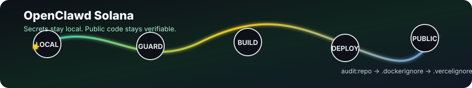
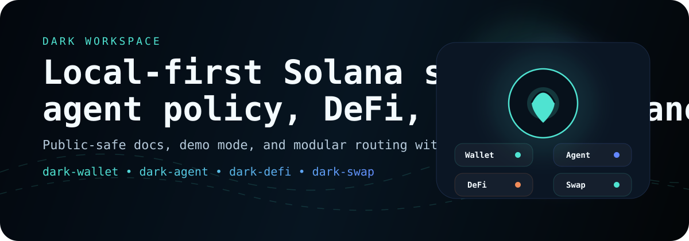
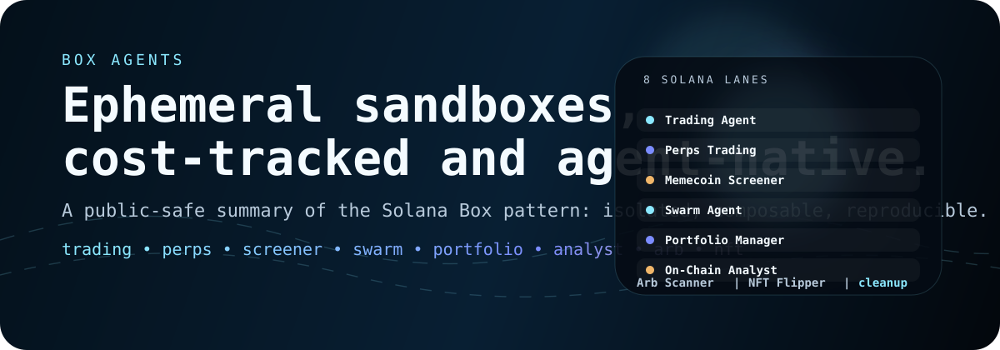
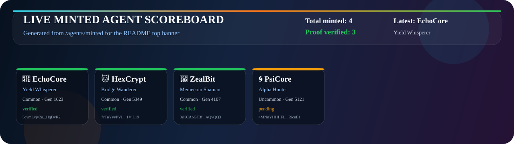

# OpenClawd Solana

<p align="center">
  
</p>

OpenClawd Solana is a public monorepo for Solana-native AI agents, tools, and
runtime services. It combines the Leviathan agent runtime, the `clawd-code`
coding CLI, an HTTP/Telegram gateway, a 95+ skill catalog, perps and x402
workflows, model-kit training utilities, and small companion packages for
wallets, registries, research, and agent identity.

The project is built for public development, but it assumes a strict secret
boundary: real `.env` files, wallet keypairs, RPC credentials, API keys, local
session state, and model checkpoints stay out of git.

For the navigable codebase layout, see [docs/REPO_MAP.md](./docs/REPO_MAP.md).

## What Is Included

| Area | Path | Purpose |
| --- | --- | --- |
| Runtime | `src/`, `packages/` | Leviathan/OpenClawd runtime, registry, wallet, research, guard, and CLI packages |
| Clawd Code | `clawd-code/` | Curl-installable Solana AI coding CLI with Grok-first defaults, wallet helpers, paper-gated perps, voice, research, image, and REPL modes |
| Gateway | `services/gateway/` | Express HTTP gateway, Telegram webhook/long-polling bridge, skill/agent APIs, staking pages, x402 and Clawd Gate access policy |
| Skills | `skills/`, `skills/catalog.json` | 105 local skill entries in this checkout, with public gateway metadata enrichment |
| Agents | `agents/` | Agent catalog, character overlays, staking/minter workspaces, and public discovery docs |
| Trading | `trading/` | Perps agent, formal verification helpers, staking program docs, and trading integrations |
| Model Kit | `ai-training/` | Local/cloud model training, NVIDIA blueprint experiments, dataset tooling, and the `8bitlabs.ai` site package |
| Hermes Oracle | `hermes-blockchain-oracle/` | Python MCP-style Solana oracle smoke-tested against public Solana RPC |
| E2B Runners | `scripts/e2b-clawd-code-sandbox.mjs`, `scripts/e2b-clawd-grok-sandbox.mjs` | Isolated Clawd Code and Clawd Grok sandbox plans/runners for E2B Code Interpreter |

## Quick Start

```bash
pnpm install --frozen-lockfile
npm run audit:repo
npm run check
npm run build
```

Run the main local smoke checks:

```bash
npm --prefix clawd-code run build
npm --prefix clawd-code test
npm --prefix services/gateway test
npm --prefix trading/clawd-perps-agent run build
npm run site:check
npm run e2b:clawd-code:dry
npm run e2b:clawd-grok:dry
```

The gateway smoke binds to `127.0.0.1` and starts an ephemeral local server. The
Hermes oracle live smoke reaches public Solana RPC:

```bash
python3 hermes-blockchain-oracle/test_oracle.py
```

## Clawd Code

`clawd-code/` is the standalone Solana AI coding CLI package.

```bash
cd clawd-code
npm install
npm run build
npm test
node dist/cli.js --help
```

Common commands after installation:

```bash
clawd-code code "Build a Jupiter swap bot in TypeScript"
clawd-code wallet create
clawd-code wallet list
clawd-code trade "funding rate on SOL perps"
clawd-code research --agents 16 "Solana perps funding arb"
clawd-code voice --agent
clawd-code repl
clawd-code /inspect
```

Default models are Grok-first:

| Mode | Default |
| --- | --- |
| `code`, `repl`, `trade` | `grok-4.3` |
| `research` | `grok-4.20-multi-agent` |
| `image` | `grok-imagine-image-quality` |
| `voice --agent` | `grok-voice-think-fast-1.0` |
| fast/cheap | `grok-4.3-fast` |

Configuration lives in `~/.clawd-code/.env`, `./.env`, and optional
`~/.grok/config.toml` / `./.grok/config.toml`. Never commit those real config
files.

## Gateway

The gateway package builds into its own package-local `dist/` directory so it
can resolve `services/gateway/node_modules` in local and container runs.

```bash
npm install --prefix services/gateway
npm --prefix services/gateway test
npm --prefix services/gateway start
```

<<<<<<< HEAD
Important gateway gates:
=======
```python
from openai import OpenAI
client = OpenAI(base_url="https://clawd-router.fly.dev/v1", api_key="clawd_sk_...")
response = client.chat.completions.create(
    model="clawdrouter/auto",
    messages=[{"role": "user", "content": "Write a Solana agent plan"}],
)
```

```bash
# Live perps relay
curl https://clawd-router.fly.dev/v1/relay/perps | jq '.phoenix.markets.body[0:3]'

# Unauthenticated calls return 401 authentication_required
curl -i https://clawd-router.fly.dev/v1/chat/completions \
  -H "Content-Type: application/json" \
  -d '{"model":"clawdrouter/auto","messages":[{"role":"user","content":"hello"}]}'
```

### Local Development

```bash
cd clawdrouter
npm install && npm run build && npm run dev
# Without x402 control plane:
CLAWDROUTER_AUTH_MODE=local npm run dev
```

### Fly.io Deployment

```bash
cd clawdrouter && npm run build
fly deploy --config fly.toml --remote-only

fly secrets set --app clawd-router \
  OPENROUTER_API_KEY=... \
  HELIUS_API_KEY=... \
  HELIUS_RPC_URL=... \
  BIRDEYE_API_KEY=... \
  CLAWDROUTER_INTERNAL_SECRET=...
```

Full source in [`clawdrouter/`](./clawdrouter/) · API key at [x402.wtf/profile/api](https://x402.wtf/profile/api)

---

## 🏟️ Agent Arena — Cheshire Terminal Identity & Hiring

Installable skill at [`agent-arena-skill/`](./agent-arena-skill/) ([SKILL.md](./agent-arena-skill/SKILL.md)) that gives any OpenClawd agent a permanent, on-chain identity on [cheshireterminal.ai](https://cheshireterminal.ai) — mint, get discovered, get hired, get reviewed, all Solana-native (no EVM).

```bash
npm run arena:install     # installs the Cheshire Terminal Agent Arena skill
```

**Identity is a Metaplex Core NFT** addressed as `svm://solana-mainnet/<asset>` — permanent, portable, verifiable by anyone without trusting Cheshire Terminal.

| Step | Call | Cost |
| --- | --- | --- |
| Mint | `POST cheshireterminal.ai/api/metaplex-agents/mint` | ~0.01 SOL tx fee |
| Register | `POST cheshireterminal.ai/api/metaplex-agents/register` | ~0.01 SOL tx fee |
| Fetch profile | `GET cheshireterminal.ai/api/metaplex-agents/fetch/:assetAddress` | Free |
| Hire | call the agent's `services[]` endpoint (`x402`, `A2A`, or `MCP`); pay `$CLAWD`/SOL on a 402 | — |
| Review | `POST cheshireterminal.ai/api/metaplex-agents/review` (requires on-chain `txSignature`) | Free |

Register with `a2a: true` / `mcp: true` to get a hosted [Google A2A agent card](https://a2a-protocol.org) and [Anthropic MCP server card](https://modelcontextprotocol.io) automatically — any A2A or MCP client can discover and hire the agent without it hosting its own cards. Reputation (ATOM) is Sybil-resistant: only wallets with a verified on-chain payment signature can leave a review.

Pairs with the arena client/UI at [github.com/Solizardking/Agentarena](https://github.com/Solizardking/Agentarena) — the room/turn frontend that this skill's `arena.md` protocol talks to. TypeScript SDK quick start, full REST reference, and the ATOM reputation engine are documented end-to-end in [`agent-arena-skill/SKILL.md`](./agent-arena-skill/SKILL.md).

---

## 🏆 Recent Commit Leaderboard

> Auto-refreshed every 30 min by GitHub Actions. Latest activity from the team.

<!-- COMMIT_LEADERBOARD:START -->
| # | Commit | Message | Author | Date |
|---|---|---|---|---|
| 🥇 | [`1429633`](../../commit/1429633) | chore: refresh commit leaderboard [skip ci] | github-actions[bot] | Jun 27 |
| 🥈 | [`bf6bbfe`](../../commit/bf6bbfe) | chore: refresh commit leaderboard [skip ci] | github-actions[bot] | Jun 27 |
| 🥉 | [`e33386b`](../../commit/e33386b) | chore: refresh commit leaderboard [skip ci] | github-actions[bot] | Jun 27 |
| 4️⃣ | [`dcba49c`](../../commit/dcba49c) | chore: refresh commit leaderboard [skip ci] | github-actions[bot] | Jun 27 |
| 5️⃣ | [`6e637d3`](../../commit/6e637d3) | chore: refresh commit leaderboard [skip ci] | github-actions[bot] | Jun 27 |
| 6️⃣ | [`332d01e`](../../commit/332d01e) | chore: refresh commit leaderboard [skip ci] | github-actions[bot] | Jun 27 |
| 7️⃣ | [`a1a586c`](../../commit/a1a586c) | chore: refresh commit leaderboard [skip ci] | github-actions[bot] | Jun 27 |
| 8️⃣ | [`d4a4f4b`](../../commit/d4a4f4b) | chore: refresh commit leaderboard [skip ci] | github-actions[bot] | Jun 26 |
| 9️⃣ | [`c2e896c`](../../commit/c2e896c) | chore: refresh commit leaderboard [skip ci] | github-actions[bot] | Jun 26 |
| 🔟 | [`f3c5a6d`](../../commit/f3c5a6d) | chore: refresh commit leaderboard [skip ci] | github-actions[bot] | Jun 26 |
| · | [`5adb331`](../../commit/5adb331) | chore: refresh commit leaderboard [skip ci] | github-actions[bot] | Jun 26 |
| · | [`c8ce15b`](../../commit/c8ce15b) | chore: refresh commit leaderboard [skip ci] | github-actions[bot] | Jun 26 |
| · | [`f99bcd5`](../../commit/f99bcd5) | chore: refresh commit leaderboard [skip ci] | github-actions[bot] | Jun 26 |
| · | [`d2fa4f8`](../../commit/d2fa4f8) | chore: refresh commit leaderboard [skip ci] | github-actions[bot] | Jun 26 |
| · | [`10f7907`](../../commit/10f7907) | chore: refresh commit leaderboard [skip ci] | github-actions[bot] | Jun 26 |
<!-- COMMIT_LEADERBOARD:END -->

---

## Current Session Handoff — Verified June 12, 2026

This README reflects the repo as verified from source, not just the intended product surface.

| Area | Current truth | Smoke command |
|---|---|---|
| Root install | Lockfile is reconciled across 26 pnpm workspace projects | `pnpm install --frozen-lockfile` |
| Root runtime | TypeScript check and runtime build pass | `npm run check` · `npm run build` |
| Repo audit | Secret filename/content scan, package surface count, directory count, and installer mode pass | `npm run audit:repo` |
| One-shot installer | Shell syntax and help output pass; global install path is intentionally not run during local smoke tests | `bash -n install.sh` · `bash install.sh --help` |
| NemoClawd | CLI wrapper, policy preset loading, registry helpers, NIM helpers, and installer preflight pass | `npm test --prefix nemo-clawd` |
| Agents hub | 130 agents and 136 skills validate through the x402 setup verifier | `npm test --prefix agents` |
| Gateway | Gateway TypeScript build and x402 route smoke test pass | `npm test --prefix gateway` |
| Library | 82 library agents validate and mirror into `public/library/` | `npm run library:validate` · `npm run library:doctor` |
| CLI package path | The published `@openclawdsolana/clawd` package lives at `packages/clawd-code-cli/` | `node packages/clawd-code-cli/dist/index.js --help` |
| Characters | Current character loader reports 97 personas | `node packages/clawd-code-cli/dist/index.js character list` |
| Local registry | Registry stats use `~/.clawd/agent-index.db`; sandboxed runners may need permission to access it | `node packages/agent-registry/dist/cli/index.js stats` |

Package fixes in this pass:
- Root runtime now declares the `openai` dependency used by `src/gacha/index.ts`.
- Runtime TypeScript includes DOM fetch types for the x402 fetch wrapper.
- `nemo-clawd` now pins the published `openclawd@^1.0.0` package instead of an unpublished `2026.3.11` version.
- `nemo-clawd/bin/nemoclawd.js` wraps the existing CLI entrypoint, matching `package.json` and tests.
- Nemo policy presets load from the checked-in `nemo-clawd-python/policies/presets` directory.

Environment note: this checkout declares Node `>=20 <25`. The smoke run was executed on Node `v25.6.1`, so pnpm prints an unsupported-engine warning even though the verified checks above pass. pnpm also warns that build scripts for `@google/genai`, `@prisma/engines`, `openclawd`, and `prisma` are awaiting `pnpm approve-builds`, and reports a non-fatal missing `workerd` bin link under `packages/agentwallet`.

---

## Dark Workspace - Local-First Modular Wallet

<div align="center">
  
</div>

The `dark/` workspace is wired into the repo as a public-safe, local-first
wallet stack. It keeps the wallet shell, paper-wallet lane, policy lane, DeFi
lane, and swap lane separate so the docs stay clean and the code stays easy to
follow.

| Module | Role |
|---|---|
| `dark-wallet` | Browser wallet shell, Solana paper wallet flow, and local state |
| `dark-agent` | Spend policy, automation modes, and guardrails |
| `dark-defi` | Vault, yield, and risk surfaces |
| `dark-swap` | Route preview and quote estimation |

What ships:
- Demo mode runs locally without private keys, secret env values, or box internals.
- Connected mode reads the injected wallet address and the selected Solana cluster when a wallet is present.
- The paper-wallet tab generates Solana keypairs locally, supports extra entropy, and prints through the browser dialog.
- The Dark Clawd sidecar uses `XAI_API_KEY` when present, but never touches secret key material.
- Root-level scripts expose `npm run dark:dev`, `npm run dark:build`, `npm run dark:typecheck`, and `npm run dark:preview`.

Run it:

```bash
npm run dark:dev
# or
cd dark/dark-wallet && npm install && npm run dev
```

Read the lane overview in [dark/README.md](./dark/README.md).

---

## Goals - Runtime Goal Orchestration

The `goals/` workspace is now part of the build surface. It is a Vite/Express
app for turning operator prompts, uploaded context, perps plans, and research
notes into structured goals that humans and agents can review.

What ships:
- Root scripts expose `npm run goals:dev`, `npm run goals:build`,
  `npm run goals:typecheck`, `npm run goals:start`, and `npm run goals:clean`.
- `npm run build:all` includes the goals app.
- The app is registered in both npm and pnpm workspaces as
  `solana-clawd-goals`.
- `goals/.env.example` documents provider keys with placeholders only.
- `goals/.env.local`, `goals/node_modules`, and `goals/dist` remain local or
  generated artifacts and should not be treated as source-of-truth inputs.

Run it:

```bash
npm run goals:dev
# or
npm run goals:build && npm run goals:start
```

Read the app overview in [goals/README.md](./goals/README.md).

---

## Box Agents - Ephemeral Sandboxes

<div align="center">
  
</div>

The `box/` workspace captures the sandbox pattern from the manifesto in a
public-safe form. Each run is isolated, cost-tracked, and torn down after use
so agent work stays separate from local state.

| Lane | What it does |
|---|---|
| Trading Agent | Token analysis and swap signal generation |
| Perps Trading Agent | Paper-first perps planning with agent wallet, RPC, Jupiter, Helius, and Phoenix reads |
| Memecoin Screener | New listing, liquidity, and risk screening |
| Swarm Agent | Sub-agent coordination and result fusion |
| Portfolio Manager | Wallet analysis and diversification scoring |
| On-Chain Analyst | Wallet and contract forensics |
| Arbitrage Scanner | Cross-DEX price comparison and net-profit checks |
| NFT Flipper | Floor analysis and collection scoring |

What ships:
- Agents run in disposable sandboxes.
- Perps planning is policy-gated and does not place private keys inside Box.
- The perps Box creates an ephemeral agent wallet inside the sandbox for
  simulation identity; live signing remains external.
- Solana reads are wired through configured RPC, Jupiter quotes, optional
  Helius owner lookups, and Phoenix market/trader-state endpoints. Credentialed
  URLs are redacted before logs or agent prompts.
- Runs are cost-tracked and snapshot-friendly.
- No private provider credentials or local secrets are printed in this README.
- The full landing page is [box/README.md](./box/README.md).

Latest Box perps integration:
- `box/lib/perps-policy.ts` defines paper-first limits, live-preview gates,
  Vulcan command planning, and data-source metadata.
- `box/lib/agent-wallet.ts` creates an ephemeral in-sandbox agent wallet
  manifest for simulation identity and zeroes generated secret bytes
  best-effort after deriving the public key.
- `box/lib/solana-calls.ts` builds safe call plans for Solana RPC health and
  blockhash, Jupiter SOL/USDC quotes, optional Helius assets-by-owner, and
  Phoenix market/trader-state reads.
- `box/agents/solana-perps-trading-agent.ts` writes the sandbox worker, runs the
  data checks, then asks the Box agent to review the plan without requesting or
  handling signing authority.
- `box/scripts/perps-preflight.ts` and `box/scripts/solana-call-plan.ts` provide
  local verification without needing live trading credentials.

Neon Auth + install tracking:
- Gateway can use Neon Auth JWKS and Neon Data API through server-side env vars
  only: `NEON_AUTH_URL`, `NEON_AUTH_JWKS`, `NEON_DATA_API_URL`,
  `NEON_DATA_API_KEY`, and `NEON_ID`.
- Install/agent/box tracking writes to `agent_install_events` through
  `/api/track/install`; protected reads use Bearer JWT verification against the
  configured JWKS.
- Public installers and Box agents emit minimal install metadata to
  `CLAWD_TRACKING_URL`, defaulting to `/api/track/install` on the public
  gateway. Set `CLAWD_DISABLE_TRACKING=true` to opt out. No Neon connection
  string, database password, or raw API key is committed.
- Schema starter: `gateway/scripts/neon-install-events.schema.sql`.
- Standalone agent installers can call
  `node agents/scripts/track-install.mjs <agent-id> <version>` to emit the same
  `agent_install` event.

---

### `$CLAWD` — `8cHzQHUS2s2h8TzCmfqPKYiM4dSt4roa3n7MyRLApump`

[](https://pump.fun/coin/8cHzQHUS2s2h8TzCmfqPKYiM4dSt4roa3n7MyRLApump)
[](https://x402.wtf)
[](https://x402.wtf)
[](https://x402.wtf/agents)
[](https://x402.wtf/skills)
[](https://x402.wtf/gateway)
[](https://github.com/better-auth/agent-auth)
[](https://github.com/solana-foundation/pay/pull/376)

[](https://www.npmjs.com/package/@openclawdsolana/clawd)
[](https://www.npmjs.com/package/@openclawdsolana/agent-registry)
[](https://www.npmjs.com/package/@openclawdsolana/agent-hub)
[](https://www.npmjs.com/package/@openclawdsolana/solana-sdk)
[](https://www.npmjs.com/package/@openclawd/wallet)
[](https://www.npmjs.com/package/@auth/agent)
[](https://t.me/clawdtoken)
[](https://x.com/clawddevs)
[](https://nodejs.org)
[](./LICENSE)
[](./package.json)

</div>

<!-- MINTED_SCOREBOARD:START -->
## Live Minted Agent Scoreboard

<div align="center">
  
</div>

**Source:** [agents/minted](/agents/minted) · auto-generated from local mint artifacts

| Agent | Role | Rarity / Gen | Proof | Asset |
|---|---|---:|---|---|
| 👾 EchoCore | Yield Whisperer | Common / 1623 | verified | `5cymLvjy...HqDvR2` |
| 🐱 HexCrypt | Bridge Wanderer | Common / 5349 | verified | `7rTnYyyP...1VjL19` |
| 🦊 ZealBit | Memecoin Shaman | Common / 4107 | verified | `3rKCAoGT...AQvQQ3` |
| 🌀 PsiCore | Alpha Hunter | Uncommon / 5121 | pending | `4MNnYHHH...RicnE1` |
<!-- MINTED_SCOREBOARD:END -->

## x402 Setup Verification

The GitHub, install, and gateway paths are now wired to the canonical x402 surfaces:

| Surface | Route | Verification |
|---|---|---|
| Agents hub | [`x402.wtf/agents`](https://x402.wtf/agents) | `agents` catalog validates 130 agents and the explicit `agents/` workspace paths |
| Skills hub | [`x402.wtf/skills`](https://x402.wtf/skills) | Gateway serves 136 catalog skills plus per-skill metadata fallback |
| Gateway | [`x402.wtf/gateway`](https://x402.wtf/gateway) | `gateway/scripts/smoke-x402-routes.mjs` starts the built gateway and checks public routes |
| Grok Studio | [`x402.wtf/grok`](https://x402.wtf/grok) | Terminal chat studio backed by server-side `XAI_API_KEY` for Grok chat, image, video, TTS, STT, downloads, and reusable assets |
| Staking | [`x402.wtf/staking`](https://x402.wtf/staking) | Helius DAS reads agent assets, token assets, and batch asset metadata for staking flows |
| Telegram | [`x402.wtf/telegram`](https://x402.wtf/telegram) | Smoke test verifies `POST /telegram/webhook` returns `200 OK` |
| Discovery | [`/.well-known/ai-plugin.json`](https://x402.wtf/.well-known/ai-plugin.json) | Static and dynamic discovery docs expose agents, skills, gateway, staking, and Telegram URLs |

Repeatable checks:

```bash
cd agents && npm run test
cd ../gateway && npm test
```

What these cover:
- `agents/scripts/validate-x402-setup.cjs` checks `CNAME`, `.well-known`, catalog counts, skills catalog URLs, installer wiring, GitHub Actions, gateway route source, and every explicitly listed `agents/` path.
- `.github/workflows/x402-setup.yml` runs the same agents verifier and gateway smoke test on PRs/pushes touching `agents/`, `gateway/`, `formal_verification/`, `skills/`, or `install.sh`.
- `install.sh --gateway` now builds the gateway and runs `npm run smoke:x402` before reporting the gateway as ready.

Production access policy:
>>>>>>> 980bc0b1458c577094d86e612764f799abf3618b

```bash
CLAWD_PRODUCTION_MODE=true
CLAWD_MIN_LIVE_TIER=SHORELINE
CLAWD_GATE_PAID_FEATURES=true
CLAWD_MIN_PAID_TIER=SHALLOW
GATEWAY_ADMIN_KEY=<server-side-admin-key>
```

Public read-only routes remain open. Live mutation routes and paid hosted
features require either `X-Clawd-Wallet` holder access or `X-Gateway-API-Key`
admin access.

## Perps Agent

The TypeScript perps agent in `trading/clawd-perps-agent/` now depends on the
public npm package `@openclawdsolana/clawd-perps` instead of a local
`openclawd-framework` symlink.

```bash
npm install --prefix trading/clawd-perps-agent
npm --prefix trading/clawd-perps-agent run typecheck
npm --prefix trading/clawd-perps-agent run build
```

Perps and trading flows are paper-first. Live execution must be explicitly
armed:

```bash
LIVE_TRADING=true
OPERATOR_CONFIRMED=true
PERPS_SIM_ONLY=false
```

## Environment

Start from `.env.example` files and copy them locally:

```bash
cp .env.example .env
cp clawd-code/.env.example ~/.clawd-code/.env
```

Common optional keys:

| Category | Variables |
| --- | --- |
| AI providers | `XAI_API_KEY`, `ANTHROPIC_API_KEY`, `OPENROUTER_API_KEY`, `DEEPSEEK_API_KEY`, `OPENAI_API_KEY`, `GEMINI_API_KEY` |
| Solana | `HELIUS_API_KEY`, `HELIUS_RPC_URL`, `SOLANA_RPC_URL`, `SOLANA_PUBLIC_KEY` |
| Gateway | `GATEWAY_PORT`, `GATEWAY_ADMIN_KEY`, `TELEGRAM_BOT_TOKEN`, `TELEGRAM_WEBHOOK_URL` |
| x402 | `X402_ENABLED`, `X402_NETWORK`, `X402_FACILITATOR_URL`, `X402_MAX_PER_REQUEST` |
| E2B | `E2B_API_KEY`, `CLAWD_E2B_REPO`, `CLAWD_E2B_BRANCH`, `CLAWD_E2B_PASS_PROVIDER_KEYS` |

The public `8bitlabs.ai` Clawd Grok sandbox computer is additionally holder
gated: browser launches require a Phantom/Solana wallet signature and a mainnet
`$CLAWD` balance of at least `1,000` before the API creates an E2B sandbox.

Do not commit real values. `.env`, `.env.*`, wallet/keypair files, raw key dumps,
databases, local sessions, generated outputs, and model artifacts are ignored.

## Security And Public Release Rules

This repo is intended for public GitHub publishing with clean history.

- Publish from a sanitized fresh export, not the old local git history.
- Do not publish `.env`, `.vercel/`, Fly secrets, wallet JSON, keypairs,
  private keys, service-account files, local sessions, `.solana/`, `.clawd/`,
  `.claude/`, `.grok/`, `node_modules/`, `dist/`, `outputs/`, `hf/`, or model
  checkpoint files.
- Do not publish local symlinks such as `openclawd-framework`.
- Keep examples placeholder-shaped, not secret-shaped. For example, use
  `replace-with-clawd-api-key`, not a value that looks like a live key.
- Run `npm run audit:repo` before every public push. The audit reports file and
  line locations for secret-pattern hits without printing matched secret text.
- Fly deploys must use `fly secrets set`; `fly.toml` is limited to non-secret
  env values. Docker/Fly build contexts are filtered by `.dockerignore`.
- Vercel deploys must use project environment settings; `.vercelignore` excludes
  local Vercel state, env files, wallet material, and generated artifacts.

The gateway currently has remaining moderate `uuid` advisories through
`@solana/web3.js` / Metaplex dependency chains with no npm fix available. The
high `form-data` advisory was removed during this pass.

## June 23, 2026 Updates

Recent history has one substantive local release-prep commit, `ee42617a`, plus
six June 23 `origin/main` commits that only refreshed the commit leaderboard.

Major updates from the release-prep work:

- Public-share hardening: expanded ignore rules, kept real env files and wallet
  material untracked, removed large model checkpoint artifacts from git, and
  documented the fresh-export release rule.
- Deployment safety: Fly uses non-secret `fly.toml` values with runtime secrets
  expected from `fly secrets set`; Vercel and Docker contexts now explicitly
  exclude local env, Vercel state, keypairs, session state, generated outputs,
  and model artifacts.
- Clawd Code web console: added the Next.js web surface, PWA manifest/icons,
  chat history, file explorer, quick actions, annotation threads, collaboration
  socket fixes, export fixes, and a dedicated web README.
- Gateway and skill hub: updated the Docker build path, access policy, x402
  route smoke checks, skill metadata enrichment, and package-local build/test
  flow.
- E2B sandbox runners: added dry-run capable Clawd Code and Clawd Grok sandbox
  scripts with provider key forwarding disabled unless explicitly requested.
- Trading/perps: moved the perps agent to the public
  `@openclawdsolana/clawd-perps` package, refreshed Vulcan catalog/path helpers,
  and tightened formal verification gate docs.
- Hermes oracle: added the Python package, Solana client, MCP-style server,
  quick tests, and public Solana RPC smoke test.
- Visual assets and docs: moved public screenshots into `gfx2/`, added dashboard
  and model-kit images, refreshed trading/gateway docs, and added this animated
  public-release flow without changing the quick-start path.

## Verified Smoke Status

Verified locally on June 23, 2026:

| Check | Result |
| --- | --- |
| `npm run audit:repo` | Pass: 0 tracked secret filenames, 0 unapproved secret-pattern hits |
| `npm run check` | Pass |
| `npm run build` | Pass |
| `bash -n install.sh` | Pass |
| `bash install.sh --help` | Pass |
| `npm --prefix clawd-code run build` | Pass |
| `npm --prefix clawd-code test` | Pass: 62 tests |
| `npm run site:check` | Pass |
| `npm run e2b:clawd-code:dry` | Pass, no provider keys forwarded |
| `npm run e2b:clawd-grok:dry` | Pass, no provider or Solana read keys forwarded |
| `npm --prefix services/gateway test` | Pass: 130 agents, 105 skills |
| `npm --prefix trading/clawd-perps-agent run typecheck` | Pass |
| `npm --prefix trading/clawd-perps-agent run build` | Pass |
| `npm --prefix trading/clawd-perps-agent audit --audit-level=high` | Pass |
| `python3 hermes-blockchain-oracle/test_oracle.py` | Pass with network access |

## License

MIT. See [LICENSE](./LICENSE).
