<p align="center">
  
</p>

<h1 align="center">Clawd Code</h1>

<p align="center">
  <strong>Grok-first, Solana-native coding command deck for terminal work, agent workflows, perps safety, wallets, voice, research, and the web console.</strong>
</p>

<p align="center">
  <a href="#launch-in-60-seconds">Launch</a>
  · <a href="#command-deck">Commands</a>
  · <a href="#web-console">Web</a>
  · <a href="#safety-rails">Safety</a>
  · <a href="#smoke-test">Smoke Test</a>
</p>

---

## Launch In 60 Seconds

Install the CLI:

```bash
curl -fsSL https://raw.githubusercontent.com/Solizardking/solana-clawd/main/clawd-code/install.sh | sh
```

Or run it from this checkout:

```bash
cd /Users/8bit/Downloads/solana-clawd/clawd-code
cp .env.example ~/.clawd-code/.env
npm install
npm run build
node dist/cli.js inspect
```

Start with a task:

```bash
clawd-code code --stream "Build a typed Solana wallet balance CLI"
clawd-code research --agents 16 "Solana perps funding arb map"
clawd-code trade "paper-check a SOL long with strict preflight"
clawd-code repl
```

## What It Is

Clawd Code is a TypeScript CLI and web workspace for shipping code with AI while keeping Solana operations explicit and gated.

| Layer | What it does |
| --- | --- |
| Terminal CLI | Runs code, research, trade, image, voice, REPL, wallet, perps, arena, goal, and provider commands from `dist/cli.js`. |
| Grok-first model router | Defaults to xAI Grok for code, research, image, and voice while keeping Anthropic, OpenRouter, and DeepSeek available. |
| Solana workspace | Creates local keypairs, checks balances/prices/funding, previews perps flows, and keeps live execution behind operator gates. |
| Ink-compatible runtime | Carries the rewritten terminal UI pieces, session state, keybindings, permission flows, MCP hooks, and tool renderers. |
| Web console | A Next.js App Router client with streaming chat, command palette, file viewer, settings, notifications, export, share routes, and the Clawd pet companion. |

## Command Deck

| Command | Purpose |
| --- | --- |
| `clawd-code code "<prompt>"` | Generate, review, or explain production code. Add `--stream` for token streaming. |
| `clawd-code trade "<intent>"` | Inspect perps posture and produce gated paper/live order previews. |
| `clawd-code research "<prompt>"` | Multi-agent research with 4 or 16 agents. |
| `clawd-code image "<prompt>"` | Image generation through configured providers. |
| `clawd-code voice "<text>"` | Text-to-speech or realtime voice-agent mode with `--agent`. |
| `clawd-code repl` | Multi-turn terminal conversation with `.mode`, `.model`, `.provider`, and history commands. |
| `clawd-code wallet create [name]` | Create a local Solana keypair under `~/.clawd-code/wallets`. |
| `clawd-code wallet list` | Show locally managed wallet public keys. |
| `clawd-code perps` | Perps dashboard. |
| `clawd-code funding` | Funding-rate dashboard. |
| `clawd-code signals` | Signal snapshot. |
| `clawd-code strategies` | Strategy inventory. |
| `clawd-code arena <subcommand>` | Cheshire Terminal Agent Arena identity, registration, and review flows. |
| `clawd-code agents` | Agent catalog helpers. |
| `clawd-code goal` | Goal tracking helpers. |
| `clawd-code verify` | Environment and provider checks. |
| `clawd-code inspect` | Grok-compatible config/model/provider discovery report. |
| `clawd-code models` | List or normalize configured models. |
| `clawd-code provider [name]` | Inspect or switch provider aliases. |

Slash aliases such as `clawd-code /wallet create`, `clawd-code /perps`, and `clawd-code /inspect` are still supported.

## Modes And Defaults

| Mode | Default model | Notes |
| --- | --- | --- |
| `code` / `repl` / `trade` | `grok-4.3` | xAI flagship reasoning, streaming, and coding workflows. |
| `research` | `grok-4.20-multi-agent` | 4 or 16 agents with search and code-interpreter style work. |
| `image` | `grok-imagine-image-quality` | Grok Imagine first, with configured fallbacks. |
| `voice --agent` | `grok-voice-think-fast-1.0` | Realtime voice agent API. |
| `fast` / cheap paths | `grok-4.3-fast` | Low-latency model alias. |

Override per run:

```bash
clawd-code code --provider anthropic --model claude-sonnet-4-6 "Review this module"
clawd-code research --provider xai --model grok-4.20-multi-agent --agents 16 "Map Solana agent frameworks"
```

Persist defaults in `~/.clawd-code/.env`:

```bash
CLAWD_PROVIDER=xai
CLAWD_MODEL=grok-4.3
CLAWD_STREAM=true
```

## Configuration Stack

Clawd Code merges configuration from several places. Later sources override earlier ones.

```text
~/.clawd-code/.env
./.env
~/.grok/config.toml
./.grok/config.toml
process.env
```

Important variables:

| Variable | Description | Default |
| --- | --- | --- |
| `CLAWD_PROVIDER` | `xai`, `anthropic`, `openrouter`, or `deepseek` | `xai` |
| `CLAWD_MODEL` | Default model for the selected provider | `grok-4.3` |
| `CLAWD_STREAM` | Stream supported modes by default | `false` |
| `XAI_API_KEY` | xAI key for Grok, image, and voice-agent modes | empty |
| `ANTHROPIC_API_KEY` | Anthropic key for Claude models | empty |
| `OPENROUTER_API_KEY` | OpenRouter key | empty |
| `DEEPSEEK_API_KEY` | DeepSeek key | empty |
| `SOLANA_RPC_URL` | Solana RPC endpoint | mainnet-beta fallback |
| `HELIUS_API_KEY` | Helius key for RPC/DAS workflows | empty |
| `PHOENIX_RISE_URL` | Phoenix/Rise endpoint | configured default |
| `VULCAN_MCP_URL` | Vulcan MCP URL | `http://localhost:3001` |
| `LIVE_TRADING` | Arms live trading path when paired with all other gates | `false` |
| `OPERATOR_CONFIRMED` | Explicit operator acknowledgement for live flows | `false` |
| `PERPS_SIM_ONLY` | Keeps perps execution simulated | `true` |

Optional Grok config:

```toml
[models]
default = "grok-4.3"

[model.grok-fast]
model = "grok-4.3-fast"
base_url = "https://api.x.ai/v1"
name = "Grok Fast"
env_key = "XAI_API_KEY"
```

## Web Console

The web app lives in [web/](./web). It is a Next.js App Router interface for chat, command search, file browsing, settings, notifications, export, share links, and mobile-friendly workflows.

```bash
cd /Users/8bit/Downloads/solana-clawd/clawd-code/web
cp .env.example .env.local
npm install
npm run dev
```

Open `http://localhost:3000`.

The web app has its own README: [web/README.md](./web/README.md).

## Safety Rails

Live trading is off unless every live gate is intentionally set:

```bash
LIVE_TRADING=true
OPERATOR_CONFIRMED=true
PERPS_SIM_ONLY=false
```

The trade path also applies local preflight checks: allowed symbols, max notional, max leverage, max spread, wallet posture, and route mode. Keep paper mode as the default while changing code or config.

Wallet files are Solana CLI-compatible JSON keypairs under `~/.clawd-code/wallets` with `0600` permissions. Treat them as private keys.

## Agent Arena

Clawd Code integrates the Cheshire Terminal Agent Arena for on-chain agent identity and reputation:

```bash
clawd-code arena health
clawd-code arena mint --wallet <YOUR_SOLANA_PUBKEY> --name "My Agent"
clawd-code arena register --wallet <YOUR_PUBKEY> --a2a https://my-agent.com/a2a --mcp https://my-agent.com/mcp --capabilities trading,research,solana
clawd-code arena fetch <assetAddress>
clawd-code arena review <assetAddress> --tx <txSignature> --from <yourWallet> --score 95
clawd-code arena status
```

Arena identity is stored at `~/.clawd-code/arena-identity.json` with `0600` permissions.

## Smoke Test

CLI smoke test:

```bash
cd /Users/8bit/Downloads/solana-clawd/clawd-code
npm install
npm run build
npm test
node dist/cli.js --help
node dist/cli.js inspect
```

Web smoke test:

```bash
cd /Users/8bit/Downloads/solana-clawd/clawd-code/web
npm install
npm run type-check
npm run build
npm run dev
```

If `inspect` reports missing API keys, that is expected on a clean machine. The command should still print config sources and model defaults.

## Project Map

```text
clawd-code/
├── src/
│   ├── cli.ts                 # CLI entry point and command routing
│   ├── modes/                 # code, trade, research, image, voice, repl
│   ├── server/                # web/session/direct-connect services
│   ├── remote/                # remote session adapters and WebSocket bridge
│   ├── ink/                   # terminal rendering compatibility layer
│   ├── components/            # terminal UI components
│   ├── services/              # analytics, MCP, x402, voice, LSP, memory
│   └── tools.ts               # tool definitions
├── web/                       # Next.js App Router web console
├── docs/                      # architecture and subsystem notes
├── prompts/                   # prompt templates
├── scripts/                   # build and smoke helpers
├── clawd-plugin/              # plugin bundle
├── docker/                    # container assets
├── clawd.json                 # agent character/config
├── .env.example               # CLI env template
└── package.json
```

## Release Contents

The npm package allowlist includes:

- `dist/`
- `install.sh`
- `README.md`
- `LICENSE`
- `.env.example`
- `clawd.json`

Runtime files, secrets, wallets, `.env`, `node_modules`, `outputs`, and generated build artifacts stay out of the package.

## Troubleshooting

| Symptom | Check |
| --- | --- |
| `XAI_API_KEY not set` | Add it to `~/.clawd-code/.env` or export it for the shell. |
| `inspect` cannot reach `/v1/models` | Confirm network access and the xAI key. |
| Web chat returns backend errors | Confirm `NEXT_PUBLIC_API_URL` points at a running backend that serves `/api/chat`. |
| Perps live command is blocked | Confirm this is intentional, then check all live gates and risk caps. |
| Wallet command cannot write | Check permissions under `~/.clawd-code/wallets`. |

## License

MIT. See [LICENSE](./LICENSE).
