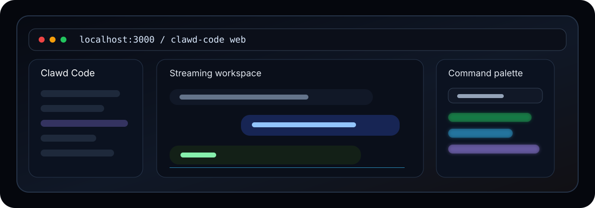

<p align="center">
  
</p>

<h1 align="center">Clawd Code Web</h1>

<p align="center">
  <strong>A Next.js App Router console for streaming chat, command search, local file views, settings, notifications, exports, and share links.</strong>
</p>

<p align="center">
  <a href="#quick-start">Quick Start</a>
  · <a href="#interface-map">Interface</a>
  · <a href="#api-contract">API</a>
  · <a href="#smoke-test">Smoke Test</a>
</p>

---

## Quick Start

```bash
cd /Users/8bit/Downloads/solana-clawd/clawd-code/web
cp .env.example .env.local
npm install
npm run dev
```

Open `http://localhost:3000`.

For a build check:

```bash
npm run type-check
npm run build
```

## What It Is

This is the browser console for Clawd Code. It keeps the first screen focused on the working chat surface instead of a landing page.

The app includes:

| Area | What users get |
| --- | --- |
| Chat surface | Streaming messages, stop generation, Markdown rendering, code/tool blocks, and conversation state. |
| Sidebar | Resizable/collapsible navigation with chat history, file explorer, and quick actions. |
| Command palette | Searchable keyboard command launcher with recents and shortcut help. |
| File viewer | Local file read/write routes, image handling, language detection, diffs, and tabs. |
| Settings | Model, API, MCP, permissions, keyboard, general, and data controls. |
| Collaboration | Presence, typing indicators, cursor ghosts, annotations, and socket helpers. |
| Notifications | Toasts, notification center, browser notifications, and live-region accessibility hooks. |
| Export/share | Markdown, JSON, HTML, plain text export plus in-memory share links. |

## Interface Map

```text
web/
├── app/
│   ├── page.tsx               # Renders the chat workspace
│   ├── layout.tsx             # Metadata, theme, toast providers
│   └── api/                   # chat, files, export, share route handlers
├── components/
│   ├── chat/                  # Chat layout, message list, input, Markdown
│   ├── layout/                # Sidebar, header, file explorer, quick actions
│   ├── command-palette/       # Searchable command launcher
│   ├── collaboration/         # Presence, annotations, typing state
│   ├── settings/              # Preferences and safety controls
│   ├── tools/                 # Tool renderers and ANSI output
│   └── ui/                    # Radix/Tailwind primitives
├── hooks/                     # Keyboard, viewport, reduced-motion, presence
├── lib/                       # Zustand store, API client, export/search/workers
└── public/                    # Icons and README preview art
```

## API Contract

The browser calls local Next route handlers first, and those route handlers proxy to the configured backend.

| Variable | Used by | Default |
| --- | --- | --- |
| `OPENROUTER_API_KEY` | Server-side chat credentials | empty |
| `OPENROUTER_GLM` | Default OpenRouter chat model | `z-ai/glm-5.2` |
| `OPENROUTER_SITE_URL` | Optional OpenRouter ranking/referrer header | `http://localhost:3000` |
| `OPENROUTER_APP_NAME` | Optional OpenRouter title header | `Clawd Code Web` |
| `NEXT_PUBLIC_API_URL` | Companion helper API base | `http://localhost:3001` |
| `NEXT_PUBLIC_WS_URL` | Realtime/collaboration sockets | `ws://localhost:3001` |

Chat flow:

```text
ChatInput -> /api/chat -> OpenRouter chat completions -> normalized SSE chunks
```

Expected stream chunks:

```ts
type StreamChunk =
  | { type: "text"; content: string }
  | { type: "tool_use"; tool: { id: string; name: string; input?: Record<string, unknown> } }
  | { type: "tool_result"; tool: { id: string; name: string; result?: string; is_error?: boolean } }
  | { type: "done" }
  | { type: "error"; error: string };
```

## Safety Notes

The file APIs resolve local filesystem paths. Keep this app on a trusted local network unless you add authentication, path sandboxing, and deployment-grade authorization in front of file read/write routes.

The settings UI includes permission controls for tool auto-approval. Keep destructive tools off by default while testing new backends.

## Animation And Accessibility

The UI already uses Framer Motion in the sidebar and command palette, plus CSS animation tokens in `app/globals.css`. Prefer small motion that helps orientation:

- sidebar open/close should be fast and spatially predictable;
- command palette entrance should be brief;
- streaming text should remain readable;
- honor reduced-motion hooks for users who request it.

## Smoke Test

```bash
cd /Users/8bit/Downloads/solana-clawd/clawd-code/web
npm run type-check
npm run build
npm run dev
```

Then verify:

| Check | Expected |
| --- | --- |
| `http://localhost:3000` loads | Full-height Clawd Code chat workspace. |
| Sidebar toggle | Smooth resize/collapse with no layout overlap. |
| Model selector | Shows configured model options. |
| Command palette | Opens with the configured keyboard shortcut and search input focuses. |
| Chat submit | Streams through OpenRouter when `OPENROUTER_API_KEY` is configured; otherwise shows an error state. |
| Export route | Returns a file for a valid conversation/export request. |

## Related

- Root CLI README: [../README.md](../README.md)
- CLI package: [../package.json](../package.json)
- Next config: [next.config.mjs](./next.config.mjs)
- Environment template: [.env.example](./.env.example)
