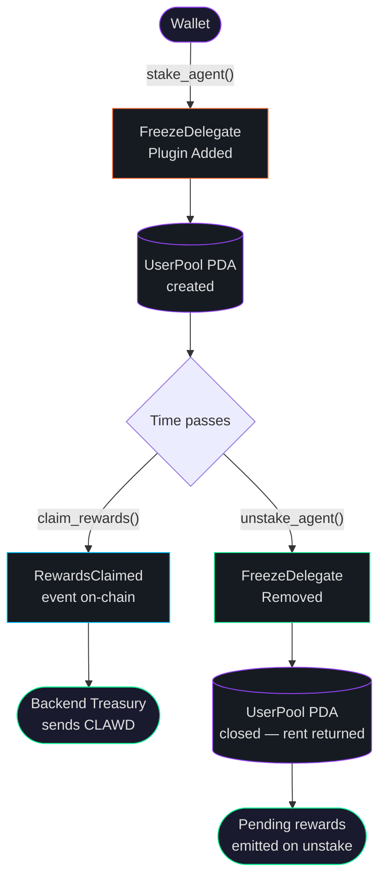

<div align="center">
  
</div>

<div align="center">

[](https://explorer.solana.com/address/9f84tiYsb7RoXwzpGwo2YzhaTDgM2HhKSF9rFncG9TTP?cluster=devnet)
[](https://www.anchor-lang.com/)
[](https://developers.metaplex.com/core)
[](LICENSE)

**Stake your OpenClawd agent NFTs on Solana · Earn $CLAWD · Stay non-custodial**

[Program Explorer](https://explorer.solana.com/address/9f84tiYsb7RoXwzpGwo2YzhaTDgM2HhKSF9rFncG9TTP?cluster=devnet) · [Global Pool](https://explorer.solana.com/address/DEYfxcRB4rxFxRrWyjfzfHBS6PWYpFb8djxQrKHwe2XQ?cluster=devnet) · [$CLAWD Token](https://explorer.solana.com/address/8cHzQHUS2s2h8TzCmfqPKYiM4dSt4roa3n7MyRLApump)

</div>

---

## Live Deployment

> **The program is deployed and the global pool is initialized on Solana devnet.**

| Account | Address | Status |
|---------|---------|--------|
| **Program** | `9f84tiYsb7RoXwzpGwo2YzhaTDgM2HhKSF9rFncG9TTP` | ✅ Live |
| **Global Pool PDA** | `DEYfxcRB4rxFxRrWyjfzfHBS6PWYpFb8djxQrKHwe2XQ` | ✅ Initialized |
| **$CLAWD Token** | `8cHzQHUS2s2h8TzCmfqPKYiM4dSt4roa3n7MyRLApump` | ✅ Active |
| **Network** | Solana Devnet | — |
| **Mainnet** | *Pending devnet review (Gate 4)* | — |

---

## What Is This?

The **OpenClawd Agent Staking** protocol lets holders of Metaplex Core agent NFTs lock their agents to earn **$CLAWD** token rewards — without ever giving up custody. The NFT never leaves your wallet; instead, a `FreezeDelegate` plugin is attached on-chain to make it non-transferable for the duration of the stake.

Rewards accrue second-by-second at **1,000 CLAWD base-units per second** per agent (~86.4 CLAWD/day). When you claim, an on-chain event is emitted and the backend treasury wallet settles the $CLAWD transfer to your wallet — no vault, no lockup, fully verifiable.

---

## How It Works

```
┌──────────────────────────────────────────────────────────────────────────┐
│                                                                          │
│   1. STAKE          2. ACCRUE            3. CLAIM          4. UNSTAKE   │
│                                                                          │
│   Agent NFT  ───►  Rewards grow    ───►  On-chain    ───►  FreezeDelegate│
│   stays in         1,000 base-units      event             removed;      │
│   your wallet      per second            emitted ──►       NFT freely    │
│   FreezeDelegate   since stake_time      backend sends     transferable  │
│   frozen=true                            $CLAWD to wallet  again         │
│                                                                          │
└──────────────────────────────────────────────────────────────────────────┘
```

### Flow Diagram



---

## Protocol Architecture

### On-Chain State

```
┌──────────────────────────────────────────────────┐
│  GlobalPool PDA                                  │
│  seeds = ["global-authority"]                    │
│  address: DEYfxcRB4rxFxRrWyjfzfHBS6PWYpFb8djxQr │
│                                                  │
│  admin:                     Pubkey               │
│  total_agents_staked:        u64                 │
│  total_rewards_distributed:  u64                 │
│  reserved:                  [u64; 4]             │
└────────────────────┬─────────────────────────────┘
                     │  1 per staked agent
          ┌──────────▼──────────────────────────────┐
          │  UserPool PDA                           │
          │  seeds = ["user-pool", asset_pubkey]    │
          │                                         │
          │  owner:           Pubkey                │
          │  asset:           Pubkey                │
          │  stake_time:      i64  ← Unix timestamp │
          │  last_claim_time: i64  ← reset on claim │
          │  total_claimed:   u64  ← base-units     │
          └─────────────────────────────────────────┘
                  Closed on unstake — rent returned
```

### Instructions

| Instruction | Signer | What it does |
|-------------|--------|--------------|
| `initialize` | Admin | Creates `GlobalPool` PDA, sets admin. Called once. |
| `stake_agent` | NFT Owner | Adds `FreezeDelegate(frozen=true)` to asset via CPI. Creates `UserPool`. |
| `unstake_agent` | Owner or Admin | Unfreezes + removes plugin. Closes `UserPool`. Emits pending rewards. |
| `claim_rewards` | NFT Owner | Updates `last_claim_time`. Emits `RewardsClaimed` event. Backend settles CLAWD. |

### Events

| Event | Fields | Emitted by |
|-------|--------|-----------|
| `AgentStaked` | `owner, asset, stake_time` | `stake_agent` |
| `AgentUnstaked` | `owner, asset, unstake_time, pending_rewards, total_accrued` | `unstake_agent` |
| `RewardsClaimed` | `owner, asset, amount, claim_time` | `claim_rewards` |

---

## Reward Schedule

Rewards accrue at **1,000 CLAWD base-units per second** per staked agent (6-decimal token, so 1,000 base-units = 0.001 CLAWD).

| Period | Base-Units Earned | CLAWD Earned |
|--------|:-----------------:|:------------:|
| 1 second | 1,000 | 0.001 |
| 1 minute | 60,000 | 0.06 |
| 1 hour | 3,600,000 | 3.6 |
| 1 day | 86,400,000 | **86.4** |
| 1 week | 604,800,000 | **604.8** |
| 1 month (30d) | 2,592,000,000 | **2,592** |

The rate is defined in `constant.rs` and is adjustable via server-side multipliers without a program upgrade.

**Reward formula:**
```
pending = (now - last_claim_time) * REWARD_RATE_PER_SECOND
```
Using saturating arithmetic — no overflow or underflow possible.

---

## Getting Started

### Prerequisites

- Node.js 18+ and npm/yarn
- [Solana CLI](https://docs.solana.com/cli/install-solana-cli-tools) configured for devnet
- A funded devnet wallet (`solana airdrop 2`)
- A Metaplex Core agent NFT in the collection

### Install

```bash
cd staking
npm install
```

### Build

```bash
npm run build
# or: anchor build
```

### Run Tests (Devnet)

```bash
# Requires ANCHOR_WALLET and ANCHOR_PROVIDER_URL set (or defaults apply)
npm test
# or: anchor test
```

The test suite runs 7 phases end-to-end against devnet:
1. Creates a fresh Metaplex Core collection
2. Mints a test agent NFT into that collection
3. Reads the live GlobalPool (already initialized)
4. Stakes the agent — verifies `FreezeDelegate` added, `UserPool` created, counter incremented
5. Waits 3 seconds and verifies reward accrual
6. Claims rewards — verifies `last_claim_time` advances, `total_claimed` increases
7. Unstakes — verifies plugin removed, `UserPool` closed, rent returned, counter decremented
8. Rejects a double-stake attempt (PDA collision guard)

---

## CLI Usage

The project ships a Commander-based TypeScript CLI for all staking operations.

```bash
# Initialize global pool (admin only — already done on devnet)
npm run script:devnet -- init

# Stake an agent NFT
npm run script:devnet -- stake \
  --asset <AGENT_ASSET_ADDRESS>

# Unstake an agent NFT
npm run script:devnet -- unstake \
  --asset <AGENT_ASSET_ADDRESS>

# Claim accrued rewards
npm run script:devnet -- claim \
  --asset <AGENT_ASSET_ADDRESS>

# Check stake status
npm run script:devnet -- status \
  --asset <AGENT_ASSET_ADDRESS>
```

The CLI auto-derives the collection from the Metaplex Core asset's update authority. Pass `--collection` only if you want an explicit safety check.

All commands accept `-e/--env`, `-r/--rpc`, and `-k/--keypair` flags. Defaults: `devnet`, public devnet RPC, `~/.config/solana/id.json`.

---

## Integrating a New Agent

### 1. Mint a Metaplex Core Agent

```typescript
import { mintAndSubmitAgent, mplAgentIdentity } from '@metaplex-foundation/mpl-agent-registry'
import { createUmi } from '@metaplex-foundation/umi-bundle-defaults'
import { keypairIdentity } from '@metaplex-foundation/umi'

const umi = createUmi('https://api.devnet.solana.com').use(mplAgentIdentity())
umi.use(keypairIdentity(keypair))

const result = await mintAndSubmitAgent(umi, {}, {
  wallet: umi.identity.publicKey,
  name: 'My Clawd Agent',
  uri: 'https://arweave.net/your-metadata.json',
  agentMetadata: {
    type: 'agent',
    name: 'My Clawd Agent',
    description: 'An autonomous Clawd agent',
    services: [{ name: 'trading', endpoint: 'https://myagent.ai/trade' }],
    registrations: [],
    supportedTrust: [],
  },
})
// result.assetAddress → your agent's on-chain address
```

### 2. Stake via Program SDK

```typescript
import * as anchor from "@coral-xyz/anchor"
import { PublicKey, SystemProgram } from "@solana/web3.js"

const PROGRAM_ID = new PublicKey("9f84tiYsb7RoXwzpGwo2YzhaTDgM2HhKSF9rFncG9TTP")
const MPL_CORE_PROGRAM_ID = new PublicKey("CoREENxT6tW1HoK8ypY1SxRMZTcVPm7R94rH4PZNhX7d")

const [globalPool] = PublicKey.findProgramAddressSync(
  [Buffer.from("global-authority")], PROGRAM_ID
)
const [userPool] = PublicKey.findProgramAddressSync(
  [Buffer.from("user-pool"), assetPubkey.toBuffer()], PROGRAM_ID
)

await program.methods.stakeAgent()
  .accountsStrict({
    owner: wallet.publicKey,
    user:  wallet.publicKey,
    globalPool,
    userPool,
    asset:         assetPubkey,
    collection:    collectionPubkey,
    coreProgram:   MPL_CORE_PROGRAM_ID,
    systemProgram: SystemProgram.programId,
  })
  .rpc({ commitment: "confirmed" })
```

### 3. Claim Rewards

```typescript
await program.methods.claimRewards()
  .accountsStrict({
    owner: wallet.publicKey,
    globalPool,
    userPool,
    systemProgram: SystemProgram.programId,
  })
  .rpc({ commitment: "confirmed" })
// Backend treasury detects RewardsClaimed event → transfers CLAWD to owner
```

---

## Agent Commerce Integration

Clawd agents are more than stakeable NFTs — they participate in **autonomous agent commerce**:

| Feature | Description |
|---------|-------------|
| **EIP-8004 compliance** | Every agent registration emits discoverable identity metadata |
| **Asset Signer PDA** | The agent's on-chain wallet — a PDA with no private key, controlled via MPL Core's Execute hook |
| **Executive delegation** | Off-chain operators sign transactions on the agent's behalf (revocable per-asset) |
| **x402 ready** | Agent metadata declares stablecoin payment support for agent-to-agent commerce |
| **A2A / MCP** | Agents can discover, hire, and pay other agents over standard protocols |

---

## Security Model

```
┌──────────────────────────────────────────────────────────────────┐
│                     Security Guarantees                          │
│                                                                  │
│  ✓  Non-custodial     NFT never leaves owner's wallet           │
│  ✓  No private keys   .gitignore blocks all key file patterns   │
│  ✓  PDA wallet        Asset Signer has no extractable key       │
│  ✓  Owner wins        Owner can always unstake; admin cannot    │
│                       block or steal the asset                   │
│  ✓  Emergency escape  Admin can unstake for recovery only        │
│  ✓  Overflow safe     All arithmetic uses checked_add/sub       │
│  ✓  Clock safe        Clock::get() failures bubble as errors    │
└──────────────────────────────────────────────────────────────────┘
```

**Key invariants enforced on-chain:**
- `user.key() == owner.key()` — prevents staking on behalf of another wallet
- `asset.owner == owner.key()` — Metaplex Core ownership verified via `BaseAssetV1` decode
- `asset.update_authority == Collection(collection.key())` — collection membership enforced
- `UserPool PDA` is keyed to `asset_pubkey` — double-staking the same asset is impossible (PDA collision)
- `close = user` on `UserPool` — rent goes back to the signer, not a fixed address

**Blocked by `.gitignore`:**
`*.json`, `*.pem`, `*.key`, `id_*`, `keypair*`, `wallet*`, `secret*`, `private*`, `.env*`

---

## Error Reference

| Code | Name | Meaning |
|------|------|---------|
| 6000 | `InvalidAdmin` | Caller is not the configured program admin |
| 6001 | `InvalidMetadata` | Asset account failed Metaplex Core decode |
| 6002 | `InvalidCollection` | Collection doesn't match asset's update authority |
| 6003 | `MetadataCreatorParseError` | Creator array parse failure |
| 6004 | `InvalidOwner` | Caller doesn't own the asset |
| 6005 | `InvalidAgentAsset` | Asset address doesn't match a staked record |
| 6006 | `CounterOverflow` | Global stake counter would overflow u64 |
| 6007 | `CounterUnderflow` | Global stake counter would underflow |
| 6008 | `RewardOverflow` | Arithmetic overflow computing rewards |
| 6009 | `NoRewardsToClaim` | No rewards have accrued since last claim |
| 6010 | `ClockUnavailable` | Sysvar clock not accessible |

---

## Project Structure

```
staking/
├── programs/
│   └── mpl-corenft-staking/
│       └── src/
│           ├── lib.rs              ← Program entry · 4 instructions
│           ├── constant.rs         ← PDA seeds · REWARD_RATE_PER_SECOND
│           ├── error.rs            ← 11 error codes
│           ├── state.rs            ← GlobalPool + UserPool structs
│           └── instructions/
│               ├── initialize.rs   ← Bootstrap global pool
│               ├── stake_agent.rs  ← FreezeDelegate CPI · UserPool init
│               ├── unstake_agent.rs← Thaw + remove plugin · close PDA
│               └── claim_rewards.rs← Event emit · off-chain settlement
├── cli/
│   ├── command.ts                  ← Commander CLI (stake/unstake/init/claim)
│   └── scripts.ts                  ← Anchor SDK helpers
├── lib/
│   ├── constant.ts                 ← Program ID, collection address, RPC
│   ├── scripts.ts                  ← Reusable stake/unstake helpers
│   └── util.ts                     ← Wallet + provider utilities
├── tests/
│   └── mpl-corenft-pnft-staking.ts ← 7-phase devnet integration suite
├── docs/
│   ├── index.html                  ← Documentation site
│   └── banner.svg                  ← Animated header
├── Anchor.toml                     ← Anchor config (devnet cluster)
├── AGENTS.md                       ← Developer guide + security audit
└── ARTICLE.md                      ← Protocol writeup
```

---

## Tech Stack

| Layer | Technology | Version |
|-------|-----------|---------|
| On-chain | Anchor (Solana) | v0.30.1 |
| NFT Standard | Metaplex MPL Core | v1.0.2 |
| Agent Identity | Metaplex Agent Registry | latest |
| JS SDK | `@metaplex-foundation/umi` | latest |
| CLI | Commander.js | latest |
| Tests | Mocha + Chai (Anchor) | — |
| Payments | x402 / A2A / MCP | — |

---

## Mainnet Readiness Gate

Mainnet deployment is intentionally blocked until:

- [ ] Gate 4 devnet review complete
- [ ] Anchor keys derived for mainnet program ID
- [ ] `[programs.mainnet]` block added to `Anchor.toml`
- [ ] Upgrade authority transferred to Squads multisig
- [ ] `[provider].cluster` switched to `mainnet`

---

<div align="center">

Built by [OpenClawd](https://x402.wtf) · $CLAWD: `8cHzQHUS2s2h8TzCmfqPKYiM4dSt4roa3n7MyRLApump`

[](https://explorer.solana.com/address/9f84tiYsb7RoXwzpGwo2YzhaTDgM2HhKSF9rFncG9TTP?cluster=devnet)
[](https://explorer.solana.com/address/DEYfxcRB4rxFxRrWyjfzfHBS6PWYpFb8djxQrKHwe2XQ?cluster=devnet)

</div>
